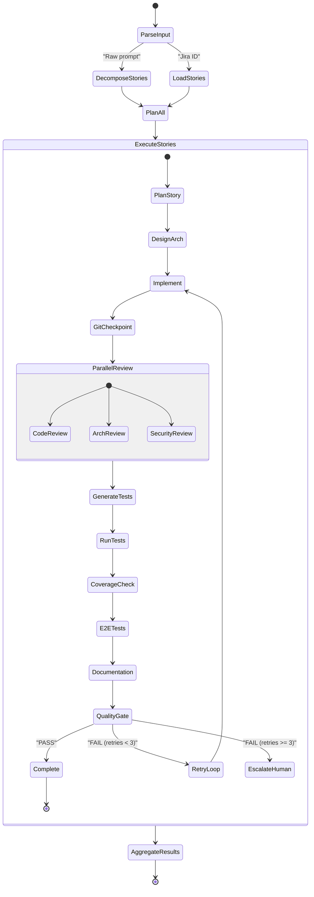
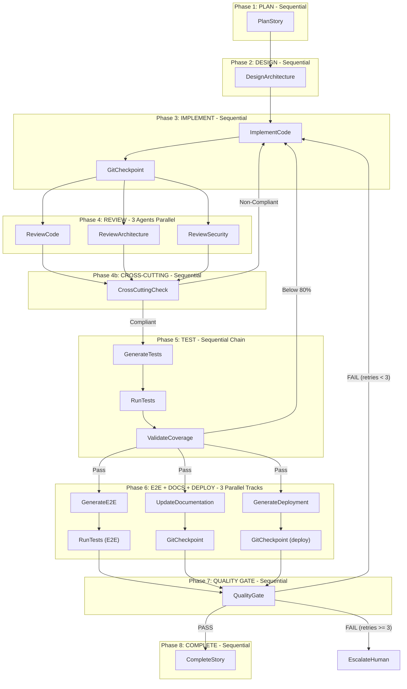

# Agentic SDLC Plugin -- Complete Design

## 1. Relationship to Existing ADM Plugin

The existing `plugins/adm/` plugin is a proven, production-ready foundation that covers ~60% of the requirements. The new `plugins/agentic-sdlc/` plugin will be a **standalone sibling** that:

- **References** existing ADM agent patterns (does NOT duplicate them)
- **Extends** the agent roster with 7 new agents (Requirement, Architect, TestRunner, Coverage, E2E, Documentation, QA Gate)
- **Replaces** the single-story `ExecuteStory` orchestrator with a multi-story `OrchestrateSDLC`
- **Adds** raw-prompt-to-stories capability (Jira-first mode still supported)
- **Adds** language-specific best practices for Go, React, and Angular (Java/Python/.NET already exist in `contexts/`)
- **Adds** formal quality gate, coverage validation, and E2E testing stages

The existing `plugins/adm/` remains untouched and independently installable.

---

## 2. Plugin Folder Structure

```
plugins/agentic-sdlc/
  README.md                          # Comprehensive plugin documentation
  GUARDRAILS.md                      # Safety protocol (Signs Architecture)
  agent-card.json                    # A2A discovery endpoint schema
  cursor/                            # Cursor IDE package
    .cursor-plugin/plugin.json       # Cursor plugin manifest
    mcp.json                         # MCP server connections (GitHub, Atlassian)
    hooks/
      hooks.json                     # Lifecycle hooks registry
      block-destructive.ps1          # Guardrail: block force-push, hard reset
      enforce-approval-gate.ps1      # Guardrail: human approval for irreversible actions
      rate-limit-retries.ps1         # Guardrail: prevent runaway retry loops
    rules/sdlc-standards.mdc        # Always-applied Cursor rule
    agents/                          # 15 agent definitions
      OrchestrateSDLC.agent.md       # Multi-story orchestrator (user-invocable)
      DecomposeRequirements.agent.md # Prompt -> structured stories
      PlanStory.agent.md             # Execution plan per story
      DesignArchitecture.agent.md    # System design + patterns
      ImplementCode.agent.md         # Code generation (TDD)
      ReviewCode.agent.md            # Code quality review
      ReviewArchitecture.agent.md    # Architecture compliance review
      ReviewSecurity.agent.md        # OWASP security review
      GenerateTests.agent.md         # Unit + integration test generation
      RunTests.agent.md              # Test execution + validation
      ValidateCoverage.agent.md      # Coverage threshold enforcement
      GenerateE2E.agent.md           # E2E test generation + execution
      UpdateDocumentation.agent.md   # Documentation updates
      GenerateDeployment.agent.md    # Container + K8s + Helm + multi-cloud deployment
      QualityGate.agent.md           # Final quality gate verdict
      CompleteStory.agent.md         # PR creation + Jira update
    skills/
      decompose-requirements/SKILL.md
      detect-language/SKILL.md
      run-tests/SKILL.md
      validate-coverage/SKILL.md
      generate-e2e/SKILL.md
      quality-gate/SKILL.md
      git-checkpoint/SKILL.md
      manage-context/SKILL.md
      compact-context/SKILL.md       # Context compaction/summarization
      trace-collector/SKILL.md       # Agent observability trace collection
      handover/SKILL.md              # Handover detection and execution
      ad-hoc-delegate/SKILL.md       # Ad-hoc delegation for blockers
      detect-deployment/SKILL.md     # Detect deployment targets and cloud providers
  claude/                            # Claude Code package
    .claude-plugin/plugin.json
    CLAUDE.md                        # Claude Code project constitution
    .mcp.json
    settings.json
    hooks/
      hooks.json
      block-destructive.sh           # Guardrail hook (shell for Claude)
    agents/                          # Claude-format agent definitions
      orchestrator.md
      requirement-decomposer.md
      planner.md
      architect.md
      implementer.md
      code-reviewer.md
      architecture-reviewer.md
      security-auditor.md
      test-generator.md
      test-runner.md
      coverage-validator.md
      e2e-generator.md
      documentation.md
      deployment-generator.md
      quality-gate.md
      completer.md
    skills/
      decompose-requirements/SKILL.md
      run-tests/SKILL.md
      validate-coverage/SKILL.md
      quality-gate/SKILL.md
  copilot/                           # GitHub Copilot adapter
    README.md
    copilot-instructions.md
    agents/
      orchestrator.agent.md
      requirement-decomposer.agent.md
      architect.agent.md
      test-generator.agent.md
      test-runner.agent.md
      coverage-validator.agent.md
      e2e-generator.agent.md
      documentation.agent.md
      deployment-generator.agent.md
      quality-gate.agent.md
    workflows/
      agentic-sdlc.md               # GitHub Actions workflow trigger
      ci-quality-gate.md             # CI/CD pipeline quality gate
  contexts/                          # Runtime context files (written by agents)
    plan.md                          # Current execution plan
    stories.json                     # Structured stories
    architecture.md                  # Architecture decisions
    test-results.json                # Test execution results
  observability/                     # Agent trace and telemetry schemas
    trace-schema.json                # Structured trace envelope definition
    token-budget.json                # Token budget allocation per phase
  prompts/                           # Reusable prompt templates
    decompose-requirements.md
    design-architecture.md
    generate-tests.md
    generate-e2e.md
    quality-gate-criteria.md
  memory/                            # Dynamic Memory Bank (runtime, APM-inspired)
    session-root.md                  # Orchestration-level state template
  templates/                         # Output templates
    story-template.json
    architecture-decision.md
    test-plan.md
    coverage-report.md
    quality-gate-report.md
    agent-card-template.json         # A2A Agent Card template
    memory-log.md                    # Standardized Memory Log template
    handover-file.md                 # Handover File template
    handover-prompt.md               # Handover Prompt meta-prompt template
    delegation-prompt.md             # Ad-Hoc delegation template
  standards/                         # Best practice enforcement
    coding/
      naming-conventions.md          # Per-language naming rules
      exception-handling.md          # Error/exception patterns per language
      dependency-management.md       # Lockfiles, pinning, supply chain
      concurrency.md                 # Thread/async/worker patterns per language
      io-management.md               # File, network, stream I/O patterns
      input-validation.md            # Boundary validation, schema enforcement
      cryptography.md                # Algorithms, key mgmt, hashing, secrets
      performance.md                 # Profiling, caching, pools, pagination
      readability-maintainability.md # Complexity limits, SOLID, formatting
    project-structures/              # Canonical folder layout per language/framework
      java-spring.md
      java-quarkus.md
      python-fastapi.md
      python-django.md
      python-flask.md
      go.md
      dotnet.md
      react.md
      angular.md
    ui/                              # Frontend UI generation standards
      ui-generation.md               # Full UI spec (tokens, components, styling, navigation)
      design-tokens.md               # Token categories, naming, default values
      accessibility-checklist.md     # WCAG 2.1 AA checklist with code-level tests
      component-catalog.md           # Atom/molecule/organism inventory with prop specs
    api/rest-standards.md
    security/owasp-checklist.md
    database/migration-standards.md
    deployment/
      containerization.md            # Dockerfile best practices (multi-stage, non-root, distroless)
      kubernetes.md                  # K8s manifest standards (resource limits, probes, security context)
      helm.md                        # Helm chart patterns (umbrella charts, values-per-env)
      ci-cd-pipelines.md             # CI/CD pipeline patterns (GitHub Actions, Azure DevOps)
  deployment-templates/              # Cloud-specific deployment templates
    dockerfiles/
      java-spring.Dockerfile         # Multi-stage Spring Boot / Quarkus
      python-fastapi.Dockerfile      # Multi-stage FastAPI / Django / Flask
      go.Dockerfile                  # Multi-stage Go (any framework)
      dotnet.Dockerfile              # Multi-stage .NET
      react.Dockerfile               # Multi-stage React (nginx)
      angular.Dockerfile             # Multi-stage Angular (nginx)
    kubernetes/
      deployment.yaml                # Base Deployment manifest template
      service.yaml                   # Service manifest template
      ingress.yaml                   # Ingress manifest template
      configmap.yaml                 # ConfigMap template
      hpa.yaml                       # Horizontal Pod Autoscaler template
    helm/
      Chart.yaml                     # Base Helm chart
      values.yaml                    # Default values
      values-dev.yaml                # Development overrides
      values-staging.yaml            # Staging overrides
      values-prod.yaml               # Production overrides
      values-onprem.yaml             # On-premises overrides
      values-azure-aks.yaml          # Azure AKS-specific (ACR, Azure Key Vault)
      values-aws-eks.yaml            # AWS EKS-specific (ECR, Secrets Manager)
      values-gcp-gke.yaml            # GCP GKE-specific (Artifact Registry, Secret Manager)
      templates/                     # Helm Go templates
        deployment.yaml
        service.yaml
        ingress.yaml
        configmap.yaml
        hpa.yaml
        _helpers.tpl
    pipelines/
      github-actions-docker.yaml     # Build + push + deploy via GitHub Actions
      azure-pipelines.yaml           # Azure DevOps pipeline
      cloudbuild.yaml                # GCP Cloud Build
  languages/                         # Language-specific best practices
    java/
      spring-boot.md                 # Spring Boot patterns + Testcontainers
      quarkus.md                     # Quarkus CDI, RESTEasy, GraalVM native
    python/
      fastapi.md                     # Async, Pydantic, pytest-asyncio
      django.md                      # ORM, DRF, TestCase, factories
      flask.md                       # Blueprints, app factory, pytest-flask
    dotnet/
      clean-architecture.md          # Minimal APIs, MediatR, xUnit
    go/
      idiomatic-go.md                # stdlib net/http, error handling, table tests
      gin.md                         # Gin routing, middleware, gin.TestMode
      echo.md                        # Echo routing, middleware, testing
    frontend/
      react/react-patterns.md
      angular/angular-patterns.md
  workflows/                         # Workflow documentation
    full-sdlc.md
    story-lifecycle.md
    retry-loop.md
    ci-integration.md                # CI/CD pipeline integration guide
```

---

## 3. System Architecture

### 3.1 Agent Registry (15 agents)

| # | Agent | Responsibility | Inputs | Outputs | Reuses ADM? |
|---|-------|---------------|--------|---------|-------------|
| 1 | OrchestrateSDLC | Multi-story orchestration, progress tracking, retry loops | User prompt OR Jira ID | Aggregated completion report | New |
| 2 | DecomposeRequirements | Parse prompt into structured stories | Raw text or Jira Feature ID | `stories.json` | New (extends PlanStory patterns) |
| 3 | PlanStory | Create execution plan per story | Story from `stories.json` | `plan.md` per story | Adapted from ADM |
| 4 | DesignArchitecture | Proactive architecture design + pattern selection | Story plan + codebase analysis | `architecture.md` | New |
| 5 | ImplementCode | TDD-driven code generation | Plan + architecture decisions | Code files + git commits | Adapted from ADM ImplementStory |
| 6 | ReviewCode | Code quality + correctness review | Diff + story context | CODE-x findings | Adapted from ADM |
| 7 | ReviewArchitecture | Architecture compliance review | Diff + architecture decisions | ARCH-x findings | Adapted from ADM |
| 8 | ReviewSecurity | OWASP security analysis | Diff + threat model | SEC-x findings | Adapted from ADM |
| 9 | GenerateTests | Unit + integration test generation | Implementation + AC | Test files | New |
| 10 | RunTests | Execute tests and report results | Test files + build system | `test-results.json` | New |
| 11 | ValidateCoverage | Coverage threshold enforcement | Test results + coverage data | Coverage report (pass/fail) | New |
| 12 | GenerateE2E | E2E test generation + execution | Story AC + UI touchpoints | E2E test files + results | New |
| 13 | UpdateDocumentation | README, ADR, API docs updates | Changed files + story context | Documentation files | New |
| 14 | QualityGate | Aggregate all gates, pass/fail verdict | All agent outputs | QA verdict + report | New |
| 15 | CompleteStory | Push code, create PR, update Jira | QA pass + branch info | PR URL + Jira status | Adapted from ADM |
| 16 | GenerateDeployment | Generate Dockerfiles, K8s manifests, Helm charts for multi-cloud deployment | Implementation + language/framework + target cloud(s) | Deployment artifacts (Dockerfile, K8s YAMLs, Helm chart, CI/CD pipeline) | New |

### 3.2 Orchestrator State Machine



### 3.3 Inter-Agent Communication Contract

Every agent produces a standardized JSON envelope:

```json
{
  "agent": "GenerateTests",
  "story_id": "PROJ-1234",
  "status": "success",
  "artifacts": ["src/test/java/com/example/FeatureTest.java"],
  "validation": {
    "passed": true,
    "checks": [
      {"name": "tests_compile", "status": "pass"},
      {"name": "ac_coverage", "status": "pass", "detail": "5/5 AC covered"}
    ]
  },
  "errors": [],
  "metadata": {
    "correlation_id": "uuid-per-story-execution",
    "retry_count": 0,
    "duration_ms": 45000
  }
}
```

Agents write their outputs to `./context/{story-id}/` as structured files. The orchestrator reads these to determine next steps.

---

## 4. Sample Agent Definitions (3 fully specified)

### 4.1 OrchestrateSDLC (Cursor format)

File: `cursor/agents/OrchestrateSDLC.agent.md`

Key design points:
- **User-invocable**: accepts either a raw prompt string or a Jira Feature/Epic ID
- **Dual-mode input**: calls `DecomposeRequirements` for raw prompts, or fetches from Jira for IDs
- **Parallel story execution**: stories without dependencies execute concurrently
- **Retry loop**: max 3 retries per story; on each failure, routes back to `ImplementCode` with the finding list
- **Git checkpoints**: commits after each major phase (implement, test, docs) for rollback capability
- **Progress tracking**: maintains `./context/sdlc-session.json` with per-story state
- **Human-in-the-loop**: optional approval gate before `CompleteStory` (configurable)

The orchestrator delegates to agents via `runSubagent` calls (Cursor) or agent invocations (Claude/Copilot). It never implements code directly.

### 4.2 DecomposeRequirements (Cursor format)

File: `cursor/agents/DecomposeRequirements.agent.md`

Key design points:
- **Dual-mode**: raw prompt (analyzes codebase, generates stories) OR Jira ID (fetches and decomposes)
- **Codebase analysis**: scans workspace for languages, frameworks, existing patterns
- **Story structure**: generates stories with title, description, acceptance criteria (Gherkin), estimated effort, dependencies, and labels
- **Output**: writes `./context/stories.json` with structured story array
- **Jira integration**: optionally persists stories to Jira (reuses `jira-operations` skill patterns)
- **User confirmation**: presents draft breakdown for approval before proceeding
- **Language-aware**: loads relevant `languages/{lang}/*.md` files to inform story decomposition

### 4.3 QualityGate (Cursor format)

File: `cursor/agents/QualityGate.agent.md`

Key design points:
- **Aggregates all quality signals**: code review, arch review, security review, test results, coverage, E2E results, documentation completeness
- **Deterministic pass/fail**: uses a strict rubric (not subjective reasoning)
- **Pass criteria**:
  - Code compiles: REQUIRED
  - All tests pass: REQUIRED
  - Coverage >= 80%: REQUIRED
  - No Critical/Major security findings: REQUIRED
  - No Critical/Major code review findings: REQUIRED
  - No Critical/Major architecture findings: REQUIRED
  - E2E tests pass (if applicable): REQUIRED
  - Documentation updated: ADVISORY (warn, don't fail)
- **Output**: structured `quality-gate-report.md` with per-gate status
- **Retry routing**: on failure, produces a prioritized fix list for `ImplementCode` to address

### 4.4 GenerateDeployment (Cursor format)

File: `cursor/agents/GenerateDeployment.agent.md`

Key design points:
- **Generates production-ready deployment artifacts** for containerized applications targeting on-premises, Azure, AWS, or GCP
- **Language/framework-aware**: detects the project's language and framework (from the `detect-language` skill output or the story's `language`/`framework` fields) and selects the correct Dockerfile template
- **Multi-cloud support**: produces a single Helm chart with cloud-specific values overlays:
  - `values-onprem.yaml` -- on-premises (generic ingress, local registry, manual secrets)
  - `values-azure-aks.yaml` -- Azure AKS (ACR for images, Azure Key Vault for secrets, Azure Ingress Controller)
  - `values-aws-eks.yaml` -- AWS EKS (ECR for images, AWS Secrets Manager, ALB Ingress)
  - `values-gcp-gke.yaml` -- GCP GKE (Artifact Registry, GCP Secret Manager, GKE Ingress)
- **Artifact outputs**:
  1. **Dockerfile** -- multi-stage, non-root user, distroless/slim base, `.dockerignore`
  2. **Kubernetes manifests** -- Deployment, Service, Ingress, ConfigMap, HPA (with resource limits, health probes, security context)
  3. **Helm chart** -- `Chart.yaml`, `values.yaml` (defaults), environment overlays (dev/staging/prod), cloud overlays (on-prem/azure/aws/gcp)
  4. **CI/CD pipeline** -- GitHub Actions workflow for build, push, and deploy (optionally Azure DevOps or GCP Cloud Build)
- **Security hardening**:
  - Non-root container execution (UID 1001)
  - Read-only root filesystem where possible
  - No secrets baked into images (uses K8s Secrets or cloud-native secret managers)
  - Resource limits and requests on every container
  - Network policies for pod-to-pod isolation
- **Runs after**: ImplementCode (needs code to containerize) and optionally after tests pass
- **Invocation modes**:
  - **Automatic** (in SDLC pipeline): orchestrator invokes after Phase 6 (E2E+Docs), before QualityGate
  - **On-demand**: user invokes directly with `@GenerateDeployment` for existing projects
- **detect-deployment skill**: detects existing deployment configs (Dockerfile, docker-compose.yml, k8s/, helm/, .github/workflows) and decides whether to generate new or update existing artifacts

**Dockerfile generation strategy per language:**

| Language/Framework | Base Image (build) | Base Image (runtime) | Key Optimization |
|---|---|---|---|
| Java / Spring Boot | `eclipse-temurin:21-jdk` | `eclipse-temurin:21-jre-alpine` | Layer-extracted JAR (Spring Boot layered JARs) |
| Java / Quarkus | `eclipse-temurin:21-jdk` | `registry.access.redhat.com/ubi8/ubi-minimal` (or GraalVM native) | Native image build option for Quarkus |
| Python / FastAPI | `python:3.12-slim` | `python:3.12-slim` | `--no-cache-dir`, virtual env copy |
| Python / Django | `python:3.12-slim` | `python:3.12-slim` | Static files collected, Gunicorn entrypoint |
| Python / Flask | `python:3.12-slim` | `python:3.12-slim` | Gunicorn/uWSGI entrypoint |
| Go / (any) | `golang:1.22-alpine` | `gcr.io/distroless/static` | Static binary, scratch-compatible |
| .NET | `mcr.microsoft.com/dotnet/sdk:8.0` | `mcr.microsoft.com/dotnet/aspnet:8.0-alpine` | `dotnet publish` trimmed output |
| React | `node:20-alpine` | `nginx:alpine` | Build output served by nginx |
| Angular | `node:20-alpine` | `nginx:alpine` | Build output served by nginx |

**Helm values overlay strategy:**

```
values.yaml          → defaults (replicas: 1, resources: small, no cloud-specific)
values-dev.yaml      → dev overrides (debug logging, relaxed limits)
values-staging.yaml  → staging (production-like, smaller resources)
values-prod.yaml     → production (HA replicas, strict resources, PDB)
values-onprem.yaml   → on-prem (local registry, generic ingress, manual TLS)
values-azure-aks.yaml → Azure (ACR registry, Azure Key Vault CSI, Azure Ingress)
values-aws-eks.yaml  → AWS (ECR registry, AWS Secrets Manager, ALB Ingress)
values-gcp-gke.yaml  → GCP (Artifact Registry, GCP Secret Manager, GKE Ingress)
```

Usage: `helm install myapp ./helm -f values-prod.yaml -f values-azure-aks.yaml` (compose environment + cloud)

---

## 5. Workflow Execution Model

### 5.1 Execution Timing Diagram (single story)

The following diagram shows the exact sequential and parallel execution order. Agents on the same horizontal row execute in parallel; vertical arrows indicate strict sequential dependencies.



### 5.2 Parallelization Rules

**Rule 1: Review agents always run in parallel.**
ReviewCode, ReviewArchitecture, and ReviewSecurity receive the same Review Context Bundle and execute simultaneously. The orchestrator waits for all three to complete before the cross-cutting check.

**Rule 2: E2E, Documentation, and Deployment run in parallel (3 tracks).**
After coverage validation passes, three independent tracks start simultaneously:
- Track A: `GenerateE2E` -> `RunTests(E2E)`
- Track B: `UpdateDocumentation` -> `GitCheckpoint`
- Track C: `GenerateDeployment` -> `GitCheckpoint`

All three tracks must complete before `QualityGate` runs. Documentation and deployment do not depend on E2E results. QualityGate aggregates all outputs.

**Rule 3: Tests wait for reviews.**
`GenerateTests` starts only after all 3 reviews pass. This avoids generating tests for code that reviews might reject, preventing wasted computation.

**Rule 4: Stories can run in parallel if independent.**
The orchestrator reads the `dependencies` field from `stories.json`:
- Stories with `dependencies: []` can execute concurrently
- Stories with `dependencies: ["STORY-001"]` wait for the referenced story to reach COMPLETE status

**Rule 5: Retry loops restart from ImplementCode only.**
On any failure (review, coverage, E2E, quality gate), the orchestrator routes back to ImplementCode with the specific finding list. Phases 1 (Plan) and 2 (Design) are never re-run during retries -- architecture is considered stable.

### 5.3 Agent Execution Summary Table

| Phase | Agents | Mode | Depends On | Outputs |
|-------|--------|------|-----------|---------|
| 1. PLAN | PlanStory | Sequential | stories.json | plan.md |
| 2. DESIGN | DesignArchitecture | Sequential | plan.md | architecture.md |
| 3. IMPLEMENT | ImplementCode | Sequential | plan.md + architecture.md | Code + implementation-log.md + git commit |
| 4. REVIEW | ReviewCode, ReviewArchitecture, ReviewSecurity | **Parallel (3)** | Review Context Bundle (diff + story + build) | CODE-x, ARCH-x, SEC-x findings |
| 4b. CROSS-CUT | Orchestrator (inline) | Sequential | All 3 review outputs | CROSS-x findings, Compliant/Non-Compliant |
| 5. TEST | GenerateTests -> RunTests -> ValidateCoverage | Sequential chain | implementation-log.md + AC | test-results.json + coverage.json |
| 6a. E2E | GenerateE2E -> RunTests(E2E) | Sequential chain | AC + UI touchpoints | E2E results |
| 6b. DOCS | UpdateDocumentation -> GitCheckpoint | Sequential chain | implementation-log.md + story context | Doc files + git commit |
| 6c. DEPLOY | GenerateDeployment -> GitCheckpoint | Sequential chain | implementation-log.md + language/framework | Dockerfile, K8s YAMLs, Helm chart, CI/CD pipeline |
| 6. (combined) | Phases 6a + 6b + 6c | **Parallel (3 tracks)** | coverage pass | All three must complete |
| 7. QA GATE | QualityGate | Sequential | All Memory Logs + test/coverage/E2E results | quality-gate-report.md |
| 8. COMPLETE | CompleteStory | Sequential | QA pass | PR + Jira update |

### 5.4 Multi-Story Execution Timeline

For a decomposition producing 3 stories (A has no deps, B has no deps, C depends on A):

```
Time →
─────────────────────────────────────────────────────────────────────────

Story A: [Plan][Design][Implement][Review×3][Test][E2E+Docs][QA][Complete]
Story B: [Plan][Design][Implement][Review×3][Test][E2E+Docs][QA][Complete]
Story C:                                            (waiting for A)
                                                              ↓
Story C:                              [Plan][Design][Implement][Review×3]...

Orchestrator: ━━━━ monitors all ━━━━ aggregates ━━━━ final report ━━━━━━
```

Stories A and B execute fully in parallel. Story C begins only after Story A reaches COMPLETE.

### 5.5 Full SDLC Workflow (single story -- step-by-step)

```
Phase 1: PLAN (sequential)
  1. PlanStory reads story from stories.json
  2. Analyzes codebase for affected files
  3. Creates execution plan with sub-tasks
  4. Writes ./memory/stories/{story-id}/plan.md
  5. Git checkpoint: "chore({story-id}): execution plan"

Phase 2: DESIGN (sequential)
  6. DesignArchitecture reads plan
  7. Detects language/framework via detect-language skill
  8. Loads relevant languages/{lang}/*.md + standards/*.md
  9. Proposes architecture decisions (patterns, modules, interfaces)
  10. Writes ./memory/stories/{story-id}/architecture.md
  11. Git checkpoint: "chore({story-id}): architecture design"

Phase 3: IMPLEMENT (sequential)
  12. ImplementCode reads plan + architecture
  13. Follows TDD: writes tests from AC first, then implementation
  14. Applies language-specific coding standards
  15. Commits after each logical unit
  16. Writes implementation-log.md (standardized Memory Log)
  17. Git checkpoint: "feat({story-id}): implementation complete"

Phase 4: REVIEW (3 agents parallel, then sequential cross-cut)
  18a. ReviewCode: correctness, quality, functional completeness     ─┐
  18b. ReviewArchitecture: structural compliance, boundaries          ├─ PARALLEL
  18c. ReviewSecurity: OWASP analysis, threat modeling               ─┘
  19. Wait for all 3 to complete
  20. Cross-cutting check (orchestrator, same as ADM Step 5)
  21. If any Non-Compliant → RETRY (back to Phase 3 with findings)

Phase 5: TEST (sequential chain)
  22. GenerateTests creates additional tests if coverage gaps found
  23. RunTests executes full test suite
  24. ValidateCoverage checks >= 80% threshold
  25. If coverage < 80% → RETRY (back to Phase 3 with gap report)
  26. Writes test-results.json + coverage.json

Phase 6: E2E + DOCS + DEPLOYMENT (3 parallel tracks)
  Track A (E2E):                                    ─┐
    27. GenerateE2E creates E2E tests from AC         │
    28. RunTests executes E2E suite                   │
  Track B (Docs):                                    ├─ PARALLEL
    29. UpdateDocumentation: README, CHANGELOG, ADR   │
    30. Git checkpoint: "docs({story-id}): docs"      │
  Track C (Deployment):                              │
    31. GenerateDeployment: Dockerfile, K8s, Helm     │
    32. Git checkpoint: "infra({story-id}): deploy"  ─┘
  33. Wait for all tracks to complete
  34. If E2E fails → RETRY (back to Phase 3)

Phase 7: QUALITY GATE (sequential)
  35. QualityGate aggregates all Memory Log summaries
  36. If PASS → Phase 8
  37. If FAIL (retries < 3) → RETRY with prioritized fix list
  38. If FAIL (retries >= 3) → ESCALATE to human

Phase 8: COMPLETE (sequential)
  39. CompleteStory pushes branch, creates draft PR (includes deployment artifacts)
  40. Updates Jira status
  41. Story marked COMPLETE
```

### 5.6 Retry Loop

On any failure (review, coverage, E2E, or QualityGate), the orchestrator:
1. Increments retry counter for this story
2. Appends the failure report to `./memory/stories/{story-id}/retry-{n}.md`
3. Creates a git tag `retry-{story-id}-{n}` for rollback
4. Routes back to `ImplementCode` (Phase 3) with:
   - The specific findings (ARCH-x, SEC-x, CODE-x, COV-x, E2E-x)
   - File paths and line numbers
   - Suggested fixes
5. Re-runs Phases 3-7 (Implement, Review, Test, E2E+Docs, QA Gate)
6. Phases 1 (Plan) and 2 (Design) are NEVER re-run during retries

---

## 6. Context Management

### 6.1 Runtime Context Files

The plugin uses `./context/` (at the target project root) as the shared state directory:

- `./context/sdlc-session.json` -- orchestrator state (stories, progress, retries)
- `./context/stories.json` -- structured story definitions
- `./context/{story-id}/plan.md` -- execution plan per story
- `./context/{story-id}/architecture.md` -- architecture decisions
- `./context/{story-id}/test-results.json` -- test execution results
- `./context/{story-id}/coverage.json` -- coverage data
- `./context/{story-id}/quality-gate-report.md` -- QA verdict
- `./context/{story-id}/retry-{n}.md` -- retry failure reports

### 6.2 stories.json Contract

```json
{
  "source": "prompt|jira",
  "source_id": "raw text hash or PROJ-1234",
  "created_at": "2026-04-03T10:00:00Z",
  "stories": [
    {
      "id": "STORY-001",
      "jira_key": "PROJ-1235",
      "title": "Implement user authentication API",
      "description": "...",
      "acceptance_criteria": [
        "Given valid credentials, When POST /auth/login, Then return JWT token with 200",
        "Given invalid credentials, When POST /auth/login, Then return 401 with error"
      ],
      "estimated_effort_days": 3,
      "story_points": 5,
      "dependencies": [],
      "labels": ["api", "security", "auth"],
      "language": "java",
      "framework": "spring-boot",
      "status": "pending",
      "retry_count": 0
    }
  ]
}
```

---

## 7. Multi-Language Support

### 7.1 Language and Framework Detection (detect-language skill)

Uses the same priority logic as AGENTS.md Section 2.1, extended for Go and frontend. Detection happens in two passes: first language, then framework.

**Pass 1 -- Language detection** (priority order, first match wins):

| # | Language | Detection Signals |
|---|----------|-------------------|
| 1 | Java | `pom.xml`, `build.gradle`, `build.gradle.kts`, `**/*.java` |
| 2 | Python | `pyproject.toml`, `requirements*.txt`, `**/*.py` |
| 3 | .NET | `*.csproj`, `global.json`, `**/*.cs` |
| 4 | Go | `go.mod`, `**/*.go` |
| 5 | React | `package.json` with `react` dependency, `**/*.tsx`, `**/*.jsx` |
| 6 | Angular | `package.json` with `@angular/core`, `angular.json` |

**Pass 2 -- Framework detection** (scan dependency files for indicators):

| Language | Framework | Detection Signal | Best Practice File |
|----------|-----------|-----------------|-------------------|
| Java | Spring Boot | `spring-boot-starter` in pom.xml or build.gradle | `languages/java/spring-boot.md` |
| Java | Quarkus | `io.quarkus` in pom.xml or build.gradle | `languages/java/quarkus.md` |
| Java | (none matched) | No framework indicator found | `languages/java/core-java.md` (general patterns) |
| Python | FastAPI | `fastapi` in requirements/pyproject | `languages/python/fastapi.md` |
| Python | Django | `django` in requirements/pyproject | `languages/python/django.md` |
| Python | Flask | `flask` in requirements/pyproject | `languages/python/flask.md` |
| Python | (none matched) | No framework indicator found | General Python context only |
| .NET | (all) | N/A | `languages/dotnet/clean-architecture.md` |
| Go | Gin | `github.com/gin-gonic/gin` in go.mod | `languages/go/gin.md` |
| Go | Echo | `github.com/labstack/echo` in go.mod | `languages/go/echo.md` |
| Go | stdlib | No framework in go.mod | `languages/go/idiomatic-go.md` (stdlib net/http) |
| React | (all) | N/A | `languages/frontend/react/react-patterns.md` |
| Angular | (all) | N/A | `languages/frontend/angular/angular-patterns.md` |

**Multiple framework detection**: If a monorepo contains multiple languages/frameworks (e.g., Java backend + React frontend), all matching files are loaded. Each story in `stories.json` records its `language` and `framework` field so agents load only the relevant standards.

### 7.2 Framework-Specific Build, Test, and Coverage Commands

The `RunTests` and `ValidateCoverage` agents use a command map to execute the correct tools per detected framework:

| Language | Framework | Build | Test | Coverage |
|----------|-----------|-------|------|----------|
| Java | Spring Boot (Maven) | `mvn clean compile -q` | `mvn test` | `mvn jacoco:report` (JaCoCo) |
| Java | Spring Boot (Gradle) | `./gradlew clean compileJava` | `./gradlew test` | `./gradlew jacocoTestReport` |
| Java | Quarkus (Maven) | `mvn clean compile -q` | `mvn test` | `mvn jacoco:report` |
| Java | Quarkus (Gradle) | `./gradlew clean compileJava` | `./gradlew test` | `./gradlew jacocoTestReport` |
| Python | FastAPI | `pip install -e ".[test]"` | `pytest` | `pytest --cov --cov-report=json` |
| Python | Django | `pip install -e ".[test]"` | `python manage.py test` or `pytest` | `pytest --cov --cov-report=json` |
| Python | Flask | `pip install -e ".[test]"` | `pytest` | `pytest --cov --cov-report=json` |
| .NET | (all) | `dotnet build` | `dotnet test` | `dotnet test --collect:"XPlat Code Coverage"` |
| Go | (all) | `go build ./...` | `go test ./...` | `go test -coverprofile=coverage.out ./...` |
| React | (all) | `npm ci` | `npm test` | `npm test -- --coverage` |
| Angular | (all) | `npm ci` | `ng test --no-watch --code-coverage` | (included in ng test) |

### 7.3 New Language and Framework Files to Create

| File | Content Focus |
|------|--------------|
| **Java** | |
| `languages/java/spring-boot.md` | Bean patterns, controller/service/repo layers, Spring Security, Testcontainers, profiles, actuator |
| `languages/java/quarkus.md` | CDI, RESTEasy Reactive, Panache ORM, GraalVM native image, Dev Services, @QuarkusTest |
| **Python** | |
| `languages/python/fastapi.md` | Async patterns, Pydantic v2, dependency injection, pytest-asyncio, httpx test client |
| `languages/python/django.md` | Models/Views/Templates, Django ORM, Django REST Framework, TestCase, factories, signals |
| `languages/python/flask.md` | Blueprints, Flask extensions, application factory pattern, pytest-flask, SQLAlchemy integration |
| **Go** | |
| `languages/go/idiomatic-go.md` | Error handling, goroutines, channels, table-driven tests, `go test` conventions, stdlib net/http |
| `languages/go/gin.md` | Gin router groups, middleware chains, binding/validation, gin.TestMode, httptest |
| `languages/go/echo.md` | Echo routing, middleware, context, validator, echo testing utilities |
| **.NET** | |
| `languages/dotnet/clean-architecture.md` | Minimal APIs, MediatR, FluentValidation, xUnit, dependency injection, EF Core |
| **Frontend** | |
| `languages/frontend/react/react-patterns.md` | Hooks, state management, component composition, React Testing Library, Vitest |
| `languages/frontend/angular/angular-patterns.md` | Modules, services, RxJS, Jasmine/Karma testing, standalone components |

### 7.3 Standards Files to Create

| File | Content Focus |
|------|--------------|
| `standards/api/rest-standards.md` | Versioning, pagination, error envelopes, HATEOAS, OpenAPI |
| `standards/security/owasp-checklist.md` | OWASP Top 10 checklist with code-level validation points |
| `standards/database/migration-standards.md` | Migration safety, rollback, zero-downtime DDL, parameterized queries |
| `standards/coding/naming-conventions.md` | Cross-language naming rules + per-language specifics (see Section 7.4) |
| `standards/coding/exception-handling.md` | Error/exception strategy per language (see Section 7.4) |
| `standards/coding/dependency-management.md` | Lockfiles, pinning, supply chain safety (see Section 7.4) |
| `standards/coding/concurrency.md` | Thread/async/worker patterns per language (see Section 7.4) |
| `standards/coding/io-management.md` | File, network, stream I/O patterns (see Section 7.4) |
| `standards/coding/input-validation.md` | Boundary validation, schema enforcement, sanitization (see Section 7.4) |
| `standards/coding/cryptography.md` | Algorithms, key management, hashing, secrets (see Section 7.4) |
| `standards/coding/performance.md` | Profiling, caching, lazy loading, resource pools (see Section 7.4) |
| `standards/coding/readability-maintainability.md` | Code structure, comments, complexity limits (see Section 7.4) |

### 7.4 Coding Standards (Mandatory for All Generated Code)

Every agent that generates or modifies code (`ImplementCode`, `GenerateTests`, `GenerateE2E`, `GenerateDeployment`) MUST follow these standards. The `ReviewCode` agent MUST verify compliance. Standards are defined in `standards/coding/` with language-specific subsections.

#### 7.4.1 Naming Conventions

Cross-cutting rules: names must be intention-revealing, avoid abbreviations (unless universally understood), and follow the existing codebase conventions. No single-letter variables outside loop iterators. No Hungarian notation.

| Language | Classes/Types | Methods/Functions | Variables | Constants | Packages/Modules | Files |
|----------|--------------|-------------------|-----------|-----------|-------------------|-------|
| Java | `PascalCase` (nouns) | `camelCase` (verbs) | `camelCase` | `UPPER_SNAKE_CASE` | `com.company.module` (lowercase dots) | `PascalCase.java` |
| Python | `PascalCase` | `snake_case` | `snake_case` | `UPPER_SNAKE_CASE` | `snake_case` | `snake_case.py` |
| Go | `PascalCase` (exported), `camelCase` (unexported) | Same as types | `camelCase` | `PascalCase` or `camelCase` (no `UPPER_SNAKE`) | `lowercase` (single word preferred) | `snake_case.go` |
| C# / .NET | `PascalCase` | `PascalCase` | `camelCase`, `_camelCase` (private fields) | `PascalCase` | `Company.Module` (PascalCase dots) | `PascalCase.cs` |
| TypeScript/React | `PascalCase` (components, classes) | `camelCase` | `camelCase` | `UPPER_SNAKE_CASE` | `kebab-case` (folders) | `PascalCase.tsx` (components), `camelCase.ts` (utils) |
| Angular | `PascalCase` (components, services) | `camelCase` | `camelCase` | `UPPER_SNAKE_CASE` | `kebab-case` | `kebab-case.component.ts` |

Additional rules:
- **Interfaces**: Java `FooService` (no `I` prefix); C# `IFooService` (with `I` prefix); Go -- no prefix, use concrete names
- **Boolean names**: prefix with `is`, `has`, `can`, `should` (e.g., `isActive`, `hasPermission`)
- **Collection names**: plural nouns (e.g., `users`, `orderItems`)
- **Enums**: PascalCase type, UPPER_SNAKE values (Java/C#); PascalCase members (Go)
- **Test methods**: `test_<behavior>_<condition>_<expected>` (Python), `should<Behavior>When<Condition>` (Java/C#), `Test<Function>_<Scenario>` (Go)

#### 7.4.2 Exception and Error Handling

**Universal principles** (all languages):
- Fail fast: validate preconditions at entry points with guard clauses
- Never swallow exceptions silently (no empty `catch {}`)
- Never use exceptions for control flow
- Always include context in error messages (what failed, with what inputs, why)
- Classify errors: business/domain (expected), validation (client fault), infrastructure (transient), system (unexpected)
- Log at the appropriate level: WARN for business errors, ERROR for system errors
- Include correlation IDs in all error logs

**Language-specific patterns:**

| Language | Error Model | Key Pattern | Anti-Pattern to Avoid |
|----------|------------|-------------|----------------------|
| Java / Spring | Checked + unchecked exceptions | `@ControllerAdvice` global handler, custom exception hierarchy (`BusinessException`, `NotFoundException`, `ValidationException`), translate to HTTP status codes at boundary | Catching `Exception` broadly, throwing `RuntimeException` without subclassing, `catch` with only log-and-rethrow |
| Python | Exception classes | Custom exception hierarchy, `try/except/else/finally`, `@retry` decorators for transient failures, `raise from` for chained context | Bare `except:`, `except Exception as e: pass`, returning `None` for errors |
| Go | Explicit `error` return values | Sentinel errors (`var ErrNotFound = errors.New(...)`), `fmt.Errorf("context: %w", err)` wrapping, `errors.Is()`/`errors.As()` checking, `errors.Join()` for multi-errors | Returning `nil, nil` for missing resources, `panic()` for business errors, ignoring returned errors (`_ = fn()`) |
| C# / .NET | Exception classes + Result pattern | Global middleware (`UseExceptionHandler`), `Result<T>` / `OneOf<T>` for expected failures, exceptions for unexpected, guard clauses at method entry, exception filters (`when` clause) | `catch (Exception)` everywhere, sync-over-async (`.Result`, `.Wait()`), catch-and-log-only without rethrow |
| TypeScript | Error classes + union types | Custom error classes extending `Error`, discriminated unions for expected outcomes, `try/catch` at boundaries only, error boundary components (React) | `catch (e: any)`, swallowing Promise rejections, no `.catch()` on async chains |

#### 7.4.3 Package Structure and Dependency Management

**Universal principles:**
- Pin all dependency versions in lockfiles; never use floating ranges (`*`, `latest`) in production
- Use lockfiles appropriate to the ecosystem and commit them to version control
- Prefer well-maintained, audited libraries over hand-rolled implementations
- Run dependency vulnerability scanning (`npm audit`, `pip-audit`, `mvn dependency:analyze`, `go mod verify`)
- Separate production and development dependencies

| Language | Lockfile | Pin Strategy | Supply Chain Safety |
|----------|----------|-------------|---------------------|
| Java (Maven) | `pom.xml` (explicit versions) + `maven-enforcer-plugin` | Exact versions in `<version>`, BOM for Spring | `maven-dependency-plugin:analyze`, `dependency-check-maven` (OWASP) |
| Java (Gradle) | `gradle.lockfile` | `gradle dependencies --write-locks` | `dependencyCheckAnalyze` plugin |
| Python | `poetry.lock` or `requirements.txt` (pinned with hashes) | `poetry lock` or `pip freeze > requirements.txt` | `pip-audit`, `safety check`, `bandit` |
| Go | `go.sum` (automatic) | `go mod tidy`, `go mod verify` | `govulncheck`, `go mod graph` |
| .NET | `packages.lock.json` | `<RestorePackagesWithLockFile>true</RestorePackagesWithLockFile>` | `dotnet list package --vulnerable` |
| Node/React/Angular | `package-lock.json` or `pnpm-lock.yaml` | `npm ci` (not `npm install`) | `npm audit`, `socket.dev` |

**Package organization:**
- Java: feature-based packages (`com.company.auth`, `com.company.order`) over layer-based (`com.company.controller`, `com.company.service`)
- Python: one module per concern, `__init__.py` for public API, `_internal` prefix for private modules
- Go: flat packages, avoid `utils`/`common`/`helpers` grab-bags, each package has a clear noun identity
- .NET: feature folders with Clean Architecture layers (`Domain`, `Application`, `Infrastructure`, `API`)

#### 7.4.4 Concurrency and Synchronization

**Universal principles:**
- Every concurrent operation must support cancellation/timeout (context propagation)
- Bound concurrency: use worker pools/semaphores, never unlimited goroutines/threads/tasks
- Prefer message passing and immutable data over shared mutable state
- Document thread-safety guarantees on every public API

| Language | Concurrency Model | Key Patterns | Pitfalls to Enforce Against |
|----------|------------------|-------------|---------------------------|
| Java | Virtual threads (Java 21+), `CompletableFuture`, `ExecutorService` | Structured concurrency (`StructuredTaskScope`), `@Async` with bounded pools, `ReentrantLock` over `synchronized` for complex cases, thread-local replaced by scoped values | Unbounded thread pools, `synchronized` on mutable collections in hot paths, blocking I/O on platform threads |
| Python | `asyncio`, `threading`, `multiprocessing`, `concurrent.futures` | `asyncio.gather()` for concurrent I/O, `asyncio.Semaphore` for bounded concurrency, `ThreadPoolExecutor` for CPU-bound, `ProcessPoolExecutor` for true parallelism | Mixing sync and async (`loop.run_until_complete` in async context), bare `threading.Thread` without join/cleanup, GIL-unaware parallelism |
| Go | Goroutines + channels | Context-first (`ctx context.Context` as first param), `errgroup` for scoped goroutines, buffered channels for backpressure, `sync.WaitGroup` for fan-out/fan-in | Goroutine leaks (no cancellation path), unbuffered channels causing deadlocks, `sync.Mutex` held across I/O calls |
| C# / .NET | `async/await`, `Task`, `Channel<T>` | `CancellationToken` on all async methods, `Channel<T>` for producer/consumer, `SemaphoreSlim` for rate limiting, `ValueTask` for hot-path alloc reduction | `.Result` / `.Wait()` (sync-over-async deadlocks), `Task.Run()` in ASP.NET request handlers, fire-and-forget without error handling |
| TypeScript | Event loop, `Promise`, Web Workers | `Promise.allSettled()` for concurrent requests, `AbortController` for cancellation, worker threads for CPU-bound | Unhandled promise rejections, blocking the event loop with sync operations, no abort signal on fetch calls |

#### 7.4.5 I/O Management

**Universal principles:**
- Always close resources deterministically (try-with-resources, `with` statement, `defer`, `using`)
- Use buffered I/O for file operations; avoid reading entire files into memory unless necessary
- Prefer streaming over buffering for large payloads (HTTP responses, file uploads)
- Set explicit timeouts on all network I/O (HTTP clients, database connections, message queues)
- Use connection pooling for databases and HTTP clients (never create per-request connections)

| Language | Resource Cleanup | HTTP Client | File I/O | Database |
|----------|-----------------|-------------|----------|----------|
| Java | `try-with-resources` (AutoCloseable) | `HttpClient` (Java 11+) with timeouts, connection pool via `WebClient` (Spring) | `Files.newBufferedReader()`, NIO for large files | HikariCP pool, `@Transactional` scope |
| Python | `with` statement (context managers) | `httpx` (async), `requests` (sync) with `Session` for pooling and timeouts | `pathlib.Path`, `aiofiles` for async | SQLAlchemy session with `scoped_session`, asyncpg for async Postgres |
| Go | `defer file.Close()` | `http.Client{Timeout: 30*time.Second}`, reuse client instances | `os.Open` + `bufio.Scanner`, `io.Copy` for streaming | `sql.DB` (built-in pooling), `pgxpool` for Postgres |
| C# / .NET | `using` statement / `await using` | `IHttpClientFactory` (pooled, typed), `HttpClient` with `CancellationToken` | `FileStream` with `using`, `StreamReader` for buffered | `DbContext` lifetime via DI, `EF Core` connection pool |
| TypeScript | `try/finally`, `AbortController` | `fetch` with `AbortSignal.timeout()`, Axios with interceptors | `fs.createReadStream()` (Node), `fs/promises` for async | Prisma/Drizzle with connection pooling |

#### 7.4.6 Input Validation

**Universal principles:**
- Validate at **every system boundary** (HTTP request, message queue, file read, external API response, environment variables)
- Use schema-based validation libraries, not hand-rolled regex
- Validate type, format, range, length, and business rules in that order
- Reject invalid input early (fail fast); return structured error responses with field-level detail
- Never trust client-side validation alone

| Language | Validation Library | Key Pattern |
|----------|-------------------|-------------|
| Java / Spring | `jakarta.validation` (Bean Validation 3.0), `@Valid`, custom `ConstraintValidator` | Annotate DTOs with `@NotNull`, `@Size`, `@Pattern`; validate at controller boundary; custom validators for business rules |
| Python / FastAPI | Pydantic v2 `BaseModel`, `Field(...)`, custom validators | Define request/response models with type hints + constraints; auto-validated by framework |
| Python / Django | Django Forms, DRF Serializers with `validate_<field>()` | Serializer-level validation for API, Form validation for web |
| Go | `go-playground/validator`, custom middleware | Struct tags (`validate:"required,email"`), validate at handler entry, return structured error map |
| C# / .NET | FluentValidation, `DataAnnotations` | `AbstractValidator<T>` with chained rules, registered in DI, invoked in pipeline behavior (MediatR) |
| TypeScript | Zod, Yup, class-validator | `z.object({...}).parse(input)` at route handler entry; inferred TypeScript types from schema |

#### 7.4.7 Cryptography Standards

**Mandatory rules** (all languages):
- Use **AES-256-GCM** for symmetric encryption (authenticated encryption); NEVER ECB mode
- Use **bcrypt** (cost factor 12+) or **Argon2id** for password hashing; NEVER MD5, SHA-1, plain SHA-256
- Use **RSA-2048+** or **ECDSA P-256+** for asymmetric operations
- Use **CSPRNG** (cryptographically secure pseudo-random number generators) for all security tokens; NEVER `Math.random()`, `random.random()`, `rand()`
- **Never hardcode keys/secrets** in source code; load from environment variables (dev) or secret managers (prod: Azure Key Vault, AWS Secrets Manager, HashiCorp Vault)
- **Never reuse IVs/nonces** with the same key
- **Rotate keys** on a defined schedule; support key versioning for graceful rotation
- Use **TLS 1.2+** for all network communication; pin certificates for internal services where appropriate

| Language | Crypto Library | Password Hashing | Secure Random |
|----------|---------------|-----------------|---------------|
| Java | `javax.crypto`, Bouncy Castle | `BCryptPasswordEncoder` (Spring Security) | `SecureRandom` |
| Python | `cryptography` library (Fernet, AES), `hashlib` | `bcrypt` or `argon2-cffi` | `secrets.token_urlsafe()`, `os.urandom()` |
| Go | `crypto/aes`, `crypto/cipher`, `golang.org/x/crypto` | `golang.org/x/crypto/bcrypt` | `crypto/rand.Read()` |
| C# / .NET | `System.Security.Cryptography` | `BCrypt.Net` or ASP.NET Identity `PasswordHasher<T>` | `RandomNumberGenerator.GetBytes()` |
| TypeScript | `crypto` (Node.js built-in), `jose` for JWTs | `bcrypt` or `argon2` npm packages | `crypto.randomBytes()`, `crypto.randomUUID()` |

#### 7.4.8 Performance Standards

**Universal principles:**
- Measure before optimizing; use profiling tools, not guesswork
- Set response time budgets: API endpoints < 200ms (p95), database queries < 50ms (p95)
- Use caching strategically: cache expensive computations, database results, and external API responses with explicit TTL and invalidation
- Prefer pagination over unbounded queries; enforce `LIMIT` on all list endpoints
- Use lazy loading for expensive resources; eager load only when access is guaranteed
- Pool expensive resources (threads, connections, buffers)

| Concern | Pattern | Anti-Pattern |
|---------|---------|-------------|
| Database queries | Use indexes, avoid N+1 (use JOINs or batch loading), `EXPLAIN ANALYZE` for slow queries | `SELECT *`, unbounded queries, query-per-loop |
| Memory | Stream large data, bound collection sizes, use weak references for caches | Loading entire files/result sets into memory, unbounded caches |
| Network | Connection pooling, request batching, HTTP/2 multiplexing, gzip compression | Per-request connection creation, synchronous serial calls to independent services |
| Serialization | Use efficient formats (Protocol Buffers, MessagePack) for internal services; JSON for external APIs | Serializing/deserializing in hot loops, custom serialization without benchmarks |
| Startup | Lazy initialization for non-critical dependencies, async warmup for caches/pools | Blocking startup on external services, loading all configs eagerly |

#### 7.4.9 Readability and Maintainability

**Universal principles:**
- Maximum cyclomatic complexity per method: 10 (hard limit, enforced by linter)
- Maximum method length: 30 lines (guideline), 50 lines (hard limit)
- Maximum file length: 300 lines (guideline), 500 lines (hard limit for non-generated files)
- Maximum method parameters: 4 (beyond that, use a parameter object/DTO)
- One class/struct per file (Java, C#); one primary export per file (Python, TypeScript, Go)
- Import ordering: stdlib, third-party, internal (enforce with linter/formatter)
- **No dead code**: remove unused imports, variables, functions, and commented-out code
- **Consistent formatting**: use the language's standard formatter (`gofmt`, `black`, `prettier`, `dotnet format`, `google-java-format`)
- **Self-documenting code**: prefer clear names and small functions over comments; write comments only for "why" (business rules, trade-offs, non-obvious constraints), never "what"
- **SOLID compliance**:
  - Single Responsibility: each class/module has one reason to change
  - Open/Closed: extend behavior through composition/interfaces, not modification
  - Liskov Substitution: subtypes must be substitutable for their base types
  - Interface Segregation: prefer small, focused interfaces over large ones
  - Dependency Inversion: depend on abstractions (interfaces), not concretions

### 7.5 Integration of Coding Standards into Agent Workflow

These coding standards are enforced at three points in the SDLC pipeline:

1. **ImplementCode agent** -- MUST load `standards/coding/*.md` files (filtered by detected language) alongside language-specific best practice files. These standards constrain code generation. The agent MUST apply them proactively, not as an afterthought.

2. **ReviewCode agent** -- MUST verify compliance against all applicable `standards/coding/*.md` files as part of its review checklist. Produces CODE-x findings for violations. Each finding references the specific standard violated (e.g., `CODE-7: Naming violation -- standards/coding/naming-conventions.md Section Java: method 'GetUser' should be 'getUser'`).

3. **GenerateTests / GenerateE2E agents** -- MUST follow the same naming, error handling, and readability standards when generating test code. Test code is production code.

**ReviewCode checklist additions** (in addition to existing checks):

| # | Check | Standard File | Severity |
|---|-------|--------------|----------|
| C1 | Naming follows language conventions | `naming-conventions.md` | Major |
| C2 | Exceptions follow error handling strategy (no swallowing, context included) | `exception-handling.md` | Critical |
| C3 | Dependencies pinned in lockfile, no floating versions | `dependency-management.md` | Critical |
| C4 | Concurrent code uses bounded pools, cancellation, resource cleanup | `concurrency.md` | Critical |
| C5 | I/O resources closed deterministically, timeouts set, pools used | `io-management.md` | Major |
| C6 | Input validated at boundaries with schema libraries | `input-validation.md` | Critical |
| C7 | Crypto uses approved algorithms, no hardcoded secrets, CSPRNG for tokens | `cryptography.md` | Critical |
| C8 | No N+1 queries, no unbounded collections, no per-request connections | `performance.md` | Major |
| C9 | Cyclomatic complexity <= 10, method <= 50 lines, file <= 500 lines | `readability-maintainability.md` | Major |
| C10 | SOLID principles followed, no dead code, consistent formatting | `readability-maintainability.md` | Major |

---

### 7.6 Project Folder Structures per Language/Framework

Each language best practice file (`languages/{lang}/*.md`) MUST include a **canonical project folder structure** that the `ImplementCode` and `DesignArchitecture` agents enforce when scaffolding new projects or extending existing ones. These structures are also referenced by the `ReviewArchitecture` agent during architecture compliance review.

New files to create: `standards/project-structures/` directory with one file per language/framework.

#### 7.6.1 Java / Spring Boot

```
src/
├── main/
│   ├── java/com/company/project/
│   │   ├── ProjectApplication.java          # @SpringBootApplication (root package)
│   │   ├── config/                           # @Configuration, SecurityConfig, WebMvcConfig
│   │   ├── common/                           # Shared exceptions, base entities, utilities
│   │   │   ├── exception/                    # GlobalExceptionHandler, BusinessException, NotFoundException
│   │   │   └── dto/                          # PageResponse, ErrorResponse envelopes
│   │   ├── auth/                             # Feature: authentication & authorization
│   │   │   ├── AuthController.java
│   │   │   ├── AuthService.java
│   │   │   ├── AuthRepository.java
│   │   │   ├── User.java                     # Entity
│   │   │   ├── LoginRequest.java             # DTO (Java Record)
│   │   │   └── LoginResponse.java            # DTO (Java Record)
│   │   ├── order/                            # Feature: orders
│   │   │   ├── OrderController.java
│   │   │   ├── OrderService.java
│   │   │   ├── OrderRepository.java
│   │   │   ├── Order.java
│   │   │   └── dto/
│   │   └── payment/                          # Feature: payments
│   └── resources/
│       ├── application.yml                   # Default config
│       ├── application-dev.yml               # Dev profile
│       ├── application-prod.yml              # Prod profile
│       ├── db/migration/                     # Flyway/Liquibase migrations
│       └── static/                           # Static assets (if any)
└── test/
    ├── java/com/company/project/
    │   ├── auth/AuthServiceTest.java         # Unit tests colocated with feature
    │   ├── order/OrderControllerIntegrationTest.java
    │   └── TestcontainersConfig.java         # Shared test infrastructure
    └── resources/
        └── application-test.yml
```

Key rules: feature-based packages (not layer-based); `@SpringBootApplication` at root package; DTOs as Java Records (Java 21+); Flyway/Liquibase for migrations; profiles for env config.

#### 7.6.2 Java / Quarkus

Same feature-based principle; replace Spring annotations with CDI. `src/main/resources/application.properties` with `%dev.` / `%prod.` profile prefixes. `src/native-test/` for GraalVM native tests.

#### 7.6.3 Python / FastAPI

```
project/
├── app/
│   ├── __init__.py
│   ├── main.py                               # Application factory, CORS, middleware
│   ├── config.py                             # Pydantic Settings + @lru_cache
│   ├── database.py                           # SQLAlchemy engine, session factory
│   ├── dependencies.py                       # Shared FastAPI dependencies (get_db, get_current_user)
│   ├── exceptions.py                         # Custom exception classes + handlers
│   ├── middleware.py                         # Logging, correlation ID, timing
│   ├── api/
│   │   ├── __init__.py
│   │   ├── router.py                         # Root APIRouter aggregation
│   │   └── v1/
│   │       ├── __init__.py
│   │       ├── auth.py                       # Auth endpoints
│   │       ├── users.py                      # User endpoints
│   │       └── orders.py                     # Order endpoints
│   ├── models/                               # SQLAlchemy ORM models
│   │   ├── __init__.py
│   │   ├── user.py
│   │   └── order.py
│   ├── schemas/                              # Pydantic request/response schemas
│   │   ├── __init__.py
│   │   ├── user.py
│   │   └── order.py
│   ├── services/                             # Business logic (framework-agnostic)
│   │   ├── __init__.py
│   │   ├── auth_service.py
│   │   └── order_service.py
│   ├── repositories/                         # Database CRUD (one per aggregate)
│   │   ├── __init__.py
│   │   └── user_repository.py
│   └── core/                                 # Cross-cutting: security, logging utils
│       ├── __init__.py
│       └── security.py
├── migrations/                               # Alembic migrations
│   ├── env.py
│   └── versions/
├── tests/
│   ├── conftest.py                           # Fixtures (TestClient, DB session)
│   ├── test_auth.py
│   └── test_orders.py
├── pyproject.toml                            # Dependencies + tool config
├── poetry.lock                               # Pinned lockfile
└── Dockerfile
```

Key rules: thin routers (HTTP only), business logic in `services/`, Pydantic schemas separate from ORM models, Alembic for migrations, API versioning via `v1/`/`v2/` routers.

#### 7.6.4 Python / Django

```
project/
├── manage.py
├── config/                                   # Django settings package
│   ├── __init__.py
│   ├── settings/
│   │   ├── base.py                           # Shared settings
│   │   ├── development.py
│   │   └── production.py
│   ├── urls.py                               # Root URL config
│   └── wsgi.py
├── apps/
│   ├── auth/                                 # Django app: authentication
│   │   ├── models.py
│   │   ├── views.py                          # Or api/views.py for DRF
│   │   ├── serializers.py                    # DRF serializers
│   │   ├── urls.py
│   │   ├── admin.py
│   │   ├── tests/
│   │   │   ├── test_models.py
│   │   │   └── test_views.py
│   │   └── factories.py                      # Factory Boy test data
│   └── orders/                               # Django app: orders
├── templates/                                # Shared templates (if server-rendered)
├── static/                                   # Static files
└── requirements/
    ├── base.txt
    ├── dev.txt
    └── prod.txt
```

Key rules: split settings by environment; one Django app per bounded context; `factories.py` for test data; DRF serializers for API validation.

#### 7.6.5 Python / Flask

```
project/
├── app/
│   ├── __init__.py                           # Application factory (create_app)
│   ├── extensions.py                         # SQLAlchemy, Migrate, CORS init
│   ├── config.py                             # Config classes (Dev, Prod, Test)
│   ├── auth/                                 # Blueprint: authentication
│   │   ├── __init__.py                       # Blueprint registration
│   │   ├── routes.py
│   │   ├── models.py
│   │   └── services.py
│   └── orders/                               # Blueprint: orders
├── migrations/                               # Flask-Migrate / Alembic
├── tests/
│   ├── conftest.py
│   └── test_auth.py
└── pyproject.toml
```

Key rules: application factory pattern; Blueprints for feature modularity; `extensions.py` for Flask extension instances.

#### 7.6.6 Go (Standard Library / Gin / Echo)

```
project/
├── cmd/
│   ├── api/
│   │   └── main.go                           # Entry point: wires dependencies, starts server (< 50 lines)
│   └── worker/
│       └── main.go                           # Background worker entry (optional)
├── internal/                                 # Private application code (compiler-enforced)
│   ├── config/
│   │   └── config.go                         # Env-based config with struct tags
│   ├── handler/                              # HTTP handlers (Gin/Echo routes or stdlib)
│   │   ├── auth_handler.go
│   │   └── order_handler.go
│   ├── middleware/                            # Auth, logging, recovery, CORS
│   │   └── auth.go
│   ├── service/                              # Business logic (no HTTP awareness)
│   │   ├── auth_service.go
│   │   └── order_service.go
│   ├── repository/                           # Database access (interfaces + implementations)
│   │   ├── user_repo.go
│   │   └── order_repo.go
│   ├── model/                                # Domain types / entities
│   │   ├── user.go
│   │   └── order.go
│   └── dto/                                  # Request/response types
│       └── auth_dto.go
├── pkg/                                      # Public reusable packages (only if truly shared)
│   └── validator/
│       └── validator.go
├── migrations/                               # SQL migration files
├── api/
│   └── openapi.yaml                          # API specification
├── scripts/                                  # Build, deploy, seed scripts
├── test/                                     # Integration/E2E tests
│   └── integration_test.go
├── go.mod
├── go.sum
└── Dockerfile
```

Key rules: `cmd/` for thin entry points; `internal/` for all private code; handlers never contain business logic; interfaces in `repository/` for testability; tests alongside code (`*_test.go`).

#### 7.6.7 .NET / Clean Architecture + Vertical Slices

```
solution/
├── src/
│   ├── Api/                                  # ASP.NET Core host (Minimal APIs)
│   │   ├── Program.cs                        # Entry point, DI registration
│   │   ├── Endpoints/                        # Minimal API endpoint classes (or Controllers/)
│   │   │   ├── AuthEndpoints.cs
│   │   │   └── OrderEndpoints.cs
│   │   ├── Middleware/                        # Exception handler, logging, correlation ID
│   │   └── appsettings.json / appsettings.Production.json
│   ├── Application/                          # Use cases / CQRS handlers
│   │   ├── Features/
│   │   │   ├── Auth/
│   │   │   │   ├── Login/
│   │   │   │   │   ├── LoginCommand.cs
│   │   │   │   │   ├── LoginHandler.cs
│   │   │   │   │   ├── LoginValidator.cs      # FluentValidation
│   │   │   │   │   └── LoginResponse.cs
│   │   │   │   └── Register/
│   │   │   └── Orders/
│   │   ├── Common/
│   │   │   ├── Behaviors/                     # MediatR pipeline behaviors (validation, logging)
│   │   │   └── Interfaces/                    # IRepository, IUnitOfWork abstractions
│   │   └── DependencyInjection.cs
│   ├── Domain/                               # Pure domain entities + value objects (no dependencies)
│   │   ├── Entities/
│   │   │   ├── User.cs
│   │   │   └── Order.cs
│   │   ├── ValueObjects/
│   │   ├── Enums/
│   │   └── Exceptions/                        # Domain exceptions
│   └── Infrastructure/                        # EF Core, external services, email, messaging
│       ├── Persistence/
│       │   ├── AppDbContext.cs
│       │   ├── Configurations/                # EF Core entity configs
│       │   └── Migrations/
│       ├── Services/                          # External service implementations
│       └── DependencyInjection.cs
├── tests/
│   ├── UnitTests/
│   │   └── Application.Tests/
│   ├── IntegrationTests/
│   │   └── Api.Tests/
│   └── ArchTests/                             # Architecture rule tests (NetArchTest)
└── Solution.sln
```

Key rules: four projects (Api, Application, Domain, Infrastructure); Domain has zero dependencies; Application depends only on Domain; vertical slices within `Features/`; MediatR pipeline behaviors for cross-cutting concerns; ArchTests to enforce dependency rules.

#### 7.6.8 React (Vite / Next.js)

```
src/
├── app/                                      # Next.js App Router pages (or routes/)
│   ├── layout.tsx                            # Root layout (nav, footer, providers)
│   ├── page.tsx                              # Home page
│   ├── auth/
│   │   ├── login/page.tsx
│   │   └── register/page.tsx
│   ├── dashboard/page.tsx
│   └── orders/
│       ├── page.tsx                           # Order list
│       └── [id]/page.tsx                      # Order detail (dynamic route)
├── features/                                 # Feature-based modules
│   ├── auth/
│   │   ├── components/                        # Auth-specific components
│   │   │   ├── LoginForm.tsx
│   │   │   └── RegisterForm.tsx
│   │   ├── hooks/
│   │   │   └── useAuth.ts
│   │   ├── services/
│   │   │   └── authApi.ts
│   │   ├── types/
│   │   │   └── auth.types.ts
│   │   └── index.ts                           # Public API (barrel export)
│   ├── orders/
│   └── dashboard/
├── shared/                                   # Cross-feature reusable code
│   ├── components/                            # Design system primitives
│   │   ├── ui/                                # Atoms: Button, Input, Badge, Spinner
│   │   ├── layout/                            # Shell, Sidebar, PageHeader
│   │   └── feedback/                          # Toast, Alert, Modal, Skeleton
│   ├── hooks/                                 # useDebounce, useMediaQuery, useLocalStorage
│   ├── utils/                                 # formatDate, formatCurrency, cn() (classnames)
│   └── types/                                 # Global types, API response envelopes
├── lib/                                      # Infrastructure / external integrations
│   ├── api/                                   # Axios/fetch instance, interceptors, error mapping
│   ├── queries/                               # React Query / TanStack Query hooks
│   └── stores/                                # Zustand / Redux stores (global state only)
├── styles/
│   ├── globals.css                            # CSS custom properties (design tokens)
│   └── tokens.css                             # Color, spacing, typography tokens
├── __tests__/                                 # Integration / E2E test helpers
└── public/                                    # Static assets
```

Key rules: feature folders with barrel exports; `shared/` for design system primitives; `lib/` for infrastructure; pages are thin route handlers that compose feature components; no business logic in pages.

#### 7.6.9 Angular

```
src/
├── app/
│   ├── app.component.ts                      # Root component
│   ├── app.config.ts                         # Application config (standalone bootstrap)
│   ├── app.routes.ts                         # Root route definitions (lazy-loaded features)
│   ├── core/                                 # Singleton services and cross-cutting concerns
│   │   ├── interceptors/
│   │   │   └── auth.interceptor.ts
│   │   ├── guards/
│   │   │   └── auth.guard.ts
│   │   ├── services/
│   │   │   ├── auth.service.ts
│   │   │   └── notification.service.ts
│   │   └── layout/
│   │       ├── header.component.ts
│   │       ├── sidebar.component.ts
│   │       └── footer.component.ts
│   ├── shared/                               # Reusable UI components, directives, pipes
│   │   ├── components/
│   │   │   ├── button/button.component.ts
│   │   │   ├── data-table/data-table.component.ts
│   │   │   ├── modal/modal.component.ts
│   │   │   └── form-field/form-field.component.ts
│   │   ├── directives/
│   │   │   └── tooltip.directive.ts
│   │   └── pipes/
│   │       └── date-format.pipe.ts
│   ├── features/                             # Vertical slices by business domain
│   │   ├── auth/
│   │   │   ├── pages/
│   │   │   │   ├── login.component.ts
│   │   │   │   └── register.component.ts
│   │   │   ├── components/
│   │   │   │   └── login-form.component.ts
│   │   │   ├── data-access/
│   │   │   │   └── auth.api.ts
│   │   │   ├── state/                         # NgRx Signals or Signal Store
│   │   │   │   └── auth.store.ts
│   │   │   └── auth.routes.ts                 # Feature routing (lazy-loaded)
│   │   └── orders/
│   │       ├── pages/
│   │       ├── components/
│   │       ├── data-access/
│   │       └── orders.routes.ts
│   └── environments/
│       ├── environment.ts
│       └── environment.prod.ts
├── assets/
├── styles/
│   ├── _variables.scss                        # Design tokens
│   ├── _mixins.scss
│   └── styles.scss                            # Global styles
└── index.html
```

Key rules: standalone components (Angular 17+); core/ for singletons; shared/ for reusable UI; features/ for vertical slices; lazy-loaded routes per feature; Angular Signals for state management.

### 7.7 UI Generation Standards (Frontend Agent Instructions)

When the `ImplementCode`, `GenerateTests`, or `GenerateE2E` agents generate frontend code (React or Angular), they MUST follow these UI generation standards. A new standards file `standards/ui/ui-generation.md` captures the full specification.

#### 7.7.1 Design System Foundation (Design Tokens)

All generated UI code MUST use a design token system rather than hardcoded values. Design tokens are the single source of truth for visual consistency.

**Required token categories:**

| Category | Token Examples | Purpose |
|----------|---------------|---------|
| Colors | `--color-primary`, `--color-surface`, `--color-error`, `--color-text-primary` | Semantic color palette (not raw hex) |
| Spacing | `--space-xs` (4px), `--space-sm` (8px), `--space-md` (16px), `--space-lg` (24px), `--space-xl` (32px) | Consistent spacing scale |
| Typography | `--font-size-sm`, `--font-size-md`, `--font-weight-bold`, `--line-height-body` | Type hierarchy |
| Borders | `--radius-sm` (4px), `--radius-md` (8px), `--radius-lg` (16px), `--border-width-1` | Corner radius and borders |
| Shadows | `--shadow-sm`, `--shadow-md`, `--shadow-lg` | Elevation system |
| Motion | `--duration-fast` (150ms), `--duration-normal` (300ms), `--ease-default` | Animation timing |
| Z-index | `--z-dropdown` (1000), `--z-modal` (2000), `--z-toast` (3000) | Stacking order |
| Breakpoints | `--breakpoint-sm` (640px), `--breakpoint-md` (768px), `--breakpoint-lg` (1024px) | Responsive thresholds |

**Implementation:**
- React: CSS custom properties in `styles/tokens.css`, consumed via `var(--token-name)` or Tailwind config
- Angular: SCSS variables in `_variables.scss`, or CSS custom properties for runtime theming

#### 7.7.2 Component Architecture (Atomic Design)

Generated components MUST follow the Atomic Design hierarchy:

**Atoms** (basic building blocks, fully reusable):
- Button (variants: primary, secondary, outline, ghost, danger; sizes: sm, md, lg; states: loading, disabled)
- Input (text, password, email, number, search; with label, helper text, error state)
- Checkbox, Radio, Toggle/Switch
- Badge, Tag, Chip
- Spinner / Loading indicator
- Icon (wrapper with consistent sizing)
- Avatar (image with fallback initials)
- Tooltip

**Molecules** (composed atoms):
- FormField (label + input + validation message + helper text)
- SearchBar (input + icon + clear button)
- Card (header + body + footer, with variants)
- Alert / Notification (icon + message + action; variants: info, success, warning, error)
- Breadcrumb
- Pagination
- Tabs (tab list + tab panels)
- Dropdown / Select (trigger + options list)
- DatePicker

**Organisms** (complex composed sections):
- DataTable (sortable columns + pagination + row selection + empty state + loading skeleton)
- Modal / Dialog (overlay + header + body + footer + focus trap + ESC dismiss)
- Drawer / Sidebar (slide-in panel, responsive collapse)
- Form (composed FormFields + submission handling + validation summary)
- Header / AppBar (logo + navigation + user menu)
- NavigationMenu (links + active state + mobile hamburger)

**Templates** (page-level layouts):
- AuthLayout (centered card, minimal chrome)
- DashboardLayout (sidebar + header + content area)
- ListDetailLayout (list panel + detail panel, responsive stack)
- FormPageLayout (header + form + action buttons)
- EmptyStateTemplate (illustration + message + CTA)
- ErrorPageTemplate (404, 500 with recovery options)

**Component rules:**
- Every component MUST have defined `props` / `@Input()` with TypeScript types
- Every component MUST handle loading, error, and empty states
- Every interactive component MUST support keyboard navigation
- Every component MUST include `aria-` attributes for accessibility
- Components MUST NOT contain business logic or API calls (presentation only)
- Components MUST use design tokens, never hardcoded colors/sizes/spacing

#### 7.7.3 Styling Architecture

**Recommended approaches (ordered by preference):**

| Rank | Approach | React | Angular | When to Use |
|------|----------|-------|---------|-------------|
| 1 | Tailwind CSS + CSS custom properties | Tailwind classes in JSX | Tailwind with `@apply` in component styles | New projects, rapid iteration, utility-first |
| 2 | CSS Modules | `*.module.css` colocated with component | Built-in `ViewEncapsulation` (default) | When team prefers CSS file separation |
| 3 | SCSS + BEM | `*.module.scss` | `*.component.scss` with BEM naming | Angular-heavy teams, complex animations |

**Styling rules:**
- NEVER use inline styles except for truly dynamic values (computed positions, data-driven colors)
- NEVER use `!important` (fix specificity issues at the architecture level)
- NEVER use global CSS selectors that target element tags (`div`, `p`, `h1`); always use classes
- All spacing/sizing MUST use design tokens or Tailwind's constrained scale
- Dark mode: use CSS custom property swapping or Tailwind's `dark:` variant; NEVER duplicate stylesheets
- Container queries for component-level responsiveness (CSS `@container`) alongside media queries for page-level

#### 7.7.4 Responsive Design (Mobile-First)

**Mandatory approach: mobile-first progressive enhancement.**

All generated layouts MUST:
1. Start with the mobile layout as the base (no media query)
2. Add complexity for larger screens via `min-width` breakpoints
3. Use a consistent breakpoint scale:
   - `sm`: 640px (large phone landscape)
   - `md`: 768px (tablet portrait)
   - `lg`: 1024px (tablet landscape / small laptop)
   - `xl`: 1280px (desktop)
   - `2xl`: 1536px (large desktop)

**Layout patterns:**

| Pattern | Implementation | Use Case |
|---------|---------------|----------|
| Stack to grid | Single column on mobile, 2-3 column grid on desktop | Card lists, dashboards |
| Sidebar collapse | Hamburger/drawer on mobile, persistent sidebar on desktop | Admin dashboards |
| Bottom nav to top nav | Bottom tab bar on mobile, horizontal nav on desktop | Consumer apps |
| Table to card | Card layout on mobile, full DataTable on desktop | Data-heavy pages |
| Dialog to page | Full-screen modal on mobile, centered dialog on desktop | Forms, wizards |

**Touch targets:** minimum `44px x 44px` for all interactive elements, `8px` gap between adjacent targets.

#### 7.7.5 Navigation Patterns

**Required navigation structure:**

- **Primary navigation**: persistent (sidebar or top bar), max 5-7 items, with active state indication
- **Secondary navigation**: tabs or sub-nav within features, context-aware
- **Breadcrumbs**: for hierarchical content deeper than 2 levels
- **Back navigation**: always available, browser history-aware

**Route structure rules:**
- Use meaningful, RESTful URL paths: `/orders`, `/orders/:id`, `/orders/:id/edit`
- Lazy-load feature routes for performance (React: `React.lazy()` + `Suspense`; Angular: `loadChildren`)
- Always show a loading state during route transitions
- Preserve scroll position on back navigation
- Deep-link support: every meaningful view has a unique URL

**Mobile navigation:**
- Use bottom tab bar for 3-5 primary destinations (thumb zone)
- Use hamburger/drawer for 6+ items or complex hierarchies
- Never nest hamburger menus more than 2 levels deep

#### 7.7.6 Form Design and Validation

**Form generation rules:**
- Progressive disclosure: show only relevant fields (conditional sections)
- Inline validation: show errors on blur (not on every keystroke)
- Validation summary: show all errors at form top after failed submission
- Field grouping: logically group related fields with visual separators
- Labels always visible (never placeholder-only labels)
- Required field indicator (`*`) on required fields
- Helper text below fields for format hints
- Submit button state: disabled during submission, show loading spinner
- Preserve form data on navigation away (warn on unsaved changes)

**Validation approach per framework:**

| Framework | Library | Pattern |
|-----------|---------|---------|
| React | React Hook Form + Zod | `useForm()` with Zod schema resolver, field-level `register()`, `formState.errors` |
| Angular | Reactive Forms + custom validators | `FormGroup` with `FormControl`, `Validators.*`, async validators for server checks |

#### 7.7.7 Data Display Patterns

**DataTable requirements:**
- Server-side pagination for > 100 rows (never load unbounded data)
- Column sorting (clickable headers with sort direction indicator)
- Search / filter bar above table
- Row selection (checkbox column) with bulk actions
- Loading skeleton (not spinner) during data fetch
- Empty state with illustration and CTA
- Responsive: collapse to card layout on mobile

**List/Card patterns:**
- Virtualized lists for > 50 items (React: `react-virtuoso`; Angular: CDK `VirtualScrollViewport`)
- Skeleton loading (match card shape, not generic spinner)
- Pull-to-refresh on mobile
- Infinite scroll or pagination (never both)

**Dashboard/Chart patterns:**
- KPI cards at top (key metrics with trend indicators)
- Charts sized to content area, responsive
- Time range selector for temporal data
- Accessible: provide data table alternative for screen readers

#### 7.7.8 Accessibility (WCAG 2.1 AA Compliance)

**Mandatory for all generated UI:**

| Requirement | Standard | Implementation |
|------------|----------|----------------|
| Color contrast | 4.5:1 for normal text, 3:1 for large text | Verify against design tokens |
| Keyboard navigation | All interactive elements focusable via Tab | `tabIndex`, focus-visible styles, skip-to-content link |
| ARIA attributes | Roles, labels, states for custom widgets | `aria-label`, `aria-expanded`, `aria-live`, `role` |
| Focus management | Focus trapped in modals, moved to new content | `FocusTrap` component, `autoFocus` on dialogs |
| Screen reader | Meaningful alt text, live regions for dynamic content | `alt` on images, `aria-live="polite"` for toasts |
| Motion | Respect `prefers-reduced-motion` | `@media (prefers-reduced-motion: reduce)` |
| Touch targets | Minimum 44x44px with 8px spacing | CSS min dimensions on interactive elements |
| Error identification | Errors associated with fields | `aria-describedby` linking error message to input |
| Language | Page language declared | `lang` attribute on `<html>` |

**Testing requirements:**
- `axe-core` (React: `@axe-core/react`; Angular: `axe-core/cli`) run as part of test suite
- Tab-through testing in E2E tests (verify focus order)
- Screen reader testing documented in acceptance criteria

#### 7.7.9 Performance Standards (Frontend-Specific)

| Metric | Target | How Enforced |
|--------|--------|-------------|
| Largest Contentful Paint (LCP) | < 2.5s | Image optimization, above-fold priority loading |
| First Input Delay (FID) | < 100ms | No heavy JS on main thread during interaction |
| Cumulative Layout Shift (CLS) | < 0.1 | Explicit image dimensions, skeleton loaders |
| Bundle size (initial) | < 200KB gzipped | Code splitting, tree shaking, lazy routes |
| Image optimization | WebP/AVIF with fallback, responsive `srcset` | Next.js Image / Angular `NgOptimizedImage` |
| Font loading | `font-display: swap`, preload critical fonts | `<link rel="preload" as="font">` |

**Code splitting rules:**
- Route-level splitting: every feature route is a separate chunk
- Component-level splitting: heavy components (charts, editors) loaded on demand
- Third-party splitting: separate vendor chunk, never bundle large libs into feature chunks

#### 7.7.10 Reusable Component Checklist

Every shared UI component MUST include:

1. **TypeScript types**: strict props interface with JSDoc comments
2. **Default props**: sensible defaults for optional props
3. **Variants**: size (sm/md/lg), visual (primary/secondary/outline), state (loading/disabled/error)
4. **Composition**: accept `children` (React) or `ng-content` (Angular) for flexible content
5. **Ref forwarding**: `React.forwardRef` / `ViewChild` for imperative access
6. **Styling escape hatch**: accept `className` (React) / `class` (Angular) for consumer overrides
7. **Accessibility**: ARIA attributes, keyboard handling, focus management
8. **Storybook story** (if using Storybook) or JSDoc usage example
9. **Unit test**: rendering, prop variants, user interaction, accessibility (axe)
10. **Responsive behavior**: documented breakpoint behavior if layout-dependent

### 7.8 New Standards and Template Files Summary

Files to create for project structures and UI generation:

| File | Content |
|------|---------|
| `standards/project-structures/java-spring.md` | Spring Boot feature-based package layout |
| `standards/project-structures/java-quarkus.md` | Quarkus project layout |
| `standards/project-structures/python-fastapi.md` | FastAPI clean architecture layout |
| `standards/project-structures/python-django.md` | Django apps-based layout |
| `standards/project-structures/python-flask.md` | Flask blueprint layout |
| `standards/project-structures/go.md` | Go cmd/internal/pkg layout |
| `standards/project-structures/dotnet.md` | .NET Clean Architecture + vertical slices |
| `standards/project-structures/react.md` | React feature-based layout |
| `standards/project-structures/angular.md` | Angular core/shared/features layout |
| `standards/ui/ui-generation.md` | Full UI generation spec (Sections 7.7.1-7.7.10) |
| `standards/ui/design-tokens.md` | Token naming, categories, default values |
| `standards/ui/accessibility-checklist.md` | WCAG 2.1 AA checklist with code-level tests |
| `standards/ui/component-catalog.md` | Atom/molecule/organism inventory with prop specs |

---

## 8. IDE Integration Design

### 8.1 Cursor

- **Entry point**: User invokes `@OrchestrateSDLC` agent with a prompt or Jira ID
- **Plugin manifest**: [`.cursor-plugin/plugin.json`](plugins/agentic-sdlc/cursor/.cursor-plugin/plugin.json) registers agents, skills, MCP servers
- **MCP connections**: GitHub (PRs, code search) + Atlassian (Jira operations) via `mcp.json`
- **Agent format**: `*.agent.md` frontmatter with `name`, `description`, `model`, `tools`, `agents`, `user-invocable`
- **Skill format**: `SKILL.md` in skill directories
- **State**: Session manifest in `./memories/session/` + context files in `./context/`

### 8.2 Claude Code

- **Entry point**: User invokes orchestrator agent via Claude Code's agent system
- **Plugin manifest**: [`.claude-plugin/plugin.json`](plugins/agentic-sdlc/claude/.claude-plugin/plugin.json)
- **Agent format**: `*.md` frontmatter with `name`, `description`, `model`, `effort`, `maxTurns`
- **MCP connections**: `.mcp.json` with same GitHub + Atlassian servers
- **Hooks**: `hooks.json` for lifecycle events

### 8.3 GitHub Copilot

- **Entry point**: PR-triggered workflow or manual agent invocation
- **Agent format**: `*.agent.md` with Copilot frontmatter (`description`, `tools`, `engine: copilot`)
- **Workflow format**: GitHub Actions-style YAML frontmatter markdown
- **Adapter**: Copy `copilot/` contents into target repo's `.github/` directory
- **Limitations**: Copilot agents are less stateful; workflow focuses on PR-triggered reviews + quality gates rather than full orchestration

---

## 9. Key Implementation Files (Priority Order)

The following files are the core deliverables, listed in implementation order:

**Phase A: Foundation (plugin scaffolding + orchestrator)**
1. `cursor/.cursor-plugin/plugin.json` -- plugin manifest
2. `cursor/mcp.json` -- MCP server connections
3. `cursor/rules/sdlc-standards.mdc` -- always-applied rules
4. `cursor/agents/OrchestrateSDLC.agent.md` -- the central orchestrator
5. `cursor/skills/manage-context/SKILL.md` -- context file read/write operations
6. `cursor/skills/git-checkpoint/SKILL.md` -- git commit/tag per phase

**Phase B: New agents (7 agents not in ADM)**
7. `cursor/agents/DecomposeRequirements.agent.md`
8. `cursor/agents/DesignArchitecture.agent.md`
9. `cursor/agents/GenerateTests.agent.md`
10. `cursor/agents/RunTests.agent.md`
11. `cursor/agents/ValidateCoverage.agent.md`
12. `cursor/agents/GenerateE2E.agent.md`
13. `cursor/agents/GenerateDeployment.agent.md`
14. `cursor/agents/UpdateDocumentation.agent.md`
15. `cursor/agents/QualityGate.agent.md`

**Phase C: Adapted agents (from ADM patterns)**
15. `cursor/agents/PlanStory.agent.md`
16. `cursor/agents/ImplementCode.agent.md`
17. `cursor/agents/ReviewCode.agent.md`
18. `cursor/agents/ReviewArchitecture.agent.md`
19. `cursor/agents/ReviewSecurity.agent.md`
20. `cursor/agents/CompleteStory.agent.md`

**Phase D: Skills**
21. `cursor/skills/decompose-requirements/SKILL.md`
22. `cursor/skills/detect-language/SKILL.md`
23. `cursor/skills/run-tests/SKILL.md`
24. `cursor/skills/validate-coverage/SKILL.md`
25. `cursor/skills/generate-e2e/SKILL.md`
26. `cursor/skills/quality-gate/SKILL.md`

**Phase E: Language + Framework + Standards + Templates**
27. `languages/java/spring-boot.md` -- Spring Boot patterns, Testcontainers
28. `languages/java/quarkus.md` -- Quarkus CDI, RESTEasy, GraalVM native
29. `languages/python/fastapi.md` -- Async, Pydantic, pytest-asyncio
30. `languages/python/django.md` -- ORM, DRF, TestCase, factories
31. `languages/python/flask.md` -- Blueprints, app factory, pytest-flask
32. `languages/go/idiomatic-go.md` -- stdlib net/http, error handling, table tests
33. `languages/go/gin.md` -- Gin routing, middleware, gin.TestMode
34. `languages/go/echo.md` -- Echo routing, middleware, testing
35. `languages/dotnet/clean-architecture.md` -- Minimal APIs, MediatR, xUnit
36. `languages/frontend/react/react-patterns.md`
37. `languages/frontend/angular/angular-patterns.md`
38. `standards/api/rest-standards.md`
39. `standards/security/owasp-checklist.md`
40. `standards/database/migration-standards.md`
40a. `standards/coding/naming-conventions.md`
40b. `standards/coding/exception-handling.md`
40c. `standards/coding/dependency-management.md`
40d. `standards/coding/concurrency.md`
40e. `standards/coding/io-management.md`
40f. `standards/coding/input-validation.md`
40g. `standards/coding/cryptography.md`
40h. `standards/coding/performance.md`
40i. `standards/coding/readability-maintainability.md`
40j. `standards/project-structures/java-spring.md`
40k. `standards/project-structures/java-quarkus.md`
40l. `standards/project-structures/python-fastapi.md`
40m. `standards/project-structures/python-django.md`
40n. `standards/project-structures/python-flask.md`
40o. `standards/project-structures/go.md`
40p. `standards/project-structures/dotnet.md`
40q. `standards/project-structures/react.md`
40r. `standards/project-structures/angular.md`
40s. `standards/ui/ui-generation.md`
40t. `standards/ui/design-tokens.md`
40u. `standards/ui/accessibility-checklist.md`
40v. `standards/ui/component-catalog.md`
41. `templates/story-template.json`
42. `templates/quality-gate-report.md`
43. `prompts/decompose-requirements.md`
44. `prompts/design-architecture.md`
45. `prompts/quality-gate-criteria.md`

**Phase E2: Deployment Agent + Standards + Templates**
46. `cursor/agents/GenerateDeployment.agent.md`
47. `cursor/skills/detect-deployment/SKILL.md`
48. `standards/deployment/containerization.md` -- Dockerfile best practices
49. `standards/deployment/kubernetes.md` -- K8s manifest standards
50. `standards/deployment/helm.md` -- Helm chart patterns
51. `standards/deployment/ci-cd-pipelines.md` -- Pipeline patterns
52. `deployment-templates/dockerfiles/java-spring.Dockerfile`
53. `deployment-templates/dockerfiles/python-fastapi.Dockerfile`
54. `deployment-templates/dockerfiles/go.Dockerfile`
55. `deployment-templates/dockerfiles/dotnet.Dockerfile`
56. `deployment-templates/dockerfiles/react.Dockerfile`
57. `deployment-templates/dockerfiles/angular.Dockerfile`
58. `deployment-templates/kubernetes/deployment.yaml`
59. `deployment-templates/kubernetes/service.yaml`
60. `deployment-templates/kubernetes/ingress.yaml`
61. `deployment-templates/kubernetes/configmap.yaml`
62. `deployment-templates/kubernetes/hpa.yaml`
63. `deployment-templates/helm/Chart.yaml`
64. `deployment-templates/helm/values.yaml`
65. `deployment-templates/helm/values-dev.yaml`
66. `deployment-templates/helm/values-staging.yaml`
67. `deployment-templates/helm/values-prod.yaml`
68. `deployment-templates/helm/values-onprem.yaml`
69. `deployment-templates/helm/values-azure-aks.yaml`
70. `deployment-templates/helm/values-aws-eks.yaml`
71. `deployment-templates/helm/values-gcp-gke.yaml`
72. `deployment-templates/helm/templates/*.yaml` (6 Helm Go templates + _helpers.tpl)
73. `deployment-templates/pipelines/github-actions-docker.yaml`
74. `deployment-templates/pipelines/azure-pipelines.yaml`
75. `deployment-templates/pipelines/cloudbuild.yaml`

**Phase F: Context schemas + workflow docs**
41. `contexts/stories.json` (schema/example)
42. `contexts/test-results.json` (schema/example)
43. `workflows/full-sdlc.md`
44. `workflows/story-lifecycle.md`
45. `workflows/retry-loop.md`

**Phase G: Claude + Copilot packaging**
46. Claude package (15 agent files + 4 skill files + config)
47. Copilot package (9 agent files + 1 workflow + config)

**Phase H: Guardrails and safety framework**
48. `plugins/agentic-sdlc/GUARDRAILS.md` -- Signs Architecture safety protocol
49. `cursor/hooks/block-destructive.ps1` -- block force-push, hard reset, destructive DDL
50. `cursor/hooks/enforce-approval-gate.ps1` -- human approval for Tier 3 actions
51. `cursor/hooks/rate-limit-retries.ps1` -- prevent runaway retry loops
52. `claude/hooks/block-destructive.sh` -- Claude equivalent guardrail hook

**Phase I: Observability and context engineering**
53. `observability/trace-schema.json` -- agent trace envelope definition
54. `observability/token-budget.json` -- token budget allocation per phase
55. `cursor/skills/compact-context/SKILL.md` -- context compaction/summarization skill
56. `cursor/skills/trace-collector/SKILL.md` -- agent observability trace collection skill

**Phase J: A2A readiness and CI/CD integration**
57. `plugins/agentic-sdlc/agent-card.json` -- A2A discovery agent card
58. `templates/agent-card-template.json` -- reusable A2A agent card template
59. `copilot/workflows/ci-quality-gate.md` -- CI pipeline quality gate workflow
60. `workflows/ci-integration.md` -- CI/CD integration guide

**Phase K: Memory system and handover protocol (APM-inspired)**
61. `memory/session-root.md` -- template for orchestration-level state
62. `templates/memory-log.md` -- standardized Memory Log template (YAML frontmatter + 5 sections)
63. `templates/handover-file.md` -- Handover File template for context window saturation
64. `templates/handover-prompt.md` -- Handover Prompt meta-prompt template
65. `templates/delegation-prompt.md` -- Ad-Hoc delegation prompt template for blockers
66. `cursor/skills/handover/SKILL.md` -- handover detection and execution skill
67. `cursor/skills/ad-hoc-delegate/SKILL.md` -- ad-hoc delegation skill for blocker escalation
68. Update `cursor/agents/OrchestrateSDLC.agent.md` -- add handover triggers, context scoping rules, model selection map
69. Update `cursor/agents/DecomposeRequirements.agent.md` -- add progressive discovery interview (4-round)
70. Update `cursor/agents/ImplementCode.agent.md` -- add Memory Log output, ad-hoc delegation trigger

**Phase L: Plugin documentation**
71. `plugins/agentic-sdlc/README.md` -- comprehensive plugin documentation (see Section 14)
72. `plugins/agentic-sdlc/copilot/README.md` -- Copilot-specific installation guide
73. `claude/CLAUDE.md` -- Claude Code project constitution

**Phase M: Marketplace registration**
74. Update root `.cursor-plugin/marketplace.json` to include `agentic-sdlc`
75. Update `plugins/README.md` with new plugin entry

---

## 10. Guardrails and Safety Framework (from industry research)

Based on 2026 best practices (Guardrails.md, Anthropic, Google A2A), the plugin must include a formal safety protocol.

### 10.1 GUARDRAILS.md (Signs Architecture)

File: `plugins/agentic-sdlc/GUARDRAILS.md`

A persistent safety protocol that survives across sessions. Uses the "Signs Architecture" pattern where each guardrail is a learned constraint with four fields:

- **Trigger**: The error or risky context that activates the guardrail
- **Instruction**: A deterministic command to prevent it (not a suggestion)
- **Reason**: Why this guardrail exists
- **Provenance**: When/how it was added (date, agent, incident)

Example guardrail signs:
- "NEVER run `git push --force` on main/develop branches" (Trigger: force push detected)
- "ALWAYS require human approval before executing database DDL in production" (Trigger: DDL SQL detected)
- "STOP retry loop after 3 failures per story -- escalate to human" (Trigger: retry counter >= 3)

### 10.2 Calibrated Autonomy Model

Agents must categorize every action into a risk tier before execution:

- **Tier 1 -- Auto-approve** (read-only, reversible): file reads, code search, git status, context file writes, test execution
- **Tier 2 -- Log and proceed** (reversible but impactful): code edits, git commits, branch creation, Jira status transitions
- **Tier 3 -- Human approval required** (irreversible or high-risk): PR creation, git push to remote, Jira issue creation, database migrations, deleting files/branches, production deployments

The orchestrator checks action tier before delegating. Tier 3 actions pause execution and present the proposed action to the user with: what it will do, why, and options to approve / reject / modify.

### 10.3 Hook-Based Enforcement

Hooks run deterministically (100% enforcement) vs. instructions in markdown (advisory, ~80% compliance). Three guardrail hooks:

- `block-destructive.ps1` -- Intercepts `preToolUse` for shell commands; blocks `git push --force`, `git reset --hard`, `rm -rf`, destructive DDL
- `enforce-approval-gate.ps1` -- Intercepts Tier 3 actions; pauses for human confirmation
- `rate-limit-retries.ps1` -- Tracks retry counts per story; kills runaway loops after max retries

### 10.4 Cost Controls

- **Token budget per phase**: Allocate maximum token spend per story phase (e.g., Planning: 50K, Implementation: 200K, Review: 100K each, Testing: 100K)
- **Model selection by task**: Use faster/cheaper models for routine tasks (test execution, coverage check), reserve expensive models for complex reasoning (architecture design, security review)
- **Session spending cap**: Configurable maximum total tokens per orchestration run; warn at 80%, pause at 100%

---

## 11. Observability and Context Engineering (from industry research)

### 11.1 Agent Trace Schema

Every agent invocation produces a structured trace for debugging and audit:

```json
{
  "trace_id": "uuid",
  "correlation_id": "story-execution-uuid",
  "agent": "ReviewSecurity",
  "story_id": "PROJ-1234",
  "phase": "REVIEW",
  "started_at": "ISO-8601",
  "completed_at": "ISO-8601",
  "duration_ms": 12345,
  "token_usage": {
    "input_tokens": 8500,
    "output_tokens": 2100,
    "model": "claude-opus-4.6"
  },
  "status": "success",
  "risk_tier": 1,
  "artifacts_produced": ["./context/PROJ-1234/security-review.md"],
  "parent_trace_id": "orchestrator-trace-uuid",
  "retry_count": 0
}
```

Traces are appended to `./context/{story-id}/traces.jsonl` (one JSON line per agent invocation). The orchestrator aggregates traces into a session summary for the README and PR description.

### 11.2 Context Engineering Strategy

Based on the principle that "most agent failures are context failures, not model failures" (Google DeepMind), the plugin applies four patterns:

**Pattern 1 -- Token Budget Allocation**: Each phase gets a defined token budget. Context files are trimmed/summarized before being passed to agents to stay within budget:

- System prompt + AGENTS.md + guardrails: ~5% of context window
- Story context (plan, AC, architecture): ~15%
- Code diff / implementation: ~40%
- Agent-specific instructions (standards, language patterns): ~20%
- Scratchpad / working memory: ~20%

**Pattern 2 -- Context Compaction**: A `compact-context` skill summarizes earlier phase outputs into a condensed "state of play" before passing to later phases. Example: the full 50K-token implementation diff gets compacted to a 5K summary for the documentation agent.

**Pattern 3 -- Just-in-Time (JIT) Retrieval**: Agents use search tools to retrieve specific context rather than receiving entire files dumped into their prompt. The `manage-context` skill provides structured read/write to context files with selective field extraction.

**Pattern 4 -- Structured Scratchpad**: Each agent can write intermediate reasoning to `./context/{story-id}/scratchpad/{agent-name}.md`. These are ephemeral working notes, not formal outputs. The orchestrator cleans scratchpads after each phase completes.

### 11.3 Trace Collector Skill

File: `cursor/skills/trace-collector/SKILL.md`

A skill invoked by the orchestrator after each agent completes. It:
1. Captures the agent's output, status, and token usage
2. Writes a trace line to `traces.jsonl`
3. Updates the session summary with cumulative token spend
4. Checks against the spending cap (warn/pause if exceeded)

---

## 12. A2A Protocol Readiness and CI/CD Integration (from industry research)

### 12.1 A2A Agent Card

File: `plugins/agentic-sdlc/agent-card.json`

Following the Google A2A protocol, the plugin publishes an agent card at the standard discovery endpoint (`/.well-known/agent.json`) describing the orchestrator's capabilities:

```json
{
  "name": "Agentic SDLC Orchestrator",
  "description": "Autonomous SDLC pipeline: decomposes requirements into stories, executes plan-design-implement-review-test-gate workflow",
  "version": "1.0.0",
  "skills": [
    {
      "id": "decompose-requirements",
      "description": "Parse prompt or Jira ID into structured user stories",
      "input_schema": {"type": "object", "properties": {"prompt": {"type": "string"}, "jira_id": {"type": "string"}}},
      "output_schema": {"$ref": "#/schemas/stories"}
    },
    {
      "id": "execute-story",
      "description": "Execute full SDLC lifecycle for a single story",
      "input_schema": {"$ref": "#/schemas/story"},
      "output_schema": {"$ref": "#/schemas/quality-gate-report"}
    }
  ],
  "protocols": ["A2A/1.0", "MCP/1.0"],
  "authentication": {"type": "bearer", "required": false}
}
```

This positions the plugin for future A2A interoperability -- other agents can discover and delegate SDLC tasks to this orchestrator.

### 12.2 CI/CD Quality Gate Integration

File: `copilot/workflows/ci-quality-gate.md` and `workflows/ci-integration.md`

Quality gates must be runnable in CI pipelines, not just IDE sessions. The CI integration:

- **GitHub Actions workflow**: Triggered on PR open/sync, runs the QualityGate agent's criteria as a deterministic check (compile, test, coverage threshold, lint, security scan) without requiring an LLM
- **Deterministic subset**: Coverage threshold check, test pass/fail, lint clean, known-vulnerability scan -- these don't need AI and should run as standard CI steps
- **AI-augmented subset**: Code review, architecture review, security review -- these invoke Copilot's coding agent for PR comments
- **Merge gate**: PR cannot merge until both deterministic and AI-augmented gates pass
- **Self-review pattern**: Following GitHub Copilot 2026 patterns, the agent runs self-review and iterates before opening the PR for human review

### 12.3 MCP + A2A Complementary Usage

The plugin uses both protocols:
- **MCP** (vertical): Connects agents to tools -- GitHub API, Jira API, filesystem, shell execution
- **A2A** (horizontal): Enables the orchestrator to discover and delegate to external agents (future extensibility)

The inter-agent communication contract (Section 3.3) is designed to be A2A-compatible -- it uses JSON-RPC-style envelopes with status, artifacts, and metadata that map directly to A2A `tasks/send` payloads.

---

## 13. Memory System, Handover Protocol, and Agent Coordination (from APM)

Inspired by the [Agentic Project Management (APM)](https://github.com/sdi2200262/agentic-project-management) framework (2.2k stars), which solves the fundamental challenge of **context window decay** in long-running multi-agent workflows. APM's key insight: "most agent failures are context failures" -- when conversations extend, context degrades, causing hallucinations and contradictory output.

### 13.1 Dynamic Memory Bank

APM uses a file-based memory system that persists outside agent context. Our plugin adopts this pattern with a layered directory structure:

```
./memory/
  session-root.md                      # High-level orchestration state (adapts ADM session manifest)
  stories/
    {story-id}/
      plan.md                          # Execution plan (PlanStory output)
      architecture.md                  # Architecture decisions (DesignArchitecture output)
      implementation-log.md            # Standardized Memory Log (ImplementCode output)
      review-log.md                    # Consolidated review findings
      test-results.json                # Test execution data
      coverage.json                    # Coverage data
      quality-gate-report.md           # QA verdict
      traces.jsonl                     # Agent execution traces
      scratchpad/                      # Ephemeral working notes (cleaned per phase)
        {agent-name}.md
  handovers/
    {agent-role}-handover-{n}.md       # Handover files when agents hit context limits
```

**Key difference from our current `./context/` design**: The memory bank separates *orchestrator-scope* state (session-root.md) from *agent-scope* state (per-story logs). The orchestrator never reads raw implementation details; it reads only the structured Memory Log summaries.

**Session Manifest Adaptation**: The existing ADM plugin uses `./memories/session/{jira-id}-plan.md` as a session manifest. The new plugin adapts this concept: `session-root.md` serves the same role (Jira context, branch info, coding standards, story list) but lives within the `./memory/` structure. For backward compatibility with ADM agents invoked as sub-components, the `manage-context` skill writes a compatibility symlink or redirect at the old path pointing to `session-root.md`.

### 13.1a Hybrid Context Sharing Model (Design Decision)

Context flows between agents using a **hybrid** approach -- the orchestrator decides per-artifact whether to inject or reference:

**Bundle-injected** (small/critical, passed directly in the agent prompt):
- Story context: title, summary, acceptance criteria (~500 tokens)
- Plan summary: key decisions, affected files (~1K tokens)
- Architecture decisions: patterns chosen, module structure (~1K tokens)
- Review findings: ARCH-x, SEC-x, CODE-x issues with file paths (~2K tokens)
- Quality gate verdict: pass/fail with reasons (~500 tokens)

**File-referenced** (large artifacts, agent reads from disk via manage-context skill):
- Full git diff (can be 10K-100K+ tokens)
- Complete test output / coverage reports
- Full Memory Logs from previous phases (when agent needs historical detail)
- Coding standards / language instruction files
- Scratchpad contents

**Decision logic in the orchestrator**:

```
For each artifact the next agent needs:
  IF artifact.token_count < 2000 AND artifact.is_critical:
    → Inject into agent prompt (bundle)
  ELSE:
    → Write file path to agent prompt with read instruction
    → Agent uses manage-context skill to read on demand
```

This balances speed (no disk I/O for small critical context) with safety (large artifacts don't overflow context windows). The orchestrator tracks cumulative injected tokens and switches to file-reference mode if the prompt budget is exceeded.

**Cross-agent dependency example**:

```
ImplementCode produces → implementation-log.md (file)
Orchestrator reads     → implementation-log.md summary section only (~500 tokens)
Orchestrator injects   → summary into ReviewCode's prompt (bundle)
Orchestrator instructs → ReviewCode: "Read full diff from ./memory/stories/PROJ-1234/
                          using manage-context skill" (file reference)
```

### 13.2 Standardized Memory Log Format

Every agent that produces artifacts must write a Memory Log following a strict structure (adapted from APM). This is the "context abstraction layer" between the orchestrator's big-picture and the specialist's execution details:

```markdown
---
story_id: PROJ-1234
agent: ImplementCode
status: complete
important_findings: false
retry_count: 0
---

## Execution Summary
[1-3 sentence narrative of what was built/reviewed/tested]

## File Manifest
- `src/main/java/com/example/AuthService.java` -- NEW: JWT authentication service
- `src/test/java/com/example/AuthServiceTest.java` -- NEW: 12 unit tests
- `pom.xml` -- MODIFIED: added jjwt dependency

## Key Decisions
- Used jjwt library over nimbus-jose for simpler API and smaller footprint
- Refresh tokens stored in database, not JWT (security requirement SEC-3)

## Dependencies Consumed
- Read: `architecture.md` (pattern decisions from DesignArchitecture)
- Read: `.github/instructions/java.instructions.md` (coding standards)

## Next Steps
- Ready for ReviewCode, ReviewArchitecture, ReviewSecurity
- Coverage report pending (GenerateTests next)
```

The orchestrator reads this log to verify task completion without parsing raw code. This reduces context load by orders of magnitude compared to passing full diffs.

### 13.3 Two-Artifact Handover Protocol

When an agent's context window approaches saturation during a long story execution (e.g., ImplementCode on a complex 8-point story), the orchestrator triggers a handover instead of letting quality degrade:

**Trigger**: Context usage reaches ~80% capacity, OR agent shows signs of context decay (repetitive questions, forgetting constraints, contradictory output).

**Two artifacts produced by the outgoing agent**:

1. **Handover File** (`handovers/{agent-role}-handover-{n}.md`):
   - Undocumented insights not in Memory Logs
   - Effective patterns discovered during execution
   - User preferences observed
   - Current state of work-in-progress
   - Known issues and workarounds

2. **Handover Prompt** (structured meta-prompt for the new agent instance):
   - Instructions to read the Handover File
   - Instructions to read relevant Memory Logs
   - Current position in the workflow (which phase, which step)
   - A directive to summarize understanding and pause for human verification

**Saturation limit**: A single agent role can sustain ~3-4 handovers. Beyond that, the orchestrator should split the role (e.g., `ImplementCode` becomes `ImplementCode-Backend` + `ImplementCode-Frontend`). This is the **Workload Split** pattern.

### 13.4 Context Scoping Rules per Agent

Following APM's principle of "give each agent only what it needs," each agent type has explicit context boundaries. The hybrid model means some context is **injected** (small, in the prompt) and some is **referenced** (large, read from disk).

| Agent | Injected (in prompt) | Referenced (reads from disk) | Does NOT See |
|-------|---------------------|------------------------------|-------------|
| OrchestrateSDLC | stories.json summary, quality gate verdicts | session-root.md, Memory Log summaries | Raw diffs, implementation code, scratchpads |
| DecomposeRequirements | User prompt, codebase structure summary | Language standards, existing patterns | Implementation logs from other stories |
| PlanStory | Story AC + description from stories.json | Codebase file analysis, language standards | Other stories' plans, review findings |
| DesignArchitecture | Story plan summary, affected files | Full plan.md, language/framework standards | Test results, coverage data |
| ImplementCode | Plan summary, architecture decisions, sub-tasks | Full plan.md, coding standards, instruction files | Other agents' scratchpads, other stories |
| ReviewCode/Arch/Security | Story context, build pass/fail, finding refs | Full git diff, changed file contents | Scratchpads, other stories, implementation logs |
| GenerateTests | AC list, implementation-log summary | Full implementation-log.md, test standards | Architecture decisions, review findings |
| RunTests | Test file paths, build system info | Test output (streamed) | Everything except test execution context |
| ValidateCoverage | Coverage threshold, test count | Full coverage.json report | Code, diffs, architecture |
| QualityGate | All Memory Log summaries (~500 tokens each) | Full reports only if verdict is borderline | Raw diffs, scratchpads, other stories |

**Injection budget rule**: The orchestrator caps total injected context at ~8K tokens per agent invocation. If the combined injection exceeds this, the largest artifacts are downgraded to file references. This prevents context overflow while keeping critical information immediately available.

This prevents **context pollution** -- the primary cause of agent degradation in long sessions.

### 13.5 Ad-Hoc Delegation for Blockers

When a specialist agent hits an unresolvable blocker (e.g., ImplementCode encounters a complex debugging issue), instead of spiraling in retry loops that waste tokens and corrupt context, it delegates to a temporary **Ad-Hoc Agent**:

1. **Trigger**: Agent cannot resolve issue after 2 attempts within a single phase
2. **Delegate**: Agent produces a Delegation Prompt describing the problem, reproduction steps, and what it has already tried
3. **Solve**: Orchestrator spawns a disposable Ad-Hoc agent (cheap/fast model) with only the delegation context
4. **Return**: Ad-Hoc agent produces a clean summary of findings/fix, returned to the original agent
5. **Terminate**: Ad-Hoc agent context is discarded (prevents pollution)

This pattern is distinct from the retry loop (Section 5.2) which re-runs entire phases. Ad-hoc delegation is a micro-level escape hatch within a single phase.

### 13.6 Progressive Discovery Interview (DecomposeRequirements Enhancement)

APM's Setup Agent uses a structured 4-round interview before planning. Our `DecomposeRequirements` agent (for raw prompt mode) should adopt this pattern:

1. **Round 1 -- Vision & Scope**: High-level goals, existing codebase, constraints, business context
2. **Round 2 -- Technical Requirements**: Stack choices, architecture decisions, dependencies, integration points
3. **Round 3 -- Process Requirements**: Coding standards, testing protocols, review gates, deployment preferences
4. **Round 4 -- Validation**: Present synthesized understanding for user approval before generating stories

Each round has **mandatory follow-up cycles** -- the agent analyzes responses and requests clarifications before advancing. This prevents "lazy planning" where the agent generates stories from a superficial understanding.

### 13.7 Model Selection Map per Agent Role

Following APM's cost optimization strategy, each agent role should have a recommended model tier:

| Agent Role | Recommended Tier | Rationale |
|-----------|-----------------|-----------|
| OrchestrateSDLC | Premium (Opus) | Complex coordination, long context, critical decisions |
| DecomposeRequirements | Premium (Opus) | Foundation quality cascades through all downstream work |
| PlanStory | Premium (Opus) | Poor planning causes expensive rework |
| DesignArchitecture | Premium (Opus) | Architecture decisions are hard to reverse |
| ImplementCode | Mid-tier (Sonnet) | Tightly scoped tasks, well-defined standards |
| ReviewCode/Arch/Security | Premium (Opus) | Deep reasoning required for review quality |
| GenerateTests | Mid-tier (Sonnet) | Pattern-based work from AC |
| RunTests | Fast (Haiku) | Execute commands, parse output -- no reasoning needed |
| ValidateCoverage | Fast (Haiku) | Numeric threshold check |
| GenerateE2E | Mid-tier (Sonnet) | E2E tests require moderate reasoning |
| GenerateDeployment | Mid-tier (Sonnet) | Dockerfile, K8s, Helm generation requires framework awareness |
| UpdateDocumentation | Mid-tier (Sonnet) | Structured writing from known artifacts |
| QualityGate | Mid-tier (Sonnet) | Aggregation with deterministic rubric |
| CompleteStory | Fast (Haiku) | Execute git/Jira commands |
| Ad-Hoc (debug) | Fast (Haiku) | Disposable, isolated problem solving |

### 13.8 Forced Chain-of-Thought (Chat-to-File)

APM uses a "forced chain-of-thought" pattern where agents must articulate reasoning in conversation before writing to files. This prevents lazy generation and improves output quality, especially for non-CoT models. The pattern:

1. Agent analyzes the task and explains its approach in the conversation
2. Agent presents its proposed output structure for user review
3. Only after reasoning is validated does the agent write to files

This should be enforced in: `DecomposeRequirements` (before writing stories.json), `PlanStory` (before writing plan.md), `DesignArchitecture` (before writing architecture.md), and `QualityGate` (before writing the verdict).

---

## 14. Plugin Documentation (README.md)

File: `plugins/agentic-sdlc/README.md`

A comprehensive, standalone documentation file that serves as the single reference for understanding, installing, and using the Agentic SDLC plugin. Structured as follows:

### 14.1 README Table of Contents

1. **Overview** -- what the plugin does, the problem it solves, and key capabilities (multi-story orchestration, autonomous SDLC, multi-IDE)
2. **Architecture** -- high-level system diagram (mermaid), orchestrator pattern, agent-to-agent communication contract, state machine
3. **Agent Catalog** -- table of all 15 agents with name, responsibility, inputs, outputs, and which are user-invocable vs. internal
4. **Skill Catalog** -- table of all 8 skills with name, purpose, and when each is invoked
5. **Workflow Reference** -- the 9-phase story lifecycle (Plan, Design, Implement, Review, Test, Coverage, E2E, Docs, QA Gate) with step-by-step detail
6. **Retry and Rollback** -- how the retry loop works (max 3 retries, git tags, escalation), rollback via git checkpoints
7. **Quality Gate Criteria** -- the deterministic pass/fail rubric (compile, tests, coverage >= 80%, security, code review, architecture, E2E, docs)
8. **Context Management** -- runtime context files (`./context/`), stories.json schema, test-results.json schema, session state
9. **Multi-Language Support** -- language detection logic, supported languages/frameworks, how language-specific best practices are loaded
10. **Installation** -- per-IDE installation instructions:
    - Cursor: install from plugin directory, MCP server setup
    - Claude Code: load plugin, configure `.mcp.json`
    - GitHub Copilot: copy adapter files into `.github/`, workflow setup
11. **Usage Examples** -- concrete examples of:
    - Starting from a raw prompt: `@OrchestrateSDLC "Build a user authentication API with JWT tokens, rate limiting, and password reset flow"`
    - Starting from a Jira Feature: `@OrchestrateSDLC PROJ-1234`
    - Viewing progress: reading `./context/sdlc-session.json`
    - Inspecting a quality gate failure
12. **Sample Story Lifecycle** -- end-to-end walkthrough of one story from decomposition to merged PR, showing context files at each stage
13. **Inter-Agent Communication (A2A)** -- the JSON envelope contract, correlation IDs, how agents hand off to each other
14. **Configuration** -- configurable parameters (coverage threshold, max retries, human-in-the-loop toggle, E2E enable/disable)
15. **Guardrails and Safety** -- GUARDRAILS.md signs architecture, calibrated autonomy (risk tiers), hook enforcement, cost controls, loop prevention
16. **Observability and Tracing** -- agent trace schema, correlation ID propagation, token budget allocation, trace collector skill, session spending cap
17. **Context Engineering** -- token budget allocation per phase, context compaction, JIT retrieval, structured scratchpad pattern, how to prevent context window overflows
18. **A2A Protocol Readiness** -- Agent Card schema, discovery endpoint, how the plugin maps to A2A `tasks/send`, future interoperability with external agents
19. **CI/CD Integration** -- running quality gates in pipelines, deterministic vs. AI-augmented checks, GitHub Actions workflow, merge gate requirements, self-review pattern
20. **Memory System and Handover** -- Dynamic Memory Bank structure, standardized Memory Log format, Two-Artifact Handover Protocol for context window saturation, saturation limits, workload split pattern
21. **Context Scoping** -- per-agent visibility rules (what each agent sees vs. doesn't see), preventing context pollution, cross-agent dependency injection
22. **Ad-Hoc Delegation** -- disposable specialist agents for blockers, delegation prompts, preventing debugging spirals
23. **Model Selection Guide** -- recommended model tier per agent role, cost optimization strategies, when to use premium vs. fast models
24. **Relationship to ADM Plugin** -- how this plugin relates to the existing `plugins/adm/`, what it reuses vs. what is new
25. **Standards Enforcement** -- summary of SOLID, Clean Architecture, OWASP, REST, testing standards and where they are defined
26. **Troubleshooting** -- common issues (manifest not found, MCP connection failures, Jira auth errors, git conflicts, runaway loops, context overflow, handover failures) with resolution steps
27. **Contributing** -- how to add new agents, skills, language support, or IDE integrations; naming conventions, testing expectations

### 14.2 Additional Documentation Files

Beyond the main README, the following documentation files are also produced:

- `workflows/full-sdlc.md` -- detailed workflow reference (already in Phase F)
- `workflows/story-lifecycle.md` -- single story end-to-end walkthrough (already in Phase F)
- `workflows/retry-loop.md` -- retry/rollback pattern documentation (already in Phase F)
- `copilot/README.md` -- Copilot-specific installation and usage guide
- `templates/architecture-decision.md` -- ADR template for the DesignArchitecture agent

---

## 15. Estimated Scope

- **Total files**: ~200-210 new files
- **New agent definitions**: 16 (Cursor) + 16 (Claude) + 10 (Copilot) = 42 agent files (+GenerateDeployment per IDE)
- **New skill definitions**: 13 (Cursor) + 4 (Claude) = 17 skill files (added detect-deployment)
- **Language/standards/template files**: 58 files (11 language/framework files + 29 standards [9 coding + 4 deployment + 9 project structures + 4 UI + 3 original] + 4 memory/handover templates + 4 output templates)
- **Deployment templates**: ~30 files (6 Dockerfiles + 5 K8s manifests + 8 Helm values/chart + 7 Helm Go templates + 3 CI/CD pipelines)
- **Guardrails and hooks**: GUARDRAILS.md + 3 Cursor hooks + 1 Claude hook = 5 files
- **Observability**: trace-schema.json + token-budget.json = 2 files
- **Memory system**: session-root.md template + 4 templates = 5 files
- **A2A readiness**: agent-card.json + CI quality gate workflow = 2 files
- **Config/manifest files**: ~13 files (added CLAUDE.md)
- **Workflow/context documentation**: ~9 files (added ci-integration.md)
- **Plugin documentation**: README.md (~800-1200 lines) + Copilot README + CLAUDE.md + workflow docs = ~6 files

Each agent definition is a detailed markdown file (100-500 lines) with structured workflow, stopping rules, and output contracts following the patterns established in the existing ADM plugin.

The README.md is a comprehensive standalone document covering architecture, agent catalog, guardrails, observability, context engineering, A2A readiness, CI/CD integration, installation per IDE, usage examples, workflow diagrams, configuration, troubleshooting, and contributing guidelines.

---

## 16. Key Industry Best Practices Applied (Research Summary)

The following best practices from 2026 industry research have been incorporated into this plan:

| # | Best Practice | Source | Where Applied in Plan |
|---|--------------|--------|----------------------|
| 1 | Bounded tasks per agent, one verifier, one thread | Adnan Masood (Medium) | Section 3.1 -- single responsibility per agent |
| 2 | Signs Architecture for persistent guardrails | guardrails.md | Section 10.1 -- GUARDRAILS.md |
| 3 | Calibrated autonomy (risk tiers) | MyEngineeringPath, inference.sh | Section 10.2 -- Tier 1/2/3 model |
| 4 | Hook-based enforcement (100% vs ~80% compliance) | Claude Code docs, dev.to | Section 10.3 -- guardrail hooks |
| 5 | Token budget allocation per phase | Paperclipped, LangChain | Section 11.2 -- Pattern 1 |
| 6 | Context compaction/summarization | SitePoint, fast.io | Section 11.2 -- Pattern 2 + compact-context skill |
| 7 | JIT retrieval over dump-all | Google DeepMind / Schmid | Section 11.2 -- Pattern 3 |
| 8 | Structured scratchpad for working memory | Context engineering guides | Section 11.2 -- Pattern 4 |
| 9 | A2A Agent Cards for discovery | Google A2A protocol | Section 12.1 -- agent-card.json |
| 10 | MCP + A2A complementary usage | Apigene, Google Cloud | Section 12.3 |
| 11 | CI/CD quality gates (deterministic + AI-augmented) | Shiplight AI, GitHub Blog | Section 12.2 |
| 12 | Self-review before PR creation | GitHub Copilot coding agent | Section 12.2 |
| 13 | Adversarial testing (QE agents testing agent-written code) | SuperQE / SuperQode | Informs GenerateTests + E2E agents |
| 14 | Router pattern with deterministic dispatch tables | dev.to orchestration patterns | Section 3.2 -- orchestrator state machine |
| 15 | CLAUDE.md as project constitution | Claude Code best practices | Folder structure -- claude/CLAUDE.md |
| 16 | Cost controls and spending caps | AI Agent Guardrails Guide | Section 10.4 |
| 17 | Copilot 3-layer config hierarchy (AGENTS.md > instructions > prompts) | GitHub Blog | Section 8.3 |
| 18 | Infrastructure-as-code for prompts/policies | InfoQ playbook | prompts/ and templates/ directories |
| 19 | Dynamic Memory Bank (file-based persistent memory) | APM framework | Section 13.1 -- ./memory/ directory structure |
| 20 | Standardized Memory Log format (atomic unit of history) | APM framework | Section 13.2 -- YAML frontmatter + 5-section structure |
| 21 | Two-Artifact Handover Protocol (context window saturation) | APM framework | Section 13.3 -- Handover File + Handover Prompt |
| 22 | Context Scoping per agent (prevent context pollution) | APM framework | Section 13.4 -- visibility rules table |
| 23 | Ad-Hoc Delegation for blockers (disposable specialists) | APM framework | Section 13.5 -- delegation prompt pattern |
| 24 | Progressive Discovery Interview (4-round structured) | APM framework | Section 13.6 -- DecomposeRequirements enhancement |
| 25 | Model Selection Map per agent role (cost optimization) | APM framework | Section 13.7 -- Premium/Mid/Fast tier table |
| 26 | Forced Chain-of-Thought / Chat-to-File pattern | APM framework | Section 13.8 -- reason before write |
| 27 | Handover Saturation / Workload Split pattern | APM framework | Section 13.3 -- split roles after 3-4 handovers |
| 28 | Cross-Agent Context Dependency Injection (file refs, not raw content) | APM framework | Section 13.4 -- "Dependencies Consumed" in Memory Log |
| 29 | Language-specific naming conventions (Java, Python, Go, C#, TS) | Oracle, PEP 8, Effective Go, MS C# Guide | Section 7.4.1 -- naming table per language |
| 30 | Structured exception/error handling per language (sentinel errors, Result pattern, @ControllerAdvice) | Spring Boot, Go idioms, C# middleware | Section 7.4.2 -- error model per language |
| 31 | Dependency lockfile pinning and supply chain scanning | OWASP Supply Chain, npm audit, pip-audit | Section 7.4.3 -- lockfile strategy per ecosystem |
| 32 | Bounded concurrency with cancellation (virtual threads, errgroup, CancellationToken) | Java 21 structured concurrency, Go context-first | Section 7.4.4 -- concurrency table per language |
| 33 | Cryptography standards (AES-256-GCM, bcrypt/Argon2id, CSPRNG, no hardcoded keys) | OWASP Crypto Practices, NIST | Section 7.4.7 -- algorithm and library table |
| 34 | Input validation at system boundaries with schema libraries (Pydantic, Zod, FluentValidation) | OWASP Input Validation, API Security Checklist 2026 | Section 7.4.6 -- validation library per language |
| 35 | Cyclomatic complexity and code size limits for readability | Clean Code, SonarQube defaults | Section 7.4.9 -- complexity <= 10, method <= 50 lines |
| 36 | Feature-based package organization (over layer-based) | Spring Boot 2026 guides, FastAPI guides | Section 7.6 -- canonical folder structures per language |
| 37 | Atomic Design for component hierarchy (atoms/molecules/organisms) | Brad Frost, CODITECT, Lucent UI | Section 7.7.2 -- component architecture |
| 38 | Design tokens as single source of truth for visual consistency | Design Systems Guide 2026 | Section 7.7.1 -- required token categories |
| 39 | Mobile-first progressive enhancement | Google, Layout Scene 2026 | Section 7.7.4 -- mandatory mobile-first approach |
| 40 | WCAG 2.1 AA accessibility compliance | W3C, axe-core | Section 7.7.8 -- accessibility checklist |
| 41 | Tailwind CSS + CSS Modules hybrid styling | CSS architecture guides 2026 | Section 7.7.3 -- styling architecture |
| 42 | Go cmd/internal/pkg layout | golang-standards/project-layout | Section 7.6.6 -- Go project structure |
| 43 | .NET vertical slice architecture | ardalis, Clean Architecture 2026 | Section 7.6.7 -- .NET folder structure |