# Architecture & Process Diagrams

Comprehensive architecture documentation for the **Agentic Workflow Framework** — a governance and orchestration system for AI-assisted software development.

---

## Table of Contents

1. [System Architecture Overview](#1-system-architecture-overview)
2. [Layered Architecture](#2-layered-architecture)
3. [Agent Hierarchy & Relationships](#3-agent-hierarchy--relationships)
4. [Deterministic Context Loading](#4-deterministic-context-loading)
5. [SDLC Orchestration Pipeline](#5-sdlc-orchestration-pipeline)
6. [Per-Story Lifecycle (8 Phases)](#6-per-story-lifecycle-8-phases)
7. [Parallel Execution Model](#7-parallel-execution-model)
8. [Retry Loop & Escalation](#8-retry-loop--escalation)
9. [Quality Gate Evaluation](#9-quality-gate-evaluation)
10. [Memory & Context Data Flow](#10-memory--context-data-flow)
11. [Inter-Agent Communication (A2A Protocol)](#11-inter-agent-communication-a2a-protocol)
12. [Multi-IDE Support Architecture](#12-multi-ide-support-architecture)
13. [Plugin Architecture](#13-plugin-architecture)
14. [Standards & Governance Model](#14-standards--governance-model)
15. [Deployment Templates Architecture](#15-deployment-templates-architecture)
16. [Session Lifecycle & State Machine](#16-session-lifecycle--state-machine)
17. [Observability & Token Budget](#17-observability--token-budget)
18. [End-to-End Request Flow](#18-end-to-end-request-flow)

---

## 1. System Architecture Overview

The framework operates as a **constitutional AI governance layer** that sits between a human developer and AI coding agents. `AGENTS.md` serves as the constitution — a single source of truth that every agent must obey. The system decomposes requirements into stories, then drives each story through an 8-phase SDLC pipeline with automatic quality gates, retry loops, and human escalation.

```mermaid
graph TB
    subgraph "Human Interface"
        DEV[Developer]
        IDE[IDE — Cursor / Claude Code / Copilot]
        JIRA[Jira / GitHub Issues]
    end

    subgraph "Governance Layer"
        AGENTS_MD["AGENTS.md<br/>(Constitution)"]
        CONTEXTS["contexts/<br/>Language + Domain"]
        RULES["Rules & Standards<br/>(.mdc / .md)"]
    end

    subgraph "Orchestration Layer"
        ORCH["OrchestrateSDLC<br/>(Orchestrator Agent)"]
        SESSION["sdlc-session.json<br/>(State)"]
        MEMORY["memory/<br/>(Persistent Bank)"]
    end

    subgraph "Specialist Agents (Stateless)"
        DECOMP[DecomposeRequirements]
        PLAN[PlanStory]
        DESIGN[DesignArchitecture]
        IMPL[ImplementCode]
        REV_CODE[ReviewCode]
        REV_ARCH[ReviewArchitecture]
        REV_SEC[ReviewSecurity]
        GEN_TEST[GenerateTests]
        RUN_TEST[RunTests]
        VAL_COV[ValidateCoverage]
        GEN_E2E[GenerateE2E]
        GEN_PERF[GeneratePerformanceTests]
        GEN_DEPLOY[GenerateDeployment]
        UPD_DOCS[UpdateDocumentation]
        QGATE[QualityGate]
        COMPLETE[CompleteStory]
    end

    subgraph "External Systems"
        GIT[Git Repository]
        PR[Pull Requests]
        MCP_GH[GitHub MCP]
        MCP_JIRA[Atlassian MCP]
    end

    DEV -->|requirement| IDE
    IDE --> ORCH
    JIRA -->|Feature/Epic ID| ORCH
    AGENTS_MD -.->|governs| ORCH
    AGENTS_MD -.->|governs| DECOMP
    AGENTS_MD -.->|governs| IMPL
    CONTEXTS -.->|loaded by| ORCH
    RULES -.->|enforced on| IMPL

    ORCH --> SESSION
    ORCH --> MEMORY
    ORCH -->|A2A envelope| DECOMP
    ORCH -->|A2A envelope| PLAN
    ORCH -->|A2A envelope| DESIGN
    ORCH -->|A2A envelope| IMPL
    ORCH -->|A2A envelope| REV_CODE
    ORCH -->|A2A envelope| REV_ARCH
    ORCH -->|A2A envelope| REV_SEC
    ORCH -->|A2A envelope| GEN_TEST
    ORCH -->|A2A envelope| RUN_TEST
    ORCH -->|A2A envelope| VAL_COV
    ORCH -->|A2A envelope| GEN_E2E
    ORCH -->|A2A envelope| GEN_PERF
    ORCH -->|A2A envelope| GEN_DEPLOY
    ORCH -->|A2A envelope| UPD_DOCS
    ORCH -->|A2A envelope| QGATE
    ORCH -->|A2A envelope| COMPLETE

    IMPL --> GIT
    COMPLETE --> PR
    COMPLETE --> MCP_GH
    COMPLETE --> MCP_JIRA
```

**Key design principles:**
- **Constitution-first:** Every agent loads and obeys `AGENTS.md` before any action.
- **Orchestrator + stateless specialists:** Only the orchestrator maintains session state. Specialists are pure functions — input in, artifacts out.
- **Deterministic context loading:** Agents detect project signals (language, APIs, database, security) and load only what is relevant.
- **Quality gates everywhere:** No story reaches completion without passing build, tests, coverage, reviews, and E2E checks.

---

## 2. Layered Architecture

The framework is structured in distinct layers, each with a clear responsibility boundary.

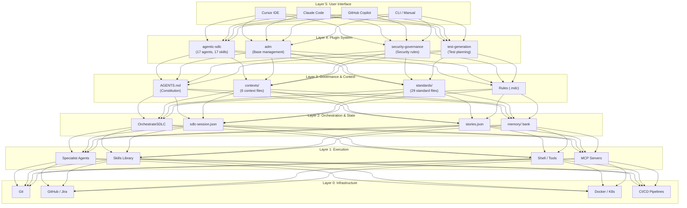

| Layer | Responsibility | Key Artifacts |
|-------|----------------|---------------|
| **5 — UI** | Human interaction point; IDE-specific integration | `.cursor/`, `.claude/`, `.github/` |
| **4 — Plugins** | Packaged agent bundles for specific workflows | `plugins/agentic-sdlc/`, `plugins/adm/` |
| **3 — Governance** | Rules, standards, and context that constrain agent behavior | `AGENTS.md`, `contexts/`, `standards/` |
| **2 — Orchestration** | Pipeline sequencing, state tracking, retry management | `OrchestrateSDLC`, session/memory files |
| **1 — Execution** | Individual agent work, skill invocation, tool use | 16 specialist agents, 17 skills, MCP |
| **0 — Infrastructure** | External systems for persistence, deployment, integration | Git, GitHub, Jira, Docker, K8s |

---

## 3. Agent Hierarchy & Relationships

The framework uses a strict **orchestrator-specialist** hierarchy. The orchestrator is the only agent that maintains state and sequences work. Specialists are stateless workers that receive an A2A envelope and return structured artifacts.

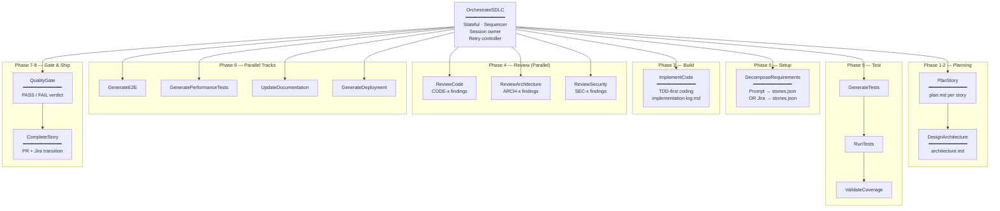

### Agent Inventory (17 Total)

| # | Agent | Role | Stateful? | Phase |
|---|-------|------|-----------|-------|
| 1 | **OrchestrateSDLC** | Pipeline controller, state owner, retry manager | Yes | All |
| 2 | **DecomposeRequirements** | Convert prompt/Jira into stories.json | No | 0 |
| 3 | **PlanStory** | Create plan.md with tasks, file paths, AC | No | 1 |
| 4 | **DesignArchitecture** | Produce architecture.md with boundaries & patterns | No | 2 |
| 5 | **ImplementCode** | TDD-first coding, implementation-log.md | No | 3 |
| 6 | **ReviewCode** | Code quality review (CODE-x findings) | No | 4 |
| 7 | **ReviewArchitecture** | Architecture conformance (ARCH-x findings) | No | 4 |
| 8 | **ReviewSecurity** | OWASP/security audit (SEC-x findings) | No | 4 |
| 9 | **GenerateTests** | Generate unit/integration tests from AC | No | 5 |
| 10 | **RunTests** | Execute test suites, capture results | No | 5 |
| 11 | **ValidateCoverage** | Check coverage against threshold (default 80%) | No | 5 |
| 12 | **GenerateE2E** | End-to-end API/UI journey tests | No | 6 |
| 13 | **GeneratePerformanceTests** | Load, stress, soak test scripts | No | 6 |
| 14 | **UpdateDocumentation** | README, CHANGELOG, OpenAPI, ADRs | No | 6 |
| 15 | **GenerateDeployment** | Dockerfile, K8s, Helm, CI/CD pipelines | No | 6 |
| 16 | **QualityGate** | Aggregate metrics → PASS/FAIL verdict | No | 7 |
| 17 | **CompleteStory** | Push branch, draft PR, Jira transition | No | 8 |

---

## 4. Deterministic Context Loading

Every agent must follow `AGENTS.md` Section 2 to detect project signals and load contexts. This ensures agents never hallucinate project conventions — they load verified evidence from the repository.

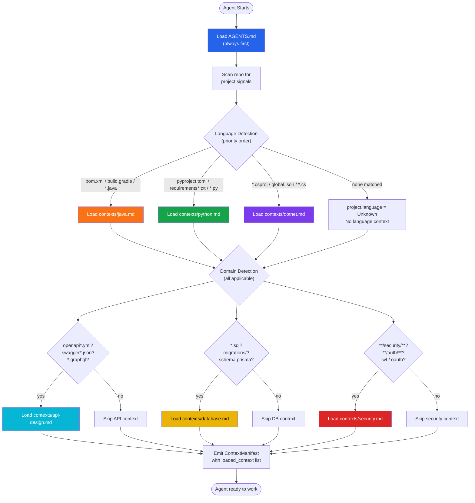

### Context Precedence (Highest → Lowest)


If any context file is missing or cannot be loaded, the agent records the gap and continues — it never fabricates content.

---

## 5. SDLC Orchestration Pipeline

The full pipeline from requirement input to merge-ready PR.

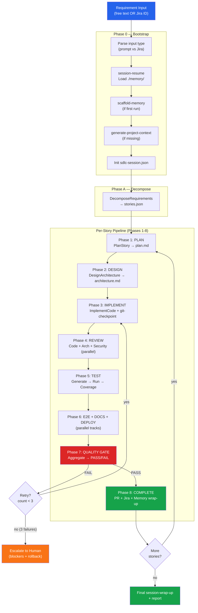

---

## 6. Per-Story Lifecycle (8 Phases)

A detailed view of what each phase produces, consumes, and which agents are involved.

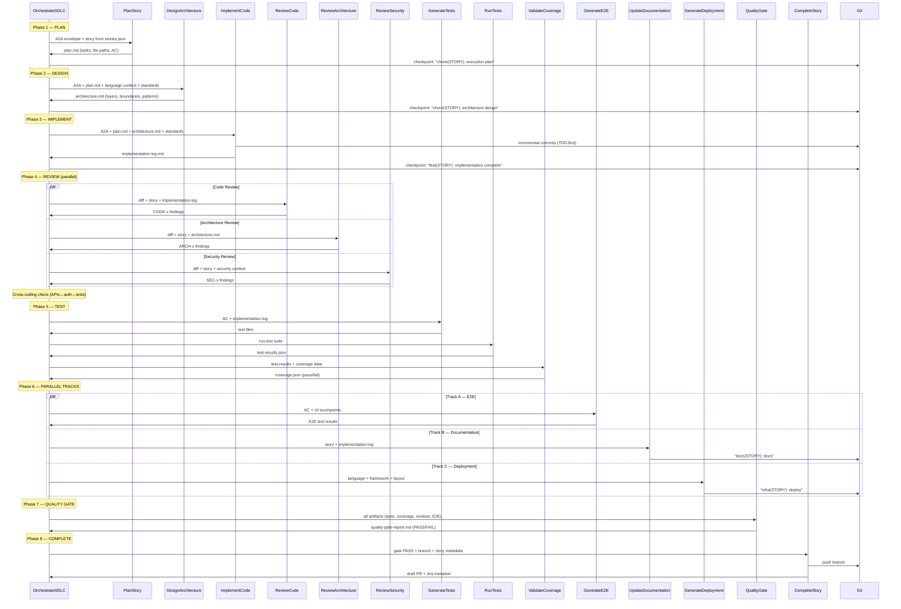

### Phase Artifacts Summary

| Phase | Agent(s) | Input Artifacts | Output Artifacts | Git Checkpoint |
|-------|----------|-----------------|------------------|----------------|
| 0 | Orchestrator | Requirement / Jira ID | `sdlc-session.json` | -- |
| A | DecomposeRequirements | Parsed input | `stories.json` | -- |
| 1 | PlanStory | Story entry | `memory/stories/{id}/plan.md` | `chore({id}): execution plan` |
| 2 | DesignArchitecture | plan.md + contexts | `memory/stories/{id}/architecture.md` | `chore({id}): architecture design` |
| 3 | ImplementCode | plan.md + architecture.md | Source code + `implementation-log.md` | `feat({id}): implementation complete` |
| 4 | ReviewCode/Arch/Security | Diff + implementation-log | CODE-x, ARCH-x, SEC-x findings | -- |
| 5 | GenerateTests/Run/Coverage | AC + implementation-log | `test-results.json`, `coverage.json` | -- |
| 6 | E2E/Docs/Deploy | Story + implementation | E2E results, README, Dockerfile/Helm | `docs({id})`, `infra({id})` |
| 7 | QualityGate | All phase outputs | `quality-gate-report.md` | -- |
| 8 | CompleteStory | Gate PASS + branch | Draft PR, Jira transition | Branch push |

---

## 7. Parallel Execution Model

The framework maximizes throughput by running independent agents in parallel where safe.

```mermaid
gantt
    title Per-Story Phase Execution Timeline
    dateFormat X
    axisFormat %s

    section Sequential
    Phase 1 — Plan           :p1, 0, 1
    Phase 2 — Design         :p2, after p1, 1
    Phase 3 — Implement      :p3, after p2, 3

    section Parallel Reviews (Phase 4)
    ReviewCode               :p4a, after p3, 1
    ReviewArchitecture       :p4b, after p3, 1
    ReviewSecurity           :p4c, after p3, 1

    section Sequential Tests (Phase 5)
    GenerateTests            :p5a, after p4a, 1
    RunTests                 :p5b, after p5a, 1
    ValidateCoverage         :p5c, after p5b, 1

    section Parallel Tracks (Phase 6)
    Track A — E2E            :p6a, after p5c, 2
    Track B — Perf Tests     :p6b, after p5c, 2
    Track C — Documentation  :p6c, after p5c, 1
    Track D — Deployment     :p6d, after p5c, 1

    section Gate & Complete
    Phase 7 — Quality Gate   :p7, after p6a, 1
    Phase 8 — Complete       :p8, after p7, 1
```

### Parallelism Rules

| Phase | Parallelism | Constraint |
|-------|-------------|------------|
| Phase 4 — Reviews | All three reviews run in parallel | Must all complete before Phase 5 |
| Phase 6 — Tracks | E2E, Perf, Docs, Deploy run in parallel | Must all complete before Phase 7; serialize if file conflicts |
| Multi-story | Independent stories may run in parallel | No shared files or migration pipelines |

---

## 8. Retry Loop & Escalation

When phases 4-7 fail, the orchestrator enters a retry loop. After 3 failures, it packages an escalation report for human review.

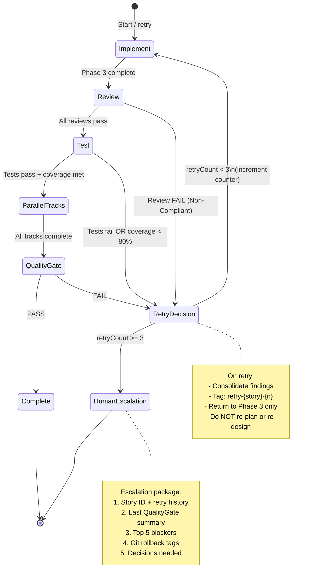

### Retry Behavior Detail

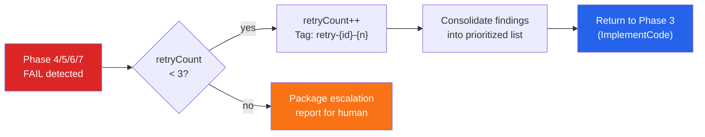

---

## 9. Quality Gate Evaluation

The QualityGate agent evaluates 8 criteria (G1-G8) with deterministic pass/fail checks.

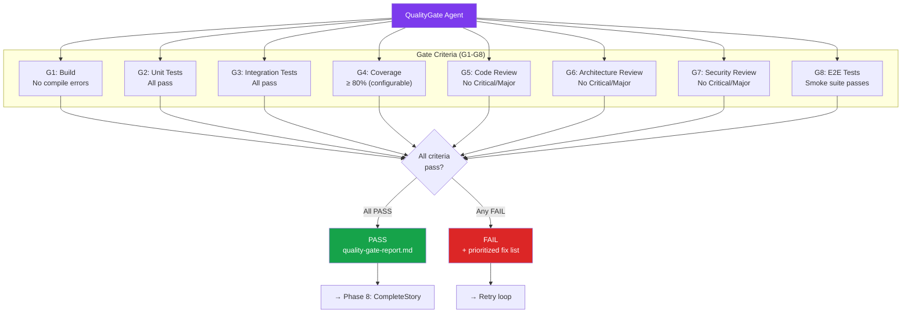

### Default Thresholds

| Gate | Metric | Default Threshold | Override |
|------|--------|-------------------|----------|
| G1 | Build success | No errors | -- |
| G2 | Unit test pass rate | 100% | -- |
| G3 | Integration test pass rate | 100% | -- |
| G4 | Line coverage | ≥ 80% | `configuration.coverageThreshold` |
| G5 | Code review findings | 0 Critical, 0 Major | Policy waiver (disabled by default) |
| G6 | Architecture findings | 0 Critical, 0 Major | Policy waiver (disabled by default) |
| G7 | Security findings | 0 Critical, 0 Major | Never waivable |
| G8 | E2E smoke | All pass | Can disable with `e2eEnabled: false` |

---

## 10. Memory & Context Data Flow

The framework maintains two distinct storage systems: **ephemeral context** (per-run pipeline state) and **persistent memory** (cross-session knowledge bank).

```mermaid
flowchart TD
    subgraph "Ephemeral Context (./context/)"
        CTX_SESSION["sdlc-session.json<br/>Pipeline state, retries,<br/>phase tracking"]
        CTX_STORIES["stories.json<br/>Full backlog contract"]
        CTX_STORY_DIR["context/{story-id}/<br/>test-results.json<br/>coverage.json<br/>quality-gate-report.md<br/>retry-{n}.md"]
    end

    subgraph "Persistent Memory (./memory/)"
        MEM_OVERVIEW["project-overview.md<br/>Identity, stack, conventions"]
        MEM_FEATURES["features.md<br/>Living feature inventory"]
        MEM_DESIGN["system-design.md<br/>Cumulative architecture"]
        MEM_PROGRESS["progress.md<br/>Story completion tracking"]
        MEM_DECISIONS["decisions.md<br/>Architecture decisions log"]
        MEM_OPEN["open-items.md<br/>Blockers, follow-ups"]
        MEM_STORY_DIR["memory/stories/{story-id}/<br/>plan.md<br/>architecture.md<br/>implementation-log.md"]
    end

    subgraph "Skills (read/write)"
        SK_RESUME["session-resume"]
        SK_SCAFFOLD["scaffold-memory"]
        SK_MANAGE["manage-context"]
        SK_WRAPUP["session-wrap-up"]
        SK_GENCTX["generate-project-context"]
    end

    subgraph "Agents (produce artifacts)"
        AG_ORCH["OrchestrateSDLC"]
        AG_DECOMP["DecomposeRequirements"]
        AG_PLAN["PlanStory"]
        AG_DESIGN["DesignArchitecture"]
        AG_IMPL["ImplementCode"]
        AG_QGATE["QualityGate"]
    end

    SK_RESUME -->|reads| MEM_OVERVIEW & MEM_PROGRESS
    SK_SCAFFOLD -->|creates| MEM_OVERVIEW & MEM_FEATURES & MEM_DESIGN & MEM_PROGRESS & MEM_DECISIONS & MEM_OPEN
    SK_MANAGE -->|reads/writes| CTX_SESSION
    SK_WRAPUP -->|persists to| MEM_FEATURES & MEM_DESIGN & MEM_PROGRESS & MEM_DECISIONS & MEM_OPEN
    SK_GENCTX -->|creates| MEM_OVERVIEW

    AG_ORCH -->|updates| CTX_SESSION
    AG_DECOMP -->|writes| CTX_STORIES
    AG_PLAN -->|writes| MEM_STORY_DIR
    AG_DESIGN -->|writes| MEM_STORY_DIR
    AG_IMPL -->|writes| MEM_STORY_DIR
    AG_QGATE -->|writes| CTX_STORY_DIR

    style CTX_SESSION fill:#f97316,color:#fff
    style CTX_STORIES fill:#f97316,color:#fff
    style MEM_OVERVIEW fill:#2563eb,color:#fff
    style MEM_DESIGN fill:#2563eb,color:#fff
```

### Data Flow Timeline

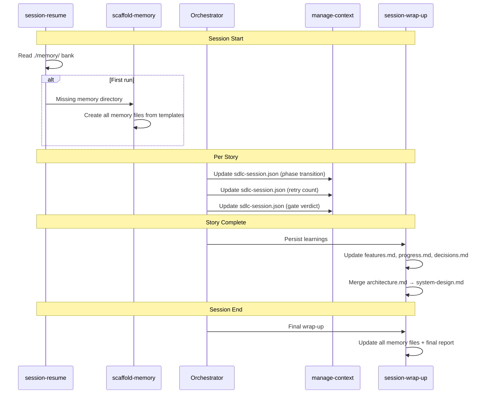

---

## 11. Inter-Agent Communication (A2A Protocol)

All agent-to-agent handoffs use a structured envelope defined in `AGENTS.md`. This ensures traceable, auditable delegation with explicit assumptions and constraints.

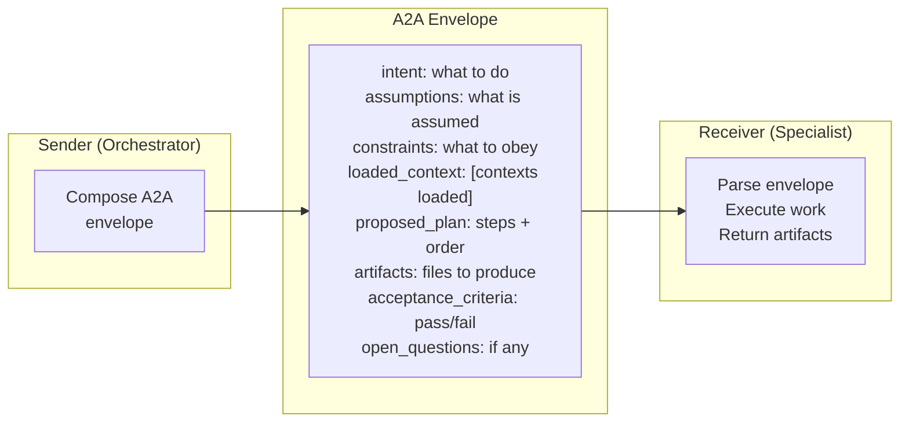

### A2A Example (Orchestrator → ImplementCode)

```
A2A:
intent: Implement STORY-001 — User authentication API with JWT
assumptions: Spring Boot 3.x, PostgreSQL, plan.md and architecture.md are current
constraints: TDD-first, coverage ≥ 80%, no files outside plan.md scope
loaded_context: [java.md, api-design.md, database.md, security.md]
proposed_plan:
  1. Write test stubs from acceptance criteria
  2. Implement AuthController, AuthService, JwtTokenProvider
  3. Implement UserRepository with JPA
  4. Run tests, fix failures
  5. Write implementation-log.md
artifacts: [src/main/java/**, src/test/java/**, implementation-log.md]
acceptance_criteria:
  - All AC tests pass
  - Coverage ≥ 80% for new packages
  - No hardcoded secrets
  - Structured logging with correlation_id
open_questions: none
```

### Communication Topology

```mermaid
graph TD
    O["OrchestrateSDLC<br/>(Hub)"]

    O -->|"A2A"| D["DecomposeRequirements"]
    O -->|"A2A"| P["PlanStory"]
    O -->|"A2A"| A["DesignArchitecture"]
    O -->|"A2A"| I["ImplementCode"]
    O -->|"A2A"| RC["ReviewCode"]
    O -->|"A2A"| RA["ReviewArchitecture"]
    O -->|"A2A"| RS["ReviewSecurity"]
    O -->|"A2A"| GT["GenerateTests"]
    O -->|"A2A"| RT["RunTests"]
    O -->|"A2A"| VC["ValidateCoverage"]
    O -->|"A2A"| E["GenerateE2E"]
    O -->|"A2A"| PF["GeneratePerformanceTests"]
    O -->|"A2A"| DC["UpdateDocumentation"]
    O -->|"A2A"| DP["GenerateDeployment"]
    O -->|"A2A"| QG["QualityGate"]
    O -->|"A2A"| CS["CompleteStory"]

    D -.->|"stories.json"| O
    P -.->|"plan.md"| O
    A -.->|"architecture.md"| O
    I -.->|"implementation-log.md"| O
    RC -.->|"CODE-x findings"| O
    RA -.->|"ARCH-x findings"| O
    RS -.->|"SEC-x findings"| O
    QG -.->|"PASS/FAIL"| O
    CS -.->|"PR URL"| O

    style O fill:#2563eb,color:#fff
```

The orchestrator is the **sole hub** — specialists never communicate directly with each other. This star topology ensures a single point of truth for sequencing and state.

---

## 12. Multi-IDE Support Architecture

The framework packages the same 17 agents and skills into three IDE-native formats, ensuring consistent behavior regardless of development environment.

```mermaid
flowchart TD
    subgraph "Shared Core"
        AGENTS["AGENTS.md"]
        CONTEXTS["contexts/<br/>6 files"]
        STANDARDS["standards/<br/>29 files"]
        TEMPLATES["deployment-templates/<br/>29 files"]
        WORKFLOWS["workflows/"]
    end

    subgraph "Cursor Package"
        C_AGENTS[".cursor/agents/<br/>+ plugins/agentic-sdlc/cursor/agents/"]
        C_SKILLS[".cursor/skills/<br/>+ plugins/agentic-sdlc/cursor/skills/"]
        C_RULES[".cursor/rules/<br/>.mdc files"]
        C_HOOKS[".cursor/hooks/<br/>PowerShell/bash"]
        C_MCP[".cursor/mcp.json"]
    end

    subgraph "Claude Code Package"
        CL_AGENTS[".claude/agents/<br/>+ plugins/agentic-sdlc/claude/agents/"]
        CL_SKILLS[".claude/skills/<br/>+ plugins/agentic-sdlc/claude/skills/"]
        CL_RULES[".claude/rules/"]
        CL_HOOKS[".claude/hooks/<br/>bash scripts"]
        CL_SETTINGS[".claude/settings.json"]
    end

    subgraph "Copilot Package"
        CP_AGENTS[".github/agents/<br/>+ plugins/agentic-sdlc/copilot/agents/"]
        CP_INSTRUCTIONS[".github/copilot-instructions.md"]
        CP_WORKFLOWS[".github/workflows/<br/>CI/CD"]
    end

    AGENTS --> C_AGENTS & CL_AGENTS & CP_AGENTS
    CONTEXTS --> C_SKILLS & CL_SKILLS
    STANDARDS --> C_RULES & CL_RULES

    style AGENTS fill:#dc2626,color:#fff
    style C_AGENTS fill:#2563eb,color:#fff
    style CL_AGENTS fill:#f97316,color:#fff
    style CP_AGENTS fill:#16a34a,color:#fff
```

### Feature Comparison Matrix

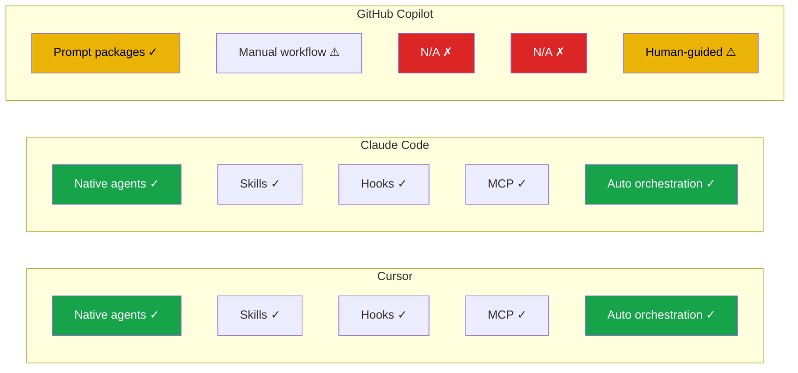

| Capability | Cursor | Claude Code | Copilot |
|------------|--------|-------------|---------|
| Native multi-agent runtime | Yes | Yes | No (manual) |
| Automatic orchestration | Yes | Yes | Human plays orchestrator |
| Skills / reusable prompts | Yes (SKILL.md) | Yes (SKILL.md) | Manual copy-paste |
| Hooks / guardrails | PowerShell + bash | bash | Branch protection + CI |
| MCP integration | Configured in IDE | Configured in IDE | GitHub UI or Actions |
| Session state | `sdlc-session.json` | `sdlc-session.json` | Manual persistence |

---

## 13. Plugin Architecture

Plugins are self-contained packages that bundle agents, skills, standards, and deployment templates for a specific workflow.

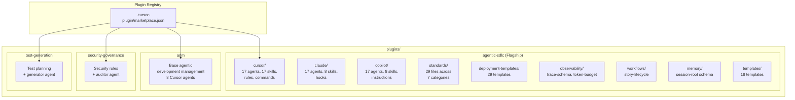

### Agentic-SDLC Plugin Inventory

| Category | Count | Examples |
|----------|-------|---------|
| **Agents** | 17 per IDE (51 total) | OrchestrateSDLC, ImplementCode, QualityGate |
| **Skills** | 17 (Cursor), 8 (Claude), 8 (Copilot) | manage-context, git-checkpoint, quality-gate |
| **Standards** | 29 files in 7 categories | Coding (9), Project structures (9), API (1), DB (1), Security (1), UI (4), Deployment (4) |
| **Deployment Templates** | 29 files in 4 categories | Dockerfiles (6), Helm (11), Kubernetes (5), Pipelines (3) |
| **Templates** | 18 files | Story, quality-gate-report, handover, memory-bank (5), specs (3) |
| **Observability** | 2 files | `trace-schema.json`, `token-budget.json` |
| **Workflows** | 1 file | `story-lifecycle.md` |

---

## 14. Standards & Governance Model

Standards are organized into 7 categories and act as constraints that agents must follow during implementation and review.

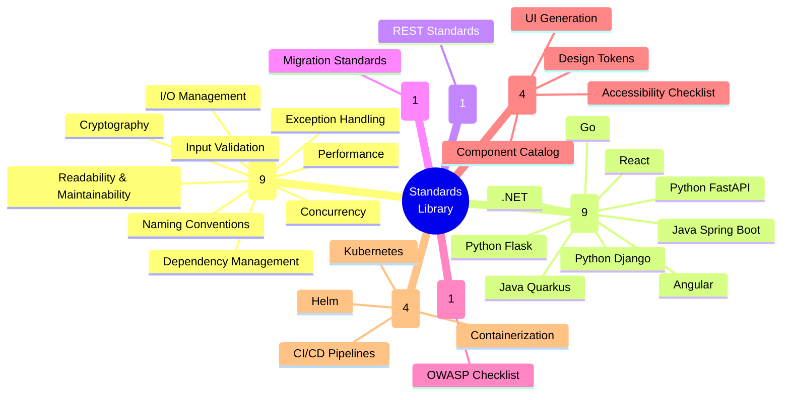

### How Standards Flow Through the Pipeline

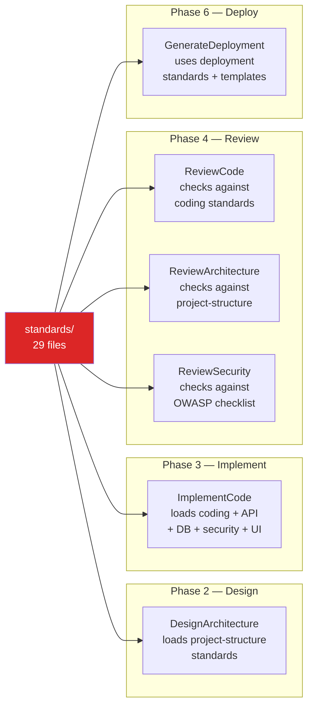

---

## 15. Deployment Templates Architecture

The framework provides ready-to-use deployment templates spanning containers, orchestration, and CI/CD across multiple cloud providers.

```mermaid
graph TD
    subgraph "Dockerfiles (6)"
        D1["java-spring.Dockerfile"]
        D2["python-fastapi.Dockerfile"]
        D3["go.Dockerfile"]
        D4["dotnet.Dockerfile"]
        D5["react.Dockerfile"]
        D6["angular.Dockerfile"]
    end

    subgraph "Kubernetes (5)"
        K1["deployment.yaml"]
        K2["service.yaml"]
        K3["ingress.yaml"]
        K4["hpa.yaml"]
        K5["configmap.yaml"]
    end

    subgraph "Helm Chart"
        H0["Chart.yaml"]
        H1["values.yaml (base)"]
        subgraph "Environment Overlays"
            HE1["values-dev.yaml"]
            HE2["values-staging.yaml"]
            HE3["values-prod.yaml"]
            HE4["values-onprem.yaml"]
        end
        subgraph "Cloud Provider Overlays"
            HC1["values-aws-eks.yaml"]
            HC2["values-azure-aks.yaml"]
            HC3["values-gcp-gke.yaml"]
        end
        subgraph "Templates"
            HT1["deployment.yaml"]
            HT2["service.yaml"]
            HT3["ingress.yaml"]
            HT4["hpa.yaml"]
            HT5["configmap.yaml"]
            HT6["_helpers.tpl"]
        end
    end

    subgraph "CI/CD Pipelines (3)"
        P1["github-actions-docker.yaml"]
        P2["azure-pipelines.yaml"]
        P3["cloudbuild.yaml"]
    end

    DETECT["detect-deployment<br/>skill"] --> D1 & D2 & D3 & D4 & D5 & D6
    DETECT --> K1 & K2 & K3 & K4 & K5
    DETECT --> H0
    DETECT --> P1 & P2 & P3

    style DETECT fill:#7c3aed,color:#fff
```

---

## 16. Session Lifecycle & State Machine

Each story progresses through a deterministic state machine tracked in `sdlc-session.json`.

```mermaid
stateDiagram-v2
    [*] --> pending: Story created

    pending --> in_progress: Orchestrator picks story

    state in_progress {
        [*] --> plan
        plan --> design
        design --> implement
        implement --> review
        review --> test: Reviews pass
        review --> implement: Reviews fail (retry)
        test --> e2e_docs_deploy: Tests pass
        test --> implement: Tests fail (retry)
        e2e_docs_deploy --> gate
        gate --> complete: PASS
        gate --> implement: FAIL (retry < 3)
    }

    in_progress --> completed: Phase 8 done
    in_progress --> failed: Retry >= 3
    failed --> escalated: Human review

    completed --> [*]
    escalated --> [*]
```

### Session JSON Schema (Simplified)

```mermaid
classDiagram
    class SDLCSession {
        +String sessionId
        +DateTime startedAt
        +String status
        +String inputType
        +String sourceId
        +String branch
        +Story[] stories
        +DetectedStack detectedStack
        +Configuration configuration
        +Metrics metrics
    }

    class Story {
        +String id
        +String title
        +String status
        +Int retryCount
        +String currentPhase
        +String lastCheckpoint
        +String gateVerdict
        +String[] dependencies
    }

    class DetectedStack {
        +StackInfo backend
        +StackInfo frontend
        +String database
        +String infrastructure
    }

    class Configuration {
        +Int coverageThreshold
        +Int maxRetriesPerStory
        +Bool humanInTheLoop
        +Bool e2eEnabled
        +Bool deploymentGeneration
    }

    class Metrics {
        +Int totalTokens
        +Int totalDurationMs
        +Int storiesCompleted
        +Int storiesTotal
    }

    SDLCSession "1" --> "*" Story
    SDLCSession "1" --> "1" DetectedStack
    SDLCSession "1" --> "1" Configuration
    SDLCSession "1" --> "1" Metrics
```

---

## 17. Observability & Token Budget

The framework tracks token consumption and emits structured traces for pipeline observability.

```mermaid
flowchart LR
    subgraph "Token Budget System"
        TB["token-budget.json<br/>Per-phase ceilings"]
        TC["trace-collector<br/>skill"]
    end

    subgraph "Phase Budgets"
        B1["Decompose: budget"]
        B2["Plan: budget"]
        B3["Design: budget"]
        B4["Implement: budget"]
        B5["Review: budget"]
        B6["Test: budget"]
        B7["E2E/Docs: budget"]
        B8["Gate: budget"]
    end

    subgraph "Trace Output"
        TR["Structured trace records<br/>per trace-schema.json"]
        MET["Session metrics<br/>totalTokens, duration"]
    end

    TB --> B1 & B2 & B3 & B4 & B5 & B6 & B7 & B8
    TC --> TR --> MET
    MET --> HANDOVER["Handover trigger<br/>if context saturated"]

    style TB fill:#7c3aed,color:#fff
    style HANDOVER fill:#f97316,color:#fff
```

### Handover Mechanism

When the context window approaches saturation (accumulated logs, repeated failures, large tool responses), the orchestrator triggers a **handover**:

1. Package session path, current phase, failing artifacts
2. Produce explicit next-step checklist
3. Persist via `session-wrap-up` to `./memory/`
4. Fresh orchestrator instance resumes via `session-resume`

---

## 18. End-to-End Request Flow

A complete trace of a user request flowing through the entire system.

```mermaid
sequenceDiagram
    actor Dev as Developer
    participant IDE as IDE (Cursor)
    participant ORCH as OrchestrateSDLC
    participant CTX as Context Loader
    participant DEC as DecomposeRequirements
    participant PS as PlanStory
    participant DA as DesignArchitecture
    participant IC as ImplementCode
    participant REV as Reviewers (×3)
    participant TST as Test Pipeline
    participant PAR as Parallel Tracks
    participant QG as QualityGate
    participant CS as CompleteStory
    participant GIT as Git/GitHub

    Dev->>IDE: "@OrchestrateSDLC Build a REST API..."
    IDE->>ORCH: Parse requirement

    Note over ORCH: Phase 0 — Bootstrap
    ORCH->>ORCH: session-resume (load memory)
    ORCH->>CTX: Detect project signals
    CTX->>CTX: Scan for pom.xml, *.py, etc.
    CTX-->>ORCH: ContextManifest [java.md, api-design.md, security.md]
    ORCH->>ORCH: Init sdlc-session.json

    Note over ORCH: Phase A — Decompose
    ORCH->>DEC: A2A: decompose requirement
    DEC->>DEC: Interview / extract capabilities
    DEC-->>ORCH: stories.json (3 stories)

    loop For each story
        Note over ORCH: Phase 1 — Plan
        ORCH->>PS: A2A: plan STORY-001
        PS-->>ORCH: plan.md
        ORCH->>GIT: checkpoint

        Note over ORCH: Phase 2 — Design
        ORCH->>DA: A2A: design STORY-001
        DA-->>ORCH: architecture.md
        ORCH->>GIT: checkpoint

        Note over ORCH: Phase 3 — Implement
        ORCH->>IC: A2A: implement STORY-001
        IC->>GIT: TDD commits
        IC-->>ORCH: implementation-log.md
        ORCH->>GIT: checkpoint

        Note over ORCH: Phase 4 — Review (parallel)
        ORCH->>REV: A2A: review code + arch + security
        REV-->>ORCH: findings (CODE-x, ARCH-x, SEC-x)

        alt Findings are Critical/Major
            ORCH->>ORCH: Increment retry → Phase 3
        end

        Note over ORCH: Phase 5 — Test
        ORCH->>TST: Generate → Run → Validate
        TST-->>ORCH: test-results.json + coverage.json

        alt Coverage < 80% or tests fail
            ORCH->>ORCH: Increment retry → Phase 3
        end

        Note over ORCH: Phase 6 — Parallel Tracks
        ORCH->>PAR: E2E + Perf + Docs + Deploy
        PAR-->>ORCH: All track results

        Note over ORCH: Phase 7 — Quality Gate
        ORCH->>QG: Aggregate all evidence
        QG-->>ORCH: PASS / FAIL

        alt PASS
            Note over ORCH: Phase 8 — Complete
            ORCH->>CS: Finalize story
            CS->>GIT: Push branch + draft PR
            CS-->>ORCH: PR URL + Jira update
        else FAIL (retries exhausted)
            ORCH->>Dev: Escalation package
        end

        ORCH->>ORCH: session-wrap-up (persist to memory)
    end

    ORCH->>ORCH: Final session-wrap-up + report
    ORCH-->>Dev: All stories complete. PR links + summary.
```

---

## Appendix A: Repository File Map

```
agentic-workflow/
├── AGENTS.md                              # Constitution (single source of truth)
├── CLAUDE.md                              # Wrapper → AGENTS.md
├── ARCHITECTURE.md                        # This document
├── README.md                              # Project overview
│
├── contexts/                              # 6 context files + PROJECT_CONTEXT.md
│   ├── java.md                            # Java conventions
│   ├── python.md                          # Python conventions
│   ├── dotnet.md                          # .NET conventions
│   ├── api-design.md                      # REST/GraphQL patterns
│   ├── database.md                        # Migration + query safety
│   └── security.md                        # Auth, secrets, OWASP
│
├── .cursor/                               # Cursor IDE integration
│   ├── agents/                            # 4 base agents
│   ├── skills/                            # 5 skills
│   ├── rules/                             # .mdc auto-applied rules
│   └── hooks/                             # Lifecycle hooks
│
├── .claude/                               # Claude Code integration
│   ├── agents/                            # 4 base agents
│   ├── skills/                            # 5 skills
│   ├── rules/                             # Context rules
│   └── settings.json                      # Hook configuration
│
└── plugins/
    ├── agentic-sdlc/                      # Flagship SDLC plugin
    │   ├── cursor/agents/    (17)         # Cursor agent definitions
    │   ├── cursor/skills/    (17)         # Cursor skills
    │   ├── cursor/commands/  (4)          # Cursor slash commands
    │   ├── claude/agents/    (17)         # Claude agent definitions
    │   ├── claude/skills/    (8)          # Claude skills
    │   ├── copilot/agents/   (17)         # Copilot agent definitions
    │   ├── copilot/skills/   (8)          # Copilot skills
    │   ├── standards/        (29)         # Coding, API, DB, security, UI, deploy
    │   ├── deployment-templates/ (29)     # Docker, K8s, Helm, CI/CD
    │   ├── templates/        (18)         # Story, quality-gate, memory-bank, specs
    │   ├── observability/    (2)          # Trace schema, token budget
    │   ├── workflows/        (1)          # Story lifecycle walkthrough
    │   └── memory/           (1)          # Session root schema
    │
    ├── adm/                               # Base agentic development management
    ├── security-governance/               # Security rules + auditor
    └── test-generation/                   # Test planning + generator
```

---

## Appendix B: Skills Inventory (17 Agentic-SDLC Skills)

```mermaid
graph TD
    subgraph "Context & State Management"
        S1["manage-context<br/>Read/write session JSON"]
        S2["detect-language<br/>Identify project language"]
        S3["compact-context<br/>Summarize for token budget"]
        S4["scaffold-memory<br/>Create memory bank"]
        S5["generate-project-context<br/>Scan repo → PROJECT_CONTEXT.md"]
        S6["session-resume<br/>Load memory on startup"]
        S7["session-wrap-up<br/>Persist learnings"]
    end

    subgraph "Pipeline Operations"
        S8["decompose-requirements<br/>Break into stories"]
        S9["git-checkpoint<br/>Tagged commits at phases"]
        S10["run-tests<br/>Execute test suites"]
        S11["validate-coverage<br/>Check threshold"]
        S12["generate-e2e<br/>E2E journey tests"]
        S13["quality-gate<br/>G1-G8 evaluation"]
        S14["detect-deployment<br/>Identify deploy target"]
    end

    subgraph "Delegation & Observability"
        S15["ad-hoc-delegate<br/>Dynamic specialist dispatch"]
        S16["handover<br/>Package state for new instance"]
        S17["trace-collector<br/>Structured trace records"]
    end
```

---

## Appendix C: Glossary

| Term | Definition |
|------|-----------|
| **AGENTS.md** | The constitutional document governing all AI agent behavior in the repository |
| **A2A Envelope** | Structured handoff format between agents (intent, assumptions, constraints, etc.) |
| **Context Loading** | Deterministic process of detecting project signals and loading relevant `contexts/*.md` files |
| **Quality Gate** | Automated checkpoint evaluating 8 criteria (build, tests, coverage, reviews, E2E) |
| **Story** | A discrete, implementable unit of work decomposed from a requirement |
| **Session** | A single pipeline run tracked in `sdlc-session.json` |
| **Memory Bank** | Persistent cross-session knowledge in `./memory/` (survives restarts) |
| **Ephemeral Context** | Per-run state in `./context/` (may be reset between sessions) |
| **Handover** | Process of packaging state for a fresh orchestrator when context is saturated |
| **Specialist Agent** | A stateless agent that performs a single focused task and returns artifacts |
| **Orchestrator** | The only stateful agent; controls sequencing, retries, and session truth |
| **MCP** | Model Context Protocol — integration layer for external tools (GitHub, Jira) |
