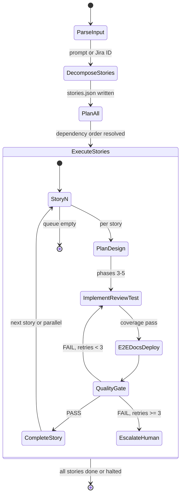
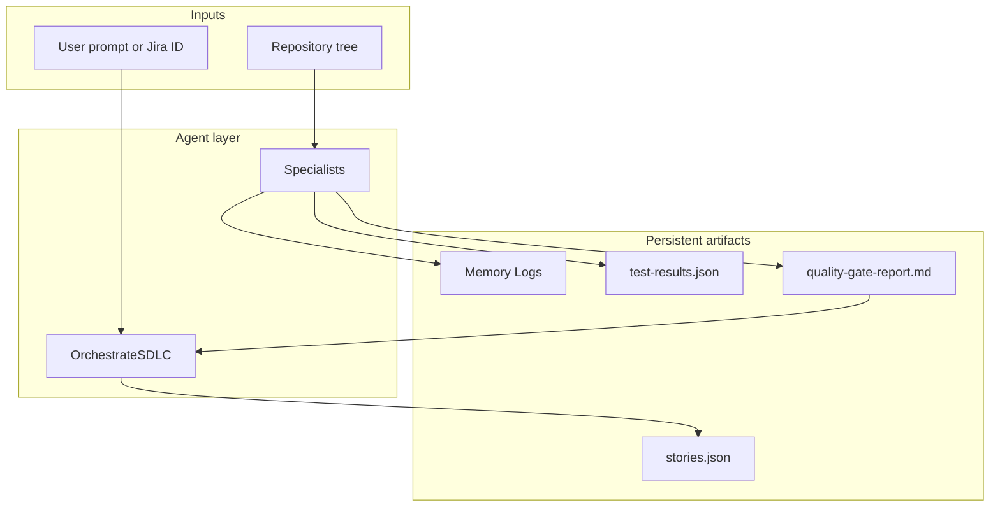
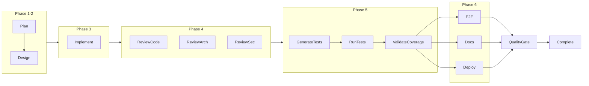
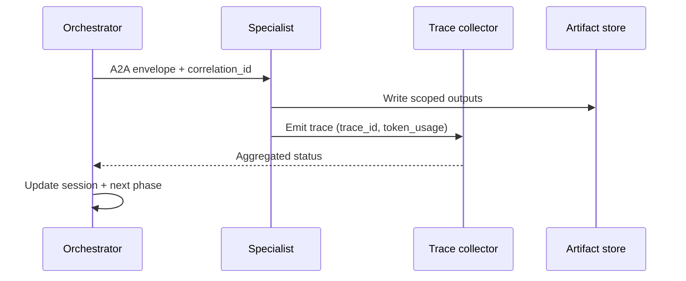

# Agentic SDLC Plugin

Autonomous, multi-agent software delivery for **Cursor**, **Claude Code**, and **GitHub Copilot**. This README is the **single standalone reference** for architecture, agents, skills, workflows, guardrails, observability, and operations.

---

## Table of Contents

1. [Overview](#1-overview)
2. [Architecture](#2-architecture)
3. [Agent Catalog](#3-agent-catalog)
4. [Skill Catalog](#4-skill-catalog)
5. [Workflow Reference](#5-workflow-reference)
6. [Retry and Rollback](#6-retry-and-rollback)
7. [Quality Gate Criteria](#7-quality-gate-criteria)
8. [Context Management](#8-context-management)
9. [Multi-Language Support](#9-multi-language-support)
10. [Installation](#10-installation)
11. [Usage Examples](#11-usage-examples)
12. [Sample Story Lifecycle](#12-sample-story-lifecycle)
13. [Inter-Agent Communication (A2A)](#13-inter-agent-communication-a2a)
14. [Configuration](#14-configuration)
15. [Guardrails and Safety](#15-guardrails-and-safety)
16. [Observability and Tracing](#16-observability-and-tracing)
17. [Context Engineering](#17-context-engineering)
18. [A2A Protocol Readiness](#18-a2a-protocol-readiness)
19. [CI/CD Integration](#19-cicd-integration)
20. [Memory System and Handover](#20-memory-system-and-handover)
21. [Context Scoping](#21-context-scoping)
22. [Ad-Hoc Delegation](#22-ad-hoc-delegation)
23. [Model Selection Guide](#23-model-selection-guide)
24. [Relationship to ADM Plugin](#24-relationship-to-adm-plugin)
25. [Standards Enforcement](#25-standards-enforcement)
26. [Troubleshooting](#26-troubleshooting)
27. [Contributing](#27-contributing)

---

## 1. Overview

### What this plugin does

The **Agentic SDLC Plugin** packages **specialist AI agents**, **reusable skills**, **prompt templates**, **standards**, **deployment artifacts**, **guardrails**, and **observability contracts** so a team can run a **repeatable** pipeline from requirements to merge-ready pull requests—with explicit **quality gates**, **retries**, and **human escalation** when automation hits its limits.

### Problem it solves

Traditional AI coding assistants are **single-threaded** and **session-fragile**: they lose scope, skip verification, and struggle with **multi-step delivery** (design → implement → review → test → document → deploy → gate). This plugin encodes an **orchestrator + specialists** model with **file-backed state**, **deterministic rubrics**, and **IDE-specific packaging** so delivery stays **auditable** and **bounded**.

### Key capabilities

| Capability | Description |
|------------|-------------|
| **Multi-story orchestration** | Decompose a large prompt or Jira Feature into **structured stories** with dependencies; run stories **in parallel** when safe, or **sequentially** when ordered by `stories.json`. |
| **Autonomous SDLC** | Eight-phase lifecycle per story: **Plan → Design → Implement → Review → Test → E2E/Docs/Deploy → Quality Gate → Complete**, with **git checkpoints** and **retry routing** back to implementation. |
| **Multi-IDE support** | **Cursor** (native agents + skills + hooks), **Claude Code** (plugin manifest, agents, skills, hooks, MCP), **GitHub Copilot** (instruction and agent markdown as **prompt packages**; human plays orchestrator). |

### Non-goals (explicit)

| This plugin does **not** | Rationale |
|---------------------------|-----------|
| Replace **human judgment** for product priority, security exceptions, or production change approval | Automation proposes; humans own risk acceptance (Tier 3). |
| Guarantee **green CI** on every host | Local sandboxes differ from CI images; agents must surface deltas. |
| Store **long-lived secrets** in repo files | Secrets belong in vaults and CI secret stores only. |
| Run **unbounded** autonomous loops | Retry ceiling + token cap + escalation are core contracts. |

### Who should use this

- Teams that already follow **`AGENTS.md`**-style governance and want **repeatable** multi-step delivery.
- Platform engineers wiring **MCP** (GitHub, Jira) for **traceable** evidence in PR/issue trackers.
- Organizations that need **audit-friendly** artifacts: Memory Logs, quality gate reports, tagged retries.

### Repository layout (high level)

| Path | Role |
|------|------|
| `cursor/agents/` | Cursor agent definitions (16 specialists + orchestrator) |
| `cursor/skills/` | Cursor skills (13) |
| `claude/agents/`, `claude/skills/` | Claude Code equivalents |
| `copilot/` | Copilot Chat packaging (`agents/`, `workflows/`, `copilot-instructions.md`) |
| `contexts/` | Sample **runtime** context (`stories.json`, `test-results.json`) |
| `memory/` | Session root template (`session-root.md`) |
| `templates/` | Memory logs, quality gate, coverage, delegation prompts |
| `standards/` | Coding, deployment, and project-structure standards |
| `workflows/` | Canonical workflow docs (`full-sdlc.md`, `retry-loop.md`, etc.) |
| `observability/` | Trace schema and token budgets |
| `deployment-templates/` | Docker, Kubernetes, Helm, CI/CD samples |

---

## 2. Architecture

### Orchestrator pattern

A single **orchestrator agent** (`OrchestrateSDLC`) owns **sequencing**, **session truth**, **parallelization decisions**, and **escalation**. **Specialist agents** are **stateless by default**: they consume **handoff envelopes**, write **scoped artifacts**, and return **structured results**. The orchestrator never substitutes for **ImplementCode** on product code.

### High-level state machine (multi-story)



### Internal story states (orchestration view)

The orchestrator tracks, per story: **phase**, **retry_count**, **checkpoint tags**, and **pointers** to evidence files—not raw logs in the main thread.

### Inter-agent JSON envelope contract

All delegations should carry the **A2A block** mandated by workspace `AGENTS.md` (see [Section 13](#13-inter-agent-communication-a2a)). This keeps **assumptions**, **constraints**, and **acceptance criteria** explicit for **stateless** specialists.

### Sixteen agents (runtime surface)

The **trace schema** (`observability/trace-schema.json`) enumerates **16** agent names as the canonical set for logging and audits:

`OrchestrateSDLC`, `DecomposeRequirements`, `PlanStory`, `DesignArchitecture`, `ImplementCode`, `ReviewCode`, `ReviewArchitecture`, `ReviewSecurity`, `GenerateTests`, `RunTests`, `ValidateCoverage`, `GenerateE2E`, `GenerateDeployment`, `UpdateDocumentation`, `QualityGate`, `CompleteStory`.

> **Note:** The workflow diagram in `workflows/full-sdlc.md` also references **CrossCuttingCheck** after parallel reviews—that is **orchestrator logic** (compliance aggregation), not a separate named trace agent.

### Data flow (evidence chain)



---

## 3. Agent Catalog

Full roster: **16** agents. **Model tier** is a **recommendation**; override via org policy. **User-invocable** means suitable as a top-level user request in Cursor/Claude; internal agents are normally **orchestrator-delegated**.

| # | Name | Responsibility | Model tier | User-invocable | Primary inputs | Primary outputs |
|---|------|----------------|------------|----------------|----------------|-----------------|
| 1 | **OrchestrateSDLC** | Session sequencing, parallelization, state, escalation | Premium | Yes | Raw prompt or Jira ID; `sdlc-session.json` | Phase reports; delegation; halt/escalate |
| 2 | **DecomposeRequirements** | Prompt/Jira → `stories.json`, AC, dependencies | Premium | Yes (optional) | Prompt text or Jira Feature/Epic | `./context/stories.json` (or merged path) |
| 3 | **PlanStory** | Scoped execution plan, affected files | Mid | No | Story record; repo | `./memory/stories/{id}/plan.md` |
| 4 | **DesignArchitecture** | Architecture/ADR-style decisions for implementers | Premium | No | Plan; standards | `architecture.md` / ADR artifacts |
| 5 | **ImplementCode** | **Only** product code changes (TDD-friendly) | Premium | No | Plan + design; findings from reviews/tests | Code + unit tests; Memory Log |
| 6 | **ReviewCode** | Code quality, patterns, test gaps | Mid | No | Diff scope; standards | Findings list with file paths |
| 7 | **ReviewArchitecture** | Alignment with design & boundaries | Premium | No | Design artifacts; diff | Arch findings |
| 8 | **ReviewSecurity** | OWASP-oriented review | Premium | No | Diff; threat context | Security findings |
| 9 | **GenerateTests** | Supplement tests where gaps exist | Mid | No | Coverage/review hints | Tests |
| 10 | **RunTests** | Execute test suite; capture structured results | Fast | No | Story id; commands | `test-results.json` pointers; logs |
| 11 | **ValidateCoverage** | Enforce coverage thresholds | Fast | No | Reports | Pass/fail + gap report |
| 12 | **GenerateE2E** | E2E scenarios for story scope | Mid | No | AC; APIs | E2E tests |
| 13 | **UpdateDocumentation** | README/runbooks/changelog as needed | Fast | No | Behavior delta | Doc edits |
| 14 | **GenerateDeployment** | Docker/K8s/Helm/CI snippets | Mid | No | Stack; targets | Deployment files |
| 15 | **QualityGate** | Aggregate deterministic rubric → verdict | Premium | No | All evidence artifacts | `quality-gate-report.md` |
| 16 | **CompleteStory** | PR creation, Jira updates, closure | Mid | No | Gate PASS | PR URL; tracker updates |

---

## 4. Skill Catalog

There are **13** Cursor skills under `cursor/skills/`. Claude Code ships overlapping skills under `claude/skills/` (subset); behaviors align on **contracts** (inputs/outputs), not file count.

| Skill name | Purpose | Typically invoked by |
|------------|---------|-------------------------|
| **ad-hoc-delegate** | Disposable specialist for **blockers**; isolated context; discard after merge | ImplementCode, RunTests, orchestrator on spiral risk |
| **compact-context** | Summarize/overlap context to avoid window overflow | Orchestrator, long-running phases |
| **decompose-requirements** | Structured decomposition prompts + story shape | DecomposeRequirements |
| **detect-deployment** | Infer delivery targets (containers, Helm, CI) | GenerateDeployment |
| **detect-language** | Evidence-based language/framework detection | PlanStory, ImplementCode, test agents |
| **generate-e2e** | E2E generation patterns | GenerateE2E |
| **git-checkpoint** | Conventional checkpoint commits/tags | ImplementCode, orchestrator |
| **handover** | Two-artifact handover when context saturates | OrchestrateSDLC |
| **manage-context** | Safe read/write of session JSON fields | OrchestrateSDLC |
| **quality-gate** | Rubric packaging and report shaping | QualityGate |
| **run-tests** | Command inference + execution patterns | RunTests |
| **trace-collector** | Assemble trace records per agent invocation | All agents (via orchestrator policy) |
| **validate-coverage** | Parse coverage; compare to thresholds | ValidateCoverage |

---

## 5. Workflow Reference

### Eight-phase story lifecycle

| Phase | Name | Agents (typical) | Notes |
|-------|------|------------------|-------|
| 1 | **PLAN** | PlanStory | One-time per **attempt** at story start |
| 2 | **DESIGN** | DesignArchitecture | One-time per **attempt** |
| 3 | **IMPLEMENT** | ImplementCode + **git-checkpoint** | Re-entered on retry from downstream |
| 4 | **REVIEW** | ReviewCode ∥ ReviewArchitecture ∥ ReviewSecurity → **Cross-cutting** | Parallel reviews; then aggregate compliance |
| 5 | **TEST** | GenerateTests → RunTests → ValidateCoverage | Coverage threshold default **80%** line (policy may add branch) |
| 6 | **E2E + DOCS + DEPLOY** | GenerateE2E ∥ UpdateDocumentation ∥ GenerateDeployment | Parallel **tracks** after coverage passes |
| 7 | **QUALITY GATE** | QualityGate | Deterministic rubric + AI synthesis |
| 8 | **COMPLETE** | CompleteStory | Only after **PASS** |

### Mermaid — phases and parallelization



### Parallelization rules

| Rule | Detail |
|------|--------|
| **Reviews** | **Three-way parallel** when tooling allows; then **cross-cutting** check before tests. |
| **Phase 6** | **E2E**, **Docs**, and **Deploy** run as **parallel tracks** after **ValidateCoverage** passes. |
| **Multi-story** | Stories with **no dependency edge** and **non-overlapping** critical files (per plan) may run in **parallel**; otherwise **serialize**. |
| **Retries** | **Plan** and **Design** do **not** re-run on retry—implementation and downstream phases do (see [Section 6](#6-retry-and-rollback)). |

Canonical detail: `workflows/full-sdlc.md`.

---

## 6. Retry and Rollback

### Retry ceiling

- **Maximum 3 retries** per story for failure routes that return to implementation (see `GUARDRAILS.md` **Sign 3**).
- **Escalation** to a human with full evidence after the ceiling.

### What triggers a retry

| Trigger | Route |
|---------|-------|
| Cross-cutting **non-compliance** after reviews | Phase 3 |
| **Coverage** below threshold | Phase 3 with gap report |
| **E2E** failure | Phase 3 with E2E findings |
| **Quality gate** FAIL | Phase 3 with prioritized fix list |

### Git tags and rollback

- Each retry should create a **`retry-{story-id}-{n}`** tag (see `workflows/retry-loop.md`).
- **Rollback:** `git reset --hard <tag>` only with **team approval**—destructive to subsequent commits on the branch.

### Restart point

- Retries **restart from Implement (Phase 3)** onward—not from Plan or Design—unless a human **resets** the story.

Full protocol: `workflows/retry-loop.md`.

---

## 7. Quality Gate Criteria

Deterministic rubric (from `prompts/quality-gate-criteria.md`). **SKIPPED** requires documented rationale.

| Gate | Criteria (summary) | Severity |
|------|-------------------|----------|
| **G1** — Build | Clean compile/build; exit 0 | REQUIRED |
| **G2** — Unit tests | All tests pass; no unapproved skips | REQUIRED |
| **G3** — Coverage | Line (and branch if policy) ≥ threshold; waivers tracked | REQUIRED |
| **G4** — Security (SAST/SCA) | No **critical**; **high** waived per policy | REQUIRED |
| **G5** — Code review | Branch policy satisfied | REQUIRED |
| **G6** — Architecture review | Mandatory arch review for high-risk, or low-risk classification | REQUIRED / ADVISORY per org |
| **G7** — E2E | Targeted E2E green for story scope | REQUIRED (or **SKIPPED** with cause) |
| **G8** — Documentation | Ops/runbook/README updates when behavior or ops change | REQUIRED / ADVISORY per change class |

**Overall:** **PASS** iff all non-skipped gates **PASS**; **FAIL** otherwise (unless waiver covers **non-compile** / **non-critical** per policy).

Template output: `templates/quality-gate-report.md`.

---

## 8. Context Management

### Directory layout

Runtime state is **workspace-local** (adjust paths to your repo policy):

| Path | Purpose |
|------|---------|
| `./context/sdlc-session.json` | Orchestrator state: current story, phase, retries, pointers |
| `./context/stories.json` | Decomposed stories (or merged canonical location) |
| `./context/test-results.json` | Latest structured test run (example in `contexts/`) |
| `./memory/session-root.md` | Session narrative (template in `memory/`) |
| `./memory/stories/{story-id}/` | Per-story plan, retries, logs |

### `stories.json` schema (summary)

Example: `contexts/stories.json`.

| Field | Meaning |
|-------|---------|
| `schema_version` | Contract version |
| `source` | `prompt` \| `jira` (etc.) |
| `stories[]` | Array of story objects |
| `stories[].id` | Stable story id (e.g., `STORY-001`) |
| `stories[].title` / `description` | Scope |
| `stories[].acceptance_criteria[]` | Testable AC |
| `stories[].dependencies[]` | Upstream story ids |
| `stories[].language` / `framework` | Hints for detection |
| `stories[].status` | Workflow status |
| `stories[].retry_count` | Retry counter |

### `test-results.json` schema (summary)

Example: `contexts/test-results.json`.

| Field | Meaning |
|-------|---------|
| `story_id` | Binding |
| `summary` | Passed/failed/skipped counts |
| `failures[]` | Structured failure records (file, line, message) |
| `coverage` | Percentages, threshold, pass flag |
| `reports` | Paths to JUnit/HTML artifacts |

---

## 9. Multi-Language Support

### Language detection priority

From `cursor/skills/detect-language/SKILL.md`:

| Priority | Signals |
|----------|---------|
| 1 — Java | `pom.xml`, Gradle files, `**/*.java` |
| 2 — Python | `pyproject.toml`, `requirements*.txt`, `**/*.py` |
| 3 — .NET | `*.csproj`, `global.json`, `**/*.cs` |
| 4 — Go | `go.mod`, `**/*.go` |
| 5 — React | `package.json` + `react` + `tsx`/`jsx` |
| 6 — Angular | `@angular/core` + `angular.json` |

### Framework detection (excerpt)

| Stack | Framework hints |
|-------|-----------------|
| Java | Spring Boot vs Quarkus via BOM/deps |
| Python | FastAPI, Django, Flask from deps |
| Go | Gin, Echo, or stdlib from `go.mod` |
| Frontend | React vs Angular from deps |

### Supported command map (conceptual)

Skills **`run-tests`** and **`validate-coverage`** infer **build / test / coverage** commands per stack (Maven/Gradle, pytest, dotnet test, go test, npm/yarn/pnpm, etc.). When ambiguous, agents **record assumptions** in Memory Log.

Language notes live under `languages/` (e.g., `languages/java/spring-boot.md`, `languages/python/fastapi.md`).

---

## 10. Installation

### Cursor

1. Copy or symlink the **`plugins/agentic-sdlc/`** tree into your workspace (or install via your org’s plugin distribution).
2. Ensure workspace **`AGENTS.md`** is present and authoritative.
3. Register **MCP servers** if you use Jira/GitHub operations—mirror the Claude template or your enterprise endpoints.
4. Enable **hooks** under `cursor/hooks/` per platform (PowerShell/bash) if using automated guardrails.
5. In Cursor, open **Agents** and load definitions from **`cursor/agents/*.agent.md`** per your IDE’s import model.

### Claude Code

1. Install the plugin from the **`claude/`** directory using **`claude/.claude-plugin/plugin.json`** (plugin manifest points to `agents/`, `skills/`, `hooks/`, `.mcp.json`).
2. Copy **`claude/.mcp.json`** to your project or merge **GitHub** + **Atlassian** MCP entries (URLs may differ for enterprise gateways).
3. Add **`claude/CLAUDE.md`** (this repo’s project constitution) to the project root or `claude/` as you standardize—see that file for precedence rules.

### GitHub Copilot

1. Copy **`copilot/`** into **`.github/`** in the target repository (merge carefully).
2. Install **`copilot-instructions.md`** as **`.github/copilot-instructions.md`** (or merge rules).
3. Copy **`agents/*.agent.md`** to **`.github/agents/`**.
4. Copy workflow YAML from **`copilot/workflows/*.md`** embedded examples into **`.github/workflows/`**.
5. See **`copilot/README.md`** for limitations vs full multi-agent runtimes.

---

## 11. Usage Examples

### Raw prompt (Cursor / Claude)

```text
@OrchestrateSDLC "Build a user authentication API with JWT tokens, rate limiting, and password reset flow"
```

The orchestrator routes to **DecomposeRequirements**, then executes stories in dependency order.

### Jira Feature

```text
@OrchestrateSDLC PROJ-1234
```

Requires **Jira MCP** (or equivalent) for Epic/Feature scope retrieval—never guess children without evidence.

### Progress check

Inspect **`./context/sdlc-session.json`** (when present) for:

- Current **story id** and **phase**
- **retry_count**
- Pointers to **quality gate** or **test** artifacts

### Quality gate failure inspection

1. Open **`./memory/stories/{story-id}/quality-gate-report.md`** (or templated path from orchestrator).
2. Cross-check **`test-results.json`** and CI logs linked from the report.
3. Read **`retry-{n}.md`** files for prior failure context.

---

## 12. Sample Story Lifecycle

**Goal:** “Build a user auth API” → merged PR.

| Stage | Artifact | What appears |
|-------|----------|--------------|
| Decompose | `stories.json` | `STORY-001` auth API; maybe `STORY-002` rate limit depends on `STORY-001` |
| Plan | `memory/stories/STORY-001/plan.md` | Files, risks, tasks |
| Design | ADR / `architecture.md` | Boundaries, security decisions |
| Implement | Code + tests | JWT, reset flow, limits |
| Review | Review findings | IDs like `CODE-1`, `SEC-1` |
| Test | `test-results.json` | Green suite |
| E2E/Docs/Deploy | E2E + README + Dockerfile/Helm | Parallel tracks |
| Gate | `quality-gate-report.md` | PASS |
| Complete | PR + Jira | Ready to merge |

### Narrative walkthrough (condensed)

1. **Morning — Decompose:** The user pastes a Feature description. **DecomposeRequirements** interviews the scope (or loads Jira), writes **`stories.json`** with two stories: authentication service first, rate limiting second (dependency edge). **OrchestrateSDLC** initializes **`sdlc-session.json`** with `current_story: STORY-001`, `phase: PLAN`.

2. **Plan & design:** **PlanStory** emits **`plan.md`** with bounded file paths and risk notes. **DesignArchitecture** captures JWT rotation, password reset token storage, and rate-limit integration points in **`architecture.md`**. Git checkpoint: `chore(STORY-001): plan and architecture`.

3. **Implement & review:** **ImplementCode** adds controllers, services, and tests. Three reviewers run in parallel; **cross-cutting** ensures OWASP and layering rules are consistent. Findings are either **none** or routed as **CODE-x / SEC-x** IDs.

4. **Test & coverage:** **GenerateTests** fills gaps; **RunTests** produces **`test-results.json`**; **ValidateCoverage** confirms **≥ 80%** (example threshold). If red, the orchestrator **does not** re-plan; it returns to **ImplementCode** with a **gap report**.

5. **E2E, docs, deploy:** **GenerateE2E** adds API journey tests; **UpdateDocumentation** updates OpenAPI snippets and README; **GenerateDeployment** adds or updates Dockerfile/Helm references **as applicable** to the repo.

6. **Gate & complete:** **QualityGate** evaluates **G1–G8** with evidence paths. On **PASS**, **CompleteStory** opens a PR, links artifacts, and updates Jira. Human review merges.

---

## 13. Inter-Agent Communication (A2A)

### JSON envelope (verbatim block from `AGENTS.md`)

```text
A2A:
intent: <what to do>
assumptions: <what you are assuming>
constraints: <what you must obey>
loaded_context: <list of contexts you actually loaded>
proposed_plan: <steps with ordering>
artifacts: <files or outputs to produce>
acceptance_criteria: <measurable pass/fail checks>
open_questions: <only if required>
```

### Correlation IDs

- **`correlation_id`**: shared across all agents working **one story execution** (see `observability/trace-schema.json`).
- **`trace_id`**: per agent invocation.
- Propagate via **session state** and **trace collector** skill outputs.

### Handoff discipline

- Prefer **file references** over pasting **full logs**.
- Record **dependencies consumed** in Memory Log (`templates/memory-log.md`).

### Example trace record (illustrative)

The following JSON shape matches `observability/trace-schema.json` (field names and enums should align with the schema file in your workspace):

```json
{
  "trace_id": "6ba7b810-9dad-11d1-80b4-00c04fd430c8",
  "correlation_id": "f47ac10b-58cc-4372-a567-0e02b2c3d479",
  "agent": "ImplementCode",
  "story_id": "STORY-001",
  "phase": "IMPLEMENT",
  "started_at": "2026-04-04T10:00:00Z",
  "completed_at": "2026-04-04T10:04:12Z",
  "duration_ms": 252000,
  "token_usage": {
    "input_tokens": 12000,
    "output_tokens": 3400,
    "model": "example-model-id"
  },
  "status": "success",
  "risk_tier": 2,
  "artifacts_produced": [
    "src/main/java/com/example/auth/AuthController.java",
    "memory/stories/STORY-001/memory-log.md"
  ],
  "parent_trace_id": null,
  "retry_count": 0
}
```

### Forced chain-of-thought (chat-to-file)

High-stakes writers should **reason in the conversation** before persisting canonical files—especially **DecomposeRequirements** (before `stories.json`), **PlanStory** (before `plan.md`), **DesignArchitecture** (before architecture artifacts), and **QualityGate** (before verdict). This reduces **lazy file dumps** and improves reviewability.

---

## 14. Configuration

| Parameter | Typical location | Purpose |
|-----------|------------------|---------|
| **Coverage threshold** | Policy in `QualityGate` prompt / CI env | Default **80%** line |
| **Max retries** | `stories.json` / session | Hard cap **3** |
| **HITL toggle** | `sdlc-session.json` or orchestrator policy | Pause before **CompleteStory** |
| **E2E enable/disable** | Session or story flags | Skip G7 with documented **SKIPPED** |
| **Model overrides** | Enterprise `models.json` (if used) | Map agents to approved models |
| **Token budgets** | `observability/token-budget.json` | Phase ceilings + session cap |

### Example `sdlc-session.json` (illustrative)

Your workspace may use different field names; align with **`OrchestrateSDLC`** agent instructions:

```json
{
  "schema_version": "1.0",
  "session_id": "sess-20260404-abc",
  "current_story_id": "STORY-001",
  "phase": "TEST",
  "stories": {
    "STORY-001": {
      "status": "in_progress",
      "retry_count": 0,
      "last_checkpoint_tag": "chore-STORY-001-plan",
      "quality_gate_report": "memory/stories/STORY-001/quality-gate-report.md"
    }
  },
  "flags": {
    "requireApprovalBeforeComplete": false,
    "e2e_enabled": true
  }
}
```

---

## 15. Guardrails and Safety

### Signs architecture (`GUARDRAILS.md`)

Each guardrail is a **sign**: **Trigger**, **Instruction**, **Reason**, **Provenance**—durable across sessions.

### Calibrated autonomy (Tier 1 / 2 / 3)

| Tier | Behavior |
|------|----------|
| **1** | Auto-approve low-risk reads and local non-prod actions |
| **2** | Log + proceed (in-scope edits, local commits) |
| **3** | **Human approval** for push to remotes, prod trackers, destructive ops |

### Hook enforcement

- Cursor hooks in `cursor/hooks/` implement **policy checks** (e.g., Tier 3, retry limits)—see `GUARDRAILS.md` **Enforcement surfaces**.

| Hook script | Purpose |
|-------------|---------|
| `cursor/hooks/block-destructive.ps1` | Block destructive git / shell patterns inconsistent with signs |
| `cursor/hooks/rate-limit-retries.ps1` | Align automated retries with session `retry_count` |
| `cursor/hooks/enforce-approval-gate.ps1` | Tier 3 / approval gating for sensitive operations |
| `cursor/hooks/hooks.json` | Registration and wiring for Cursor |

Hooks are **best-effort**; agents must still follow **`GUARDRAILS.md`** when hooks cannot classify an edge case.

### Eight signs (quick reference)

| # | Headline |
|---|----------|
| 1 | No force-push on protected branches |
| 2 | Production DDL requires human approval |
| 3 | Retry ceiling per story |
| 4 | No secrets in version control |
| 5 | No deleting branches with unmerged work (without approval) |
| 6 | Validate context files before persist |
| 7 | Stay within story scope |
| 8 | Token budget escalation |

### Cost controls

- **Phase token budgets** and **session spending cap** (`observability/token-budget.json`).
- **Stop** autonomous expansion past **~80%** of budget (Sign 8).

---

## 16. Observability and Tracing

### Trace schema summary

`observability/trace-schema.json` defines **Agent Trace Envelope** fields:

- **IDs:** `trace_id`, `correlation_id`, optional `parent_trace_id`
- **Who/when:** `agent`, `story_id`, `phase`, timestamps, `duration_ms`
- **Usage:** `token_usage` (input/output/model)
- **Outcome:** `status`, `risk_tier`, `artifacts_produced`, `retry_count`

### Token budgets and spending cap

| Phase | Default max tokens (reference) |
|-------|------------------------------|
| DECOMPOSE | 100,000 |
| PLAN | 50,000 |
| DESIGN | 75,000 |
| IMPLEMENT | 200,000 |
| REVIEW | 100,000 (×3 reviewers in parallel at orchestration level) |
| TEST | 100,000 |
| E2E / DOCS / DEPLOY | 75k / 50k / 75k |
| QUALITY_GATE | 50,000 |
| COMPLETE | 25,000 |

**Session cap** default **2,000,000** tokens with warn at **80%** (`token-budget.json`).

### Context window allocation (reference)

From `observability/token-budget.json` — approximate **fractions** of a single context window for long phases:

| Slice | Share |
|-------|-------|
| System prompt + guardrails | 5% |
| Story context | 15% |
| Code / diff | 40% |
| Agent instructions + standards | 20% |
| Scratchpad / working memory | 20% |

### Mermaid — trace lifecycle



---

## 17. Context Engineering

| Pattern | Role |
|---------|------|
| **Token budget allocation** | Keeps phases bounded (`token-budget.json`) |
| **Context compaction** | **`compact-context`** skill |
| **JIT retrieval** | Load **standards** and **language** files only when needed |
| **Structured scratchpad** | Memory Log sections: summary, manifest, decisions, dependencies |
| **Injection budget** | Cap injected tokens per agent; **fallback to file references** |

### Compaction workflow

When a phase produces **large** logs:

1. **Run** `compact-context` to produce a **structured summary** with explicit **open questions**.
2. **Replace** raw log paste in orchestrator context with **paths** + **summary**.
3. If still over budget, **handover** rather than **dropping** security or test evidence.

### JIT retrieval checklist

- [ ] Load **language** doc only for active story stack.
- [ ] Load **project-structure** standard only when creating new packages/modules.
- [ ] Load **deployment** standard only when Phase 6 is active.
- [ ] Keep **AGENTS.md** and org **policy** snippets **pinned** at low token cost.

---

## 18. A2A Protocol Readiness

### Agent Card

- **`agent-card.json`** describes the orchestrator provider, version, and **skill** interfaces for discovery-style integration.
- **`/.well-known/agent.json`** is the conventional discovery URL (see `url` field)—mounting is **host-environment dependent**.

### Mapping to external agents

- **tasks/send**-style flows should pass the same **input/output schemas** as skill entries in **`agent-card.json`** where applicable.
- **MCP** tools remain complementary for **GitHub/Jira** evidence—not a replacement for **file-backed** quality artifacts.

---

## 19. CI/CD Integration

### Deterministic vs AI-augmented

| Check type | Examples |
|------------|----------|
| **Deterministic** | Build, unit tests, coverage thresholds, linters, SAST export |
| **AI-augmented** | Architecture narrative review, quality gate synthesis (with human oversight for high risk) |

### GitHub Actions

Sample pipelines:

- `deployment-templates/pipelines/github-actions-docker.yaml`
- `copilot/workflows/` (embedded YAML docs)

Merge gates should mirror **G1–G8** where applicable; **self-review** pattern: authors run **`QualityGate`** prompts locally before PR.

### Sample CI job shape (abridged)

The following pattern is representative; align versions, runners, and secrets with your org. Full samples live under `deployment-templates/pipelines/`:

```yaml
name: quality-gate
on:
  pull_request:
    branches: [main, develop]
jobs:
  build-test:
    runs-on: ubuntu-latest
    steps:
      - uses: actions/checkout@v4
      - name: Build
        run: echo "invoke your build tool"
      - name: Unit tests
        run: echo "invoke your test runner"
      - name: Coverage threshold
        run: echo "fail if line coverage < policy"
```

### Merge gate recommendations

| Gate | CI | Human |
|------|-----|-------|
| G1–G3 | Required status checks | Spot-check flaky history |
| G4 | SARIF upload (optional) | Review waivers |
| G5–G6 | Branch protection rules | Architects for high-risk |
| G7 | E2E job (scoped) | Infra tickets for env issues |
| G8 | Docs diff check (optional) | Tech writer for external comms |

---

## 20. Memory System and Handover

### Dynamic Memory Bank

- **`./memory/session-root.md`** — session-level narrative.
- **`./memory/stories/{story-id}/`** — per-story artifacts (plan, retries, logs).

### Memory Log format

Template: `templates/memory-log.md` — YAML frontmatter + **Execution Summary**, **File Manifest**, **Key Decisions**, **Dependencies Consumed**, **Next Steps**.

### Two-Artifact Handover

When context saturates, produce:

1. **Handover file** (state + checklist + artifact pointers)
2. **Handover prompt** for the next orchestrator instance

Use **`handover`** skill; see orchestrator agent for triggers.

### Saturation limits

After multiple handovers, consider **workload split** (separate orchestrator instances per story) per org policy.

### Handover file contents (recommended)

| Section | Content |
|---------|---------|
| **Session facts** | `session_id`, repo branch, story id, phase, retry_count |
| **Artifact index** | Paths to plan, architecture, test results, gate report |
| **Blockers** | Top 5 with IDs and file:line |
| **Explicit next steps** | Ordered checklist for the receiving orchestrator |
| **Out of scope** | What the next instance must **not** redo without human approval |

### Saturation signals

- Repeated **truncated** tool outputs in the orchestrator thread.
- **Duplicate** findings across retries with no new commits.
- **Three or more** compactions in a single story attempt.

---

## 21. Context Scoping

| Agent | Should see | Should not see |
|-------|------------|----------------|
| **ImplementCode** | Plan, design, standards, scoped diffs | Unrelated stories’ raw logs |
| **Review\*** | Diffs + architecture/security context | Production secrets |
| **RunTests** | Commands + story scope | Unrelated product code dumps |
| **QualityGate** | Aggregated evidence paths | Full chat transcripts |
| **CompleteStory** | Gate outcome + PR metadata | Internal disposable ad-hoc traces |

**Dependency injection:** reference **file paths** and **Memory Log** sections—not unbounded pasted content.

### Cross-agent dependency injection pattern

Instead of pasting dependent story content:

1. Emit a **`Dependencies Consumed`** section in the Memory Log listing **paths read** and **what was extracted** (one line each).
2. Downstream agents **open only** those paths when needed.
3. For **Jira/GitHub** evidence, store **URLs + IDs**, not exported HTML dumps.

---

## 22. Ad-Hoc Delegation

Use **`ad-hoc-delegate`** when a **localized blocker** resists two attempts:

1. Classify blocker (`build`, `test`, `dependency`, …).
2. Fill `templates/delegation-prompt.md`.
3. Run a **fast/cheap** model with **minimal** attachments.
4. Merge **structured findings** only; **discard** disposable context.

See `cursor/skills/ad-hoc-delegate/SKILL.md`.

---

## 23. Model Selection Guide

| Role | Tier | Rationale |
|------|------|-----------|
| Orchestrator / Architecture / Security / Quality gate | **Premium** | High reasoning, lower defect rate |
| Planning, secondary reviews, E2E generation | **Mid** | Balance cost/quality |
| Test execution, coverage parsing, formatting | **Fast** | Deterministic-heavy |

**Rule of thumb:** premium for **irreversible** or **high-blast-radius** decisions; fast for **mechanical** tasks with strong validation downstream.

---

## 24. Relationship to ADM Plugin

| Aspect | **ADM plugin** (`plugins/adm/`) | **Agentic SDLC** (this plugin) |
|--------|----------------------------------|--------------------------------|
| Focus | Agent delivery patterns for **ADM** workflows | **Full SDLC** pipeline with **quality gates** and **deployment/docs** |
| Reuse | Shared **AGENTS.md** culture, similar markdown agent style | **New** orchestration model, **16** agents, **retry** protocol |
| Artifacts | Copilot packaging patterns | **Expanded** templates, **observability**, **guardrails** |

Treat **Agentic SDLC** as the **delivery pipeline** layer; ADM (if present) may inform **requirements** tooling, not replace this plugin’s **execution contract**.

---

## 25. Standards Enforcement

| Standard | Where |
|----------|-------|
| **SOLID / Clean Architecture** | `standards/coding/readability-maintainability.md`, project-structure docs |
| **OWASP** | `standards/coding/input-validation.md`, `cryptography.md`, security reviews |
| **REST** | API agents + `standards/` conventions |
| **Testing** | `GenerateTests`, `RunTests`, coverage skill, CI templates |
| **Dependency hygiene** | `standards/coding/dependency-management.md` |

### Standards index (representative)

| Area | Files under `standards/` |
|------|---------------------------|
| Coding | `coding/input-validation.md`, `coding/cryptography.md`, `coding/dependency-management.md`, `coding/readability-maintainability.md` |
| Deployment | `deployment/ci-cd-pipelines.md`, `deployment/containerization.md`, `deployment/helm.md` |
| Project layouts | `project-structures/java-spring.md`, `python-fastapi.md`, `dotnet.md`, `go.md`, `react.md`, `angular.md`, … |

Agents should **fail closed** when a standard conflicts with an ad-hoc suggestion—**escalate** rather than silently violate OWASP or crypto guidance.

---

## 26. Troubleshooting

| Issue | Resolution |
|-------|------------|
| **Plugin manifest not found** | Verify `claude/.claude-plugin/plugin.json` paths; reinstall plugin |
| **MCP connection failures** | Check `.mcp.json` URLs; VPN; regenerate tokens; test with MCP inspector |
| **Jira auth errors** | Validate Atlassian MCP OAuth/API; confirm project permissions |
| **Git conflicts** | Stop automation; resolve manually; retag checkpoint if needed |
| **Runaway loops** | Confirm `retry_count` in session; enforce **3** max; read `retry-loop.md` |
| **Context overflow** | Run **`compact-context`**; **handover**; reduce pasted logs |
| **Handover failures** | Ensure **two artifacts** (file + prompt); verify `session-root.md` pointers |
| **Coverage flakiness** | Stabilize tests first; separate infra failures with tickets |
| **Copilot “agents don’t run”** | Expected—use **manual** phase threads per `copilot/README.md` |
| **Stories.json invalid after edit** | Run JSON validator; restore from VCS; check trailing commas |
| **Wrong language detected** | Remove stray files confusing signals; pin `language`/`framework` in story |
| **E2E passes locally, fails in CI** | Timeouts, ports, seeds—add explicit waits; document env vars |
| **Quality gate PASS but human disagrees** | Gate is **evidence-based**, not subjective—tighten G5/G6 policies |
| **MCP rate limits** | Backoff and cache issue metadata; avoid hot loops |
| **Docker build differs from local** | Pin base images; reproduce with `docker build` in CI |

---

## 27. Contributing

### Adding an agent

1. Add **`cursor/agents/YourAgent.agent.md`** with frontmatter (`name`, `description`, `model`, `user-invocable`).
2. Mirror under **`claude/agents/`** and **`copilot/agents/`** if parity is required.
3. Update **`observability/trace-schema.json`** `agent` enum if the runtime emits traces.
4. Document inputs/outputs in this README **Agent Catalog**.

### Adding a skill

1. Create **`cursor/skills/<skill-id>/SKILL.md`** with YAML frontmatter + algorithm.
2. Add Claude sibling under **`claude/skills/`** when applicable.
3. Register in **`agent-card.json`** if exposing externally.

### Adding language support

1. Add **`languages/<stack>/<framework>.md`** conventions.
2. Extend **`detect-language`** priority tables (documented in skill).
3. Add **`standards/project-structures/<stack>.md`** if new layout rules apply.

### IDE integration

- Keep **`AGENTS.md`** as the highest authority.
- Never commit **secrets**; use env and secret managers in CI snippets.

### Naming conventions

| Asset type | Convention |
|------------|------------|
| Cursor agents | `PascalCase.agent.md` matching `name` in frontmatter |
| Claude agents | `kebab-case.md` aligned with trace `agent` enum where possible |
| Copilot agents | `lowercase.agent.md` under `.github/agents/` |
| Skills | `cursor/skills/<skill-id>/SKILL.md` — **skill-id** matches `agent-card.json` `id` when exported |

### Testing expectations for contributions

- **Schema changes** (`trace-schema.json`, context JSON): validate with `jsonschema` or CI equivalent.
- **Agent edits**: run a **dry-run** handoff with the A2A envelope and confirm **acceptance_criteria** are testable.
- **Hooks**: run on sample stdin payloads; document platform (**Windows PowerShell** vs bash).

### Reviewer checklist (PRs to this plugin)

- [ ] No secrets or internal URLs that are not public contract.
- [ ] `GUARDRAILS.md` updated if a new Tier 3 or destructive path is introduced.
- [ ] README **Agent Catalog** / **Skill Catalog** updated when adding agents or skills.
- [ ] Trace schema enum updated when adding a new **trace-emitting** agent.

---

## Appendix A — Deployment template inventory

The plugin ships **reference** deployment artifacts under `deployment-templates/` for teams that want a sensible default layout. **Customize** for your cloud, registry, and compliance requirements.

| Area | Paths |
|------|-------|
| Dockerfiles | `deployment-templates/dockerfiles/java-spring.Dockerfile`, `python-fastapi.Dockerfile`, `dotnet.Dockerfile` |
| Kubernetes | `deployment-templates/kubernetes/*.yaml` (Deployment, Service, ConfigMap, HPA) |
| Helm | `deployment-templates/helm/` (Chart + values + templates) |
| CI/CD | `deployment-templates/pipelines/github-actions-docker.yaml`, `azure-pipelines.yaml` |

These templates are **not** executed automatically by the orchestrator—they are **outputs** of **GenerateDeployment** when your repo policy calls for them.

---

## Appendix B — Environment variables (reference)

| Variable | Purpose |
|----------|---------|
| `AGENTIC_STORY_ID` | Binds hooks/tooling to the active story (see `GUARDRAILS.md`) |
| `AGENTIC_TIER3_APPROVED` | Explicit approval signal for Tier 3 operations in automated flows |
| `AGENTIC_FORCE_RETRY_COUNT` | Testing hook behavior only—**do not** use in production to bypass policy |

---

## Appendix C — Glossary

| Term | Meaning |
|------|---------|
| **A2A** | Agent-to-agent handoff envelope (intent, constraints, acceptance criteria). |
| **Cross-cutting** | Post-review aggregation step ensuring consistent compliance before tests. |
| **Gate** | Deterministic rubric item (G1–G8) evaluated for PASS/FAIL/SKIPPED. |
| **Memory Log** | Per-agent structured record (`templates/memory-log.md`). |
| **Session root** | Long-lived session narrative (`memory/session-root.md`). |
| **Tier 1/2/3** | Calibrated autonomy levels (`GUARDRAILS.md`). |

---

## Appendix D — IDE comparison (at a glance)

| Capability | Cursor | Claude Code | GitHub Copilot Chat |
|------------|--------|-------------|---------------------|
| Multi-agent definitions | `cursor/agents/` | `claude/agents/` | `.github/agents/*.agent.md` (prompts) |
| Skills | `cursor/skills/` | `claude/skills/` | Not native—use instructions |
| Hooks | `cursor/hooks/` | `claude/hooks/` | Use CI + branch protection |
| MCP | Project config | `claude/.mcp.json` | Typically none in-chat |
| Long-running orchestration | Supported via agent runtime | Supported via plugin | **Manual** split threads |

Use **Cursor or Claude Code** when you need **automated** sequencing; use **Copilot** when you need **portable prompt packs** and **CI gates** without a multi-agent runtime.

---

## Appendix E — MCP expectations (Claude template)

The sample `claude/.mcp.json` declares:

| Server key | Role |
|------------|------|
| `github` | Pull requests, code search, repository operations (host URL may be enterprise-specific) |
| `atlassian/atlassian-mcp-server` | Jira issue read/update for decomposition and **CompleteStory** |

Teams should **validate** endpoints against their **tenant** and **compliance** requirements before enabling autonomous tracker updates.

---

## Appendix F — Quality gate waiver discipline

Waivers are **exception paths**—they must remain **rare**, **time-bounded**, and **owned**.

| Field | Required |
|-------|----------|
| Waiver **ID** | Yes — traceable in VCS or ticket system |
| **Owner** | Yes — named approver |
| **Expiry** | Yes — re-validate on schedule |
| **Risk statement** | Yes — what could go wrong |
| **Mitigation** | Yes — compensating controls |

**Non-waivable by default:** failed **compile/build (G1)** and **unmitigated critical security (G4)** unless executive/CISO exception is documented out-of-band.

---

## Appendix G — Orchestrator stopping rules (summary)

The **OrchestrateSDLC** agent halts when:

- **`./context/sdlc-session.json`** cannot be read or written after a clear error to the user.
- **Git** is unavailable when a **checkpoint** is mandatory.
- **MCP** evidence retrieval fails repeatedly for Jira/GitHub after one retry with a documented error.
- **Retry cap** is exceeded for a story (**escalation** path).
- **Context saturation** cannot be relieved by compaction—**handover** is required instead of silent truncation.

These rules exist to prevent **partial writes**, **unauditable** state, and **infinite** spend.

---

## Related documents

| Document | Purpose |
|----------|---------|
| `workflows/full-sdlc.md` | Deep workflow steps |
| `workflows/retry-loop.md` | Retry/rollback detail |
| `GUARDRAILS.md` | Safety signs |
| `copilot/README.md` | Copilot-specific usage |
| `claude/CLAUDE.md` | Claude Code constitution |

---

*Plugin version: **1.0.0** (see `agent-card.json` and `claude/.claude-plugin/plugin.json`).*
