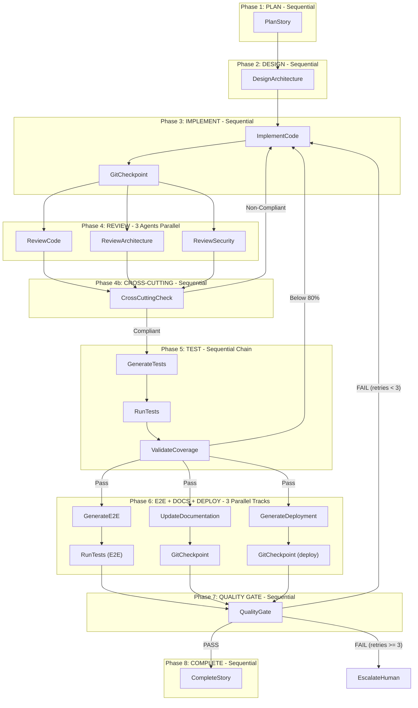

# Full SDLC Workflow Reference

This document is the canonical reference for the **agentic-sdlc** eight-phase pipeline: how agents run, what they depend on, and how parallel work and retries interact.

---

## Overview: eight-phase pipeline

The pipeline turns structured stories (from `stories.json`) into implemented code, validated tests, documentation, deployment artifacts, a quality gate verdict, and finally a pull request with Jira updates.

| Phase | Name | Role |
|-------|------|------|
| 1 | PLAN | Turn the story into an execution plan scoped to the repo |
| 2 | DESIGN | Produce architecture decisions aligned with language and standards |
| 3 | IMPLEMENT | Implement code and tests (TDD), memory logs, and git checkpoints |
| 4 | REVIEW | Three parallel reviews plus orchestrator cross-cutting compliance |
| 5 | TEST | Generate tests if needed, run suite, validate coverage (≥ 80%) |
| 6 | E2E + DOCS + DEPLOY | Three parallel tracks after coverage passes |
| 7 | QUALITY GATE | Aggregate evidence and pass or fail with retry routing |
| 8 | COMPLETE | Open PR, update Jira, mark story complete |

Phases **1–2** run once per story attempt. **Phases 3–7** may repeat on retry; **Phase 8** runs only after a successful quality gate.

---

## Execution state diagram (single story)

The following diagram matches the plan’s execution model: parallel rows mean concurrent agents; arrows show strict dependencies.



---

## Phase-by-phase steps (single story, steps 1–41)

### Phase 1: PLAN (sequential)

1. PlanStory reads the story from `stories.json`
2. Analyzes the codebase for affected files
3. Creates an execution plan with sub-tasks
4. Writes `./memory/stories/{story-id}/plan.md`
5. Git checkpoint: `chore({story-id}): execution plan`

### Phase 2: DESIGN (sequential)

6. DesignArchitecture reads the plan
7. Detects language and framework via the detect-language skill
8. Loads relevant `languages/{lang}/*.md` and `standards/*.md`
9. Proposes architecture decisions (patterns, modules, interfaces)
10. Writes `./memory/stories/{story-id}/architecture.md`
11. Git checkpoint: `chore({story-id}): architecture design`

### Phase 3: IMPLEMENT (sequential)

12. ImplementCode reads plan and architecture
13. Follows TDD: tests from acceptance criteria first, then implementation
14. Applies language-specific coding standards
15. Commits after each logical unit
16. Writes `implementation-log.md` (standardized memory log)
17. Git checkpoint: `feat({story-id}): implementation complete`

### Phase 4: REVIEW (three agents in parallel, then cross-cut)

18a. **ReviewCode**: correctness, quality, functional completeness  
18b. **ReviewArchitecture**: structural compliance, boundaries  
18c. **ReviewSecurity**: OWASP analysis, threat modeling  
19. Wait for all three to complete  
20. Cross-cutting check (orchestrator; same role as ADM Step 5)  
21. If any outcome is Non-Compliant → **RETRY** back to Phase 3 with findings  

### Phase 5: TEST (sequential chain)

22. GenerateTests adds tests if coverage gaps are found  
23. RunTests executes the full test suite  
24. ValidateCoverage enforces ≥ 80% threshold  
25. If coverage &lt; 80% → **RETRY** back to Phase 3 with a gap report  
26. Writes `test-results.json` and `coverage.json`  

### Phase 6: E2E + DOCS + DEPLOYMENT (three parallel tracks)

**Track A (E2E):**  
27. GenerateE2E creates E2E tests from acceptance criteria  
28. RunTests runs the E2E suite  

**Track B (Docs):**  
29. UpdateDocumentation updates README, CHANGELOG, ADR as needed  
30. Git checkpoint: `docs({story-id}): docs`  

**Track C (Deployment):**  
31. GenerateDeployment produces Dockerfile, Kubernetes, Helm, pipeline artifacts  
32. Git checkpoint: `infra({story-id}): deploy`  

33. Wait for all tracks to complete  
34. If E2E fails → **RETRY** back to Phase 3  

### Phase 7: QUALITY GATE (sequential)

35. QualityGate aggregates all memory log summaries and artifacts  
36. If PASS → proceed to Phase 8  
37. If FAIL and retries &lt; 3 → **RETRY** with a prioritized fix list to Phase 3  
38. If FAIL and retries ≥ 3 → **ESCALATE** to human  

### Phase 8: COMPLETE (sequential)

39. CompleteStory pushes the branch and creates a draft PR (including deployment artifacts)  
40. Updates Jira status  
41. Story marked **COMPLETE**  

---

## Parallelization rules (Section 5.2)

1. **Review agents always run in parallel.** ReviewCode, ReviewArchitecture, and ReviewSecurity share the same Review Context Bundle and run concurrently; the orchestrator waits for all three before the cross-cutting check.

2. **E2E, documentation, and deployment run as three parallel tracks** after coverage validation: Track A = GenerateE2E → RunTests(E2E); Track B = UpdateDocumentation → GitCheckpoint; Track C = GenerateDeployment → GitCheckpoint. All three must finish before QualityGate.

3. **Tests wait for reviews.** GenerateTests starts only after all three reviews pass, so tests are not expanded for code that reviews may reject.

4. **Stories can run in parallel when independent.** The orchestrator uses `dependencies` in `stories.json`: empty dependencies allow concurrent stories; a story waits until referenced stories reach COMPLETE.

5. **Retry loops restart from ImplementCode only.** On failure, routing returns to Phase 3 with findings. Phases 1 (Plan) and 2 (Design) are not re-run; architecture stays stable.

---

## Multi-story execution timeline (Section 5.4)

For three stories where A and B have no dependencies and C depends on A:

```
Time →
─────────────────────────────────────────────────────────────────────────

Story A: [Plan][Design][Implement][Review×3][Test][E2E+Docs][QA][Complete]
Story B: [Plan][Design][Implement][Review×3][Test][E2E+Docs][QA][Complete]
Story C:                                            (waiting for A)
                                                              ↓
Story C:                              [Plan][Design][Implement][Review×3]...

Orchestrator: ━━━━ monitors all ━━━━ aggregates ━━━━ final report ━━━━━━
```

Stories A and B run fully in parallel. Story C starts only after story A reaches COMPLETE.

---

## Context file flow (produce / consume)

| Artifact | Produced in | Consumed by |
|----------|-------------|-------------|
| `context/stories.json` | Decompose / orchestrator bootstrap | PlanStory, orchestrator |
| `context/sdlc-session.json` | Orchestrator | All phases (state) |
| `memory/.../plan.md` | Phase 1 | Phase 2–3 |
| `memory/.../architecture.md` | Phase 2 | Phase 3+ |
| `implementation-log.md` | Phase 3 | Reviews, docs, deploy, QA |
| `context/{story-id}/test-results.json`, `coverage.json` | Phase 5 | QualityGate, retries |
| E2E results | Phase 6a | QualityGate |
| Doc + deploy commits | Phase 6b–6c | QualityGate |
| `quality-gate-report.md` | Phase 7 | Phase 8, human |
| `retry-{n}.md` | On failure | ImplementCode on retry |

Runtime layout may also mirror key files under `./context/` per project configuration; align with `manage-context` and the orchestrator agent for the active repo.

---

## Agent execution summary (Section 5.3)

| Phase | Agents | Mode | Depends on | Outputs |
|-------|--------|------|------------|---------|
| 1. PLAN | PlanStory | Sequential | `stories.json` | `plan.md` |
| 2. DESIGN | DesignArchitecture | Sequential | `plan.md` | `architecture.md` |
| 3. IMPLEMENT | ImplementCode | Sequential | plan + architecture | Code, `implementation-log.md`, git commit |
| 4. REVIEW | ReviewCode, ReviewArchitecture, ReviewSecurity | **Parallel (3)** | Review Context Bundle | CODE-x, ARCH-x, SEC-x findings |
| 4b. CROSS-CUT | Orchestrator | Sequential | All three review outputs | CROSS-x, Compliant / Non-Compliant |
| 5. TEST | GenerateTests → RunTests → ValidateCoverage | Sequential chain | implementation log + AC | `test-results.json`, `coverage.json` |
| 6a. E2E | GenerateE2E → RunTests(E2E) | Sequential chain | AC + UI touchpoints | E2E results |
| 6b. DOCS | UpdateDocumentation → GitCheckpoint | Sequential chain | implementation log + story | Docs + git commit |
| 6c. DEPLOY | GenerateDeployment → GitCheckpoint | Sequential chain | implementation log + language/framework | Dockerfile, K8s, Helm, CI/CD |
| 6 (combined) | 6a + 6b + 6c | **Parallel (3 tracks)** | Coverage pass | All three complete |
| 7. QA GATE | QualityGate | Sequential | Memory logs + test/coverage/E2E | `quality-gate-report.md` |
| 8. COMPLETE | CompleteStory | Sequential | QA pass | PR + Jira update |

For retry semantics, see `workflows/retry-loop.md`. For a narrative walkthrough, see `workflows/story-lifecycle.md`.
